\newpage

# Abstract

Printed electronics are an emerging technology that has the potential to
enable pervasive computing in a great variety of consumer products,
thanks to their sub-cent fabrication and flexible form factors. A lot of
the envisioned applications they will support have to do with
classifying the data gathered from printed sensors to derive a useful
property about the object under measurement. Printed Machine
Learning(ML) is deployed in order to perform these types of
classifications from sensor data. Because printed electronics have far
higher demands in area and power consumption compared to traditional
electronics, these ML models must be executed in a very resource
constrained environment. Thankfully the ease of manufacturing printed
circuits using additive methods allows for hardware to be fully bespoke
to the exact trained model it implements. This allows for resource
requirements to shrink by many factors. This work evaluates the
feasibility of deploying Binary Neural Network(BNN) architectures as
printed classifiers, where BNNs are networks with weights and
activations quantised to a single bit to reduce computational demands to
the minimum, making them a good candidate architecture for the problem
at hand.

\newpage

# Introduction

## Introduction to ubiquitous computing

Technology in general and more specifically computation plays an ever
increasing part in our lives and there are no signs of the trend slowing
down any time soon. There still however exists a relatively rigid real
world - computational domain gap, meaning most of of our interactions of
the world around us don't involve any computation taking place. It is
not hard to imagine countless examples where computational elements
would add value to everyday activities such as grocery shopping or
reduce required labour in production processes such as manufacturing if
those elements had close to zero cost and greater embedability
associated with them. Although almost everyone in developed countries
carries and interacts with powerful computers everywhere they happen to
be, the form of interaction cannot easily adapt to the surrounding
context they are in. One cannot simply ask the bananas they got if they
are ripe enough, call out to their keys to find where they left them,
check with their shoes on how many more steps they got in them.
Furthermore it is clear that uncountable processes are horribly
unoptimised compared to what could be achieved if a continuous stream of
detailed information from each of of it's constituents and access to
fine grained control over the minutia of them was in place. Think for
example a farm where every individual fruit on any tree has it's growth
progress tracked.
Essentially taking the ideas of the Internet-of-Things(IoT) and pushing
them to their logical limit, ubiquitous computing is an aspirational
ideal to a future where every product is a smart device, every
observable anyone would reasonably care for is accessible. Self driving
cars will be able to safely navigate without access to vision by
querying the positions of nearby devices, since whatever is not a
device directly at least has one or more attached.

Printed electronics are positioned to play a major role in at the very
least the early stages of such a transformation. Printing is currently
the only manufacturing method that can provide sub-cent computational
elements, and cost is the greatest bottleneck to how pervasive they can
become. Additionally the non-toxicity is crucial to make adding them to
fast moving consumer goods that are disposable at these scales. The
flexibility also helps with embedding more easily.  Even relatively
"modest" compared to the complete vision applications that we can expect
to come eventually, such as RFID tags replacing barcodes and enabling
stores to track every individual item of stock or printed food quality
sensors making best-before dates obsolete have great potential to
disrupt a wide range of industries.

Machine learning can accelerate the process by many orders of magnitude
compared to how long it would take for specialised people in multiple
fields to design a computational model to interpret and process the
sensor data. In many cases the upfront engineering cost would be enough
to stop the adoption of the paradigm altogether. If all it takes is for
some sensor data to be collected and labeled that can easily be handled
by any employee. We also depend on autoML being good enough for most of
these small scale data applications, since otherwise we would just run
into the same bottleneck with needing a data scientist for every little
thing. Methods to lighten the resources demanded of the printed system
that implements the model, such as quantization and binarization can
clearly expand the scope of how complex the classification supported can
be.

\newpage

## Intro to printed electronics

Printed electronics refers to very thin electronic devices and circuits
that are produced by the application of inks with desired electric
properties to various substrates. They can be manufactured in volume for
a much lower cost compared to other electronics with methods common in
the printing industry. This makes them particularly well-suited for
applications where the benefits of electronic functionality alone do not
outweigh the associated expenses. Additionally they can offer flexible
form factors and the ability of large area coverage. Another benefit
that may come from their spread is to lessen the impact of e-waste,
since printed electronics can be much less toxic for the environment and
more easily recyclable than the rest, or even biodegradable. They cannot
compete with silicon electronics in performance due to the large
resistance of conductive inks, the lack of support for high frequency
and the  high variability in manufacturing. While the ability to cover
large areas is sometimes desirable, a lot of applications demand
miniaturization that they cannot offer. Feature sizes in printed
computational elements are six orders of magnitudes larger than
conventional electronics. A variety of active and passive devices,
including transistors, resistors, capacitors, sensors, harvesters and
antennas can be implemented with them. They are thought to be an
emerging market with considerable potential to broaden the role of
computation in everyday living. They can help the pervasiveness of
computation reach far deeper, and thus synergize well with other
advances in the sector. A recent report by IDTechEx[@fn25] forecasts the
global market for printed flexible electronics, excluding OLEDs, to
reach 12 billion dollars by 2033.


### Uses of printed electronics

The usage of printed electronics most people may be familiar with
in their everyday lives is the membrane used to detect key presses in most
non-mechanical keyboards, or perhaps windshield defrosters.

Other usages include:

- Sensors: flexible, biodegradable and stretchable sensing elements
enable the efficient monitoring of many processes. A variety of
properties of the world can be measured by printed sensors, including
temperature, touch, strain, gasses, humidity, light levels and
presence of certain chemicals. The flexibility and
non-toxicity is especially relevant for medical monitoring, so
biosensors have received a lot of attention, with some (for example
,printed seizure detecting patches) already commercially available.

- RFID: RFID (Radio Frequency Identification) is a wireless technology
reader, enabling seamless object identification and tracking through
unique identification codes stored in the tags. The goal of printed RFID
is to replace current methods for identifying goods with smart labels.
RFID tags are usually passive and don't require a power supply. They can
be cheaply made with any common printing method. They have been shown to
operate on 5G and WLAN frequencies, and can even have sensor
capabilities. Currently mostly used in ticket fares and
anti-shoplifting.

- Energy harvesting: Printed batteries can only provide power to the
functional parts of printed circuits for a limited time, and can take up
a significant portion of the circuit's area. In order to enable greater
autonomy to deployed printed electronics the ability to harvest energy
from the environment is crucial. Printed harvesters can draw power from
radio signals, vibrations and most commonly, light. Printed photoelectric/solar cells have also drawn a lot of interest outside the realm of
harvesters for small circuits, since while their performance doesn't
reach the levels of rigid silicon solar cells they can be deployed in
a wider selection of spaces, including wearables.
- Lighting: LEDs have become the predominant light source, in place of
  the energy wasteful incadecent lamps and the environmental minefields
  of fluorescent lighting. OLEDs further increase the energy savings
  and produce softer and more uniform lighting. Printing seems like a
  promising solution for low cost manufacturing of OLEDs with
  competitive luminous efficiency and enable them to cover large areas.
  Paper thin light panels have been demonstrated that way.
- Displays: Displays are one of the more mature aspects of printed
electronics, with large 4K printed OLED displays are commercially 
available. They enable flexible displays, that have many applications in
consumer electronics and wearables and thus are a 5 billion dollar
market. Even if the flexible display is not fully printed, printed
electronics can offer it additional features. QLED displays may also one
day be printed if printing accuracy keeps increasing.
- Wearables: Wearable electronic devices are already very popular, such
  as smart watches or hearing aids, or NFC rings. Printed electronics
  have much to offer to the space thanks to their flexibility.
  Conductive materials have been developed that can
  be printed on fabric and withstand washing with detergent, allowing
  electronics to be embedded in regular pieces of clothing. Printed
  sensors can be used for activity tracking, one of the most popular
  features of today's smartwatches, or health monitoring, with printed
  patches for seizure detection already on the market. One can also
  imagine they would be of interest to the fashion industry.


\newpage

## TinyML
Edge computing enables applications where data processing is location
sensitive. It provides greater security, privacy and availability
guarantees to the end users. It is a fundamental component of the IoT
market, that can reduce the dependence on cloud systems. The main
bottleneck to it's adoption spread are the resource constraints it
imposes.  

To deal with the demand of running machine learning
applications on the edge for intelligent devices, traditional
architectures are too bloated to make the cut. Many models nowadays
demand computing capabilities out of reach for even the most high-end
consumer hardware, let alone low power devices. TinyML is the field of
optimising machine learning architectures to run on ultra resource
constrained systems, typically no more than a few milliwatts.  

Multidisciplinary work is demanded for this undertaking, as both the ML
algorithms, the software and the hardware that supports them must
accommodate these constraints while not compromising the accuracy of the
models to a significant degree. Roughly the constraints at play are
energy efficiency, processing capacity, memory space and production and
engineering costs. It should be emphasised that the concern is with the
inference step of ML although enabling the training phase on edge
hardware is also it's own niche endeavor. 

Some approaches to the problem include:

- One of the most ubiquitous methods in the field is constrained neural
architecture search (NAS). Neural architecture search examines a search
space of different architectures for different hyperparameters. An
algorithm tries to locate the best possible architecture to maximise
model performance on the objective function. An evaluator examines the
trade-offs between accuracy and efficiency on deployment, given
declared constraints of memory, energy etc. It may consider one or many
target models on a single or multiple platforms. Both the search space
and the search algorithm are hardware-aware. It is a multi-objective
optimisation problem that is usually implemented as a multi-stage
single-objective optimisation problem. Running the search is very time
consuming but results outperform most manually designed networks.

- An obvious approach to handling the memory constraint issue is using
data compression techniques on the ML model. A key approach that has
demonstrated 15-40x compression factors are Kronecker Products (KP).
Large accuracy penalties may occur however, and a method called doped
Kronecker product (DKP) leverages co-matrix adaptation to try and remedy
those.

- Over-parameterization is the property of a neural network where
  redundant neurons do not improve the accuracy of results. This
  redundancy can often be removed with little or no accuracy loss.
  Network pruning removes parameters that don't impact accuracy by a
  large amount. A common case where this can easily be done is when
  parameters are either zero or sufficiently close to it. It can be
  applied at any granularity, from individual connections, neurons to
  entire layers. When a pruning procedure results in the neural network
  losing it's symmetrical structure it is referred to as unstructured
  pruning, otherwise it is structured pruning. Unstructured pruning
  results to sparse weight matrices that general processors do not
  execute efficiently.  Retraining a network after pruning parameters
  that weren't contributing enough can allow it to reach higher
  accuracies than before. Even pruning a randomly initialised network
  without training it before or after can result to a decent accuracy.

- Knowledge distillation is a process of training a smaller, shallower
student network to much the output logits of a larger, more capable
teacher network that has been trained to satisfactory accuracy. More
advanced variants include ensembles of small networks each trying to
match the results of the congregated ensemble, or self-distillation in
which shallower layers of a deep neural network try to learn to match
the more complicated features of the deeper layers. If the size
difference between the student and teacher networks is too large an
intermediate size teacher assistant network gets the teacher's answers
distilled into it and subsequently distills them to the student.

- Quantization is the process of reducing the numerical precision of
  values in the model. Networks are typically using 32 bit floating
  point numbers during training[@fn22]. The most common quantization
  targets for those are either 8-bit or 4-bit integers. In many cases
  the network does not utilise this level of precision to it's full
  extend. Reducing the precision in these cases can relieve the
  computational burden associated with negligible accuracy sacrifices.
  Quantization-aware training is a process in which the full precision
  network is fine-tuned of retrained into the reduced form. It succeeded
  quantizing the network only after the training process is completed.
  When the method is pushed to the limit, precision is reduced down to 1
  bit. Networks with a single bit of precision are called Binary Neural
  Networks(BNNs).

\newpage

## Printed machine learning

The most clearly desirable applications of computation to printed
electronics in the domain of ubiquitous computing center around some
form of classification or another. For every printed circuit that
includes one or more sensors a system to interpret the outputs of that
sensor to a useable format is required, barring trivial cases.

Creating hand-designed computational models for every combination of
sensors and usecase they are included in and designing efficient
hardware designs to support each one would take a monumental sum of
man-hours. Machine learning provides a common medium to both create
models for predicting and architectures to implement in circuits a vast
array of these applications. There are clear incentives then to provide
those mediums.

The difficulties in this undertaking all stem from the extreme resource
constraints given from the feature sizes and energy demands of printed
electronics. To overcome these barriers the entire process, from
selecting the right general architectures to only keeping the
absolutely necessary hardware elements at the resulting circuits must be
optimised for this aim.

Beyond bringing the area of the circuit to a reasonable size, a big
factor that prevents the usability of some implementations is that no
printed battery can support their power draw. We can therefore not get
them running inference in the wild. The power output of these batteries
is a hard limit that must be reached or printed ML is purely
theoretical. In this work the most permissive battery, from Molex, which
can support circuits with up to 30mW of power, is targeted.

\newpage

## Thesis objective

The concept of this thesis is taking place in a ubiquitous computing
scenario. I have insured that the entire process from dataset to netlist
that can be passed to the printer requires no manual intervention.
Anyone can pass their sensor data in one end and receive measurements
for the model accuracy, circuit area and power requirements on the
other, without special knowledge on any domain being required of
them. This is specifically done utilising bespoke implementations of
binary neural networks, in order to evaluate their efficacy in
providing a backbone for this process.

Imagine if you will the scenario of a coffee shop owner. They decide
they would like the glasses they serve their coffee in to indicate the
amount of sugar or other sweeteners used in the contained beverage.
This would prevent people from grabbing the wrong coffee from the table
because they all look indistinguishable. After searching on an online
repository for what sensor would be of any use here, they order a few
sample sheets of these printed sensors and a small gadget that clips on
the sheet and records the measurements of the sensors. After dipping
them on a dozen coffees with different mixtures of sweeteners inside,
they plug the gadget to their computer and get a spreadsheet of sensor
values for each dipping session. They simply append the label they
decided each sweetener level corresponds to and pass the spreadsheet to
the system. They decide that the reported accuracy and area are
manageable order the resulting circuit to be printed on a batch of
flexible patches they can stick to the inside of the glasses.

Various architectures have been evaluated for such a framework. This
work adds Binary Neural Networks(BNNs) to the list of of approaches for
printed ML inference. BNNs are networks quantised to the absolute limit
of 1 bit. They are designed specifically to minimise compute resources
as much as possible and thus are a prime candidate to bring ever more
classifiers under the implementation threshold of printed electronics.
The great bulk of this thesis is dedicated to examining efficient
bespoke hardware implementations for BNNs to fit in the constraints of
the technology.

\newpage

# Related works in machine learning for printed circuits

Since the printed computing technology reached the point where Machine
Learning models could be supported for inference, work has been made in
bringing them to fruition.
Tahoori et al[@fn14] demonstrates an analog two input neuron, and shows
how it could be expanded to fully printed analog neural networks with
MAC and activation operations. Douthwaite et al[@fn15] Uses time domain
encoding of signals, representing magnitude as pulse width and encoding
weights with current mirrors. Accumulation is done by linearly charging
a capacitor with the mirrored pulses. Gkoupidenis et al [@fn16] mimick
biologically inspired synaptic functions with electrolyte-gated
transistors and show how they could be used for a single layer
perceptron. Ozer et al [@fn17] envision what an automatic process for
creating bespoke processors for a variety of ML architectures in printed
electronics could look like, but don't go beyond the vision stage.
Bleier et al [@fn18] present a printed microprocessor with an
instruction set customised to the program at hand. Weller et al [@fn19]
leverage stochastic computing to reduce the requirements of mixed
analog-digital neural networks but with heavy accuracy cost.

Mubarik et al [@fn20] evaluate small machine learning architectures
(decision trees, random forests and support vector machines) in digital,
lookup table based and analog architectures in bespoke printed circuits.
They also consider MLPs, but decide they are too costly to evaluate. The
main results are about the decision trees(DTs), where they examine the
demands of printed implementations for depths of 1 to 8, in both
conventional and bespoke circuits. They show that bespoke circuits, that
are uniquely suited to printed electronics due to low non-recurring
engineering(NRE) and manufacturing costs, can be implemented with about
two orders of magnitude lower requirements than circuits that can
support a wider range of DTs and not just one. This thesis is directly
inspired by this work in using bespoke design to lower the demands of
model implementations and mainly applies their insights to the domain of
BNNs.

Armeniakos et al [@fn21] expand to more demanding SVMs and Multi Layer
Perceptrons. In order to enable their implementation, they leverage
approximate computing in two ways. First they notice that there is high
variance in the area demands of a constant multiplier based on the
coefficient it multiplies by. For example, multiplying by a power of two
takes no hardware at all since it is a constant shift. They approximate
weight coefficients of the MLPs and SVMs to take advantage of this
observation. Secondly, they apply post-synthesis pruning at the gate
level on the netlist of the designs. They target gates that have close
to constant outputs and only influence less significant bits of the
results and replace them with the constant value they mostly output.
Together these approximations result in area and power reductions of
about a factor of 2 in most cases. This work is the direct inspiration
of this thesis, where the weight coefficients are set in the training
phase to be exclusively values that don't require multipliers to be
implemented, as is the case in BNNs. The results achieved here are thus
compared with the ones from this work as a baseline. This comparison is
provided in the [Results section](#results).

In the follow up paper [@haware] they additionally apply neural
minimization techniques such as quantization, pruning and weight
clustering and combine them utilising genetic algorithms to reduce area
requirements by up to 8x.

In [@modelcircuit], in addition to the aforementioned hardware-friendly
coefficients and netlist pruning, voltage overscaling(VOS) is applied to
further reduce the power demands of classifier circuits. A genetic
algorithm is then applied to minimize area and maximise accuracy for a
given power constraint. This enables many designs to be powered by
printed batteries sacrificing less that 1% in accuracy.

Following up, [@codesign] retrains MLPs with a scoring function that takes the
hardware cost associated with multiplying with each weight's coefficient
into account. Coefficients are sorted into clusters based on their
hardware cost and retraining allows increasingly more expensive values
to be used for weights until the accuracy threshold is met. Additionally
the products are summed using approximate addition by discarding the
least significant bits of products that contribute less to the MAC's
result. Together these improvements lead to 6x area and power savings
for 1% accuracy loss and 20x for 5%. Because often their networks use
only powers of 2 as weights and thus no hardware is used to perform
multiplication, this edge of using BNNs is not present here. However
different neurons use different weights for the same input, leading in
less intermediate sums being shareable across neurons. This is an edge
BNNs can exploit, albeit paying a price in representational
capabilities.

Balaskas et al in [@axxdtrees] extend the idea of hardware-friendly
coefficients to the threshold values of comparators in decision trees.
Beyond the threshold value the precision of the comparison can also be
configured at a per-comparator basis in order increase efficiency. They
deploy a genetic algorithm to find optimal configurations of
hardware-friendly thresholds close to the original values and reduced
comparison precisions without sacrificing more than 1% accuracy. As a
result area and power are reduced 3-4x. This leads some of the smaller
designs they examine to sub-cm$^2$ area and sub-mW power draw.

Iordanou et al [@tinyclass] have an interesting approach in which they
use graph-based genetic programming to search the space of boolean logic
expressions for ones that predict the class of tabular data with high
accuracy and transpiling those logic gates into a netlist. The result is
a sea of logic gates, unlike the structured circuits of other
approaches. Needless to say this is removed from the paradigm of
traditional ML architectures this work is placed in.

\newpage

# Background information - Prerequisites

## Printed electronics technical details

### Manufacturing methods for printed electronics

Printed electronics are manufactured using techniques from the graphic
print industry. They are split into contact or R2R printing techniques
that use a template and contactless that don't. Multiple printing steps
are required for the multiple layers of the circuit. Contact printing
techniques include:  

- Gravure: In gravure, the printing cylinder gets engraved with the
template and is partly submerged in ink during the process, with a
blade discarding excess ink. This only leaves ink in the template parts,
which is transfered to the substrate under pressure. Gravure can print
in high resolution and speed compared to other methods, but the cost
of engraving the cylinder makes it only useful for vary large batches.  
- Offset: In offset printing the shape of the template is deposited
on a cylinder with an ink accepting substance and the negative of the
template is covered with ink repelling substances. That way only the
shape of the template absorbs ink from an ink roller, and then gets
transferred onto the substrate via an intermediate cylinder. 
- Flexography: The template is embedded onto a flexible plate that is
wrapped around a printing cylinder such that parts of the shape raised.
Ink applied to this cylinder only gets transferred to a second cylinder,
and then the substrate, if it is on the raised parts that correspond to
the template. It can support both non-porous and porous substrates.  
- Screen printing: A "screen" in this case is a close-knit fabric, such
that ink can pass through only by applying pressure. A stensil of the
template is placed on top of the screen and a blade pushes ink througth
the uncovered parts onto the substrate. Screen printing is the simplest
technique of the bunch and can create thicker layers and print on curved
surfaces. It suffers from lower resolution compared to other methods.
- Pad printing: Ink gets onto an engraving of the template. A soft pad
is then pressed on it and transfers the ink with the desired shape to
the substrate. It can print on surfaces of 3D objects.

Contactless techniques include:

- Inkjet: Ink is dropped onto the substrate from tiny spouts. Either
there are enough spouts to cover the width of the print or they can be
moved around to do so. It does not require large equipment and
different designs can be printed in high resolution without
complications in changing templates, making it ideal for printing on
demand. It's main drawback is it's printing speed. Continuous stream
inkjet has a stream of ink be directed onto the substrate or to a trash
bin depending on design information. It is can print larger batches than
Drop-on-Demand inkjet, but with five times lower resolution. DoD
controls whether ink will flow using a valve, so ink is not wasted. It
is deployed at smaller scales than Continuous stream.  
- Aerosol: The ink is atomised into a fine mist via compressed air or
ultrasound, accelerated and sprayed onto the substrate. It can be used
on curved surfaces and can provide even smaller feature sizes than
inkjet, but is prohibitively slow.

Additionally methods like vacuum deposition, in which evaporated ink
coats a surface in a vacuum, or dip pen nanolithography, in which an
atomic force microscope applies the ink very precisely on the substrate,
are sometimes considered included in the printed electronics umbrella,
and although they can achieve smaller feature sizes they require
specialised equipment and are not as cost friendly as the traditional
printing methods and thus less relevant.


\newpage

### Materials for printed electronics
In order to implement functional circuits inks with conducting,
semiconducting and dielectric properties are needed. They usually
consist of nanoparticles of materials with these properties mixed with
solvent to the desired viscosity and other additives to enable the
printing process. Both organic and inorganic materials can be used.

- Conducting inks: The majority of materials for conducting inks are
metal nanoparticles, the most common being silver. Although silver is
in the category of precious metals silver ink
is not awfully expensive, with pens of conductive silver ink going for
less than 4 dollars. Other metals used are gold, aluminum and copper.
Copper and aluminum inks suffer much worse ageing than silver ones. 
Organic inks are often based on carbon nanotubes or graphene.
Cheaper polymers are also used, despite their inferior conductivity.
The most popular is PEDOT:PSS.
Ceramic materials are also used in conducting inks, mainly indium
tin oxide(ITO), although it is an expensive material.
- Semiconducting inks: The most common inorganic materials used are
silicon and germanium and of the organic ones most are again CNT or
graphene based. Both p-type and n-type materials can be produced from
those, although p-types have historically be much higher performing.
(The opposite holds true for electrolyte gated transistors.)
- Dielectric inks: The dielectric layer needs to be thicker than the
conducting and semiconducting layers in order for charge not to leak
through it. Substrate materials, ceramic oxides and polymers can be
used as the active ingredient.

### EGFET

This work is built upon the Process Design Kit(PDK) for
Electrolyte-Gated oxide Field Effect Transistors(EGFET)[@egfet]. EGFET
uses solid polymer electrolytes to gate the transistors in place of
dielectrics. Specifically indium oxide is used for this purpose. They
can be operated at up to 250 Hz at 1V.

The main advantage of EGFETs compared to organic transistors is that
they can be driven at very low voltages, down to 0.6V. This is crucial
for meeting the constraints imposed by the printed batteries available.
The area they cover is however significantly larger(10-100x) that of
organic transistors such as CNT-TFT[@cnttft]. As an example a single
SR-latch based on EGFET takes up 7mm$^2$.
Another difference of electrolyte-gated transistors with their organic
counterparts is that in EGFET only n-type transistors are implementable,
whereas in CNT only p-types are possible. Neither supports both so CMOS
gates cannot be used in printed circuits.

\newpage

## Binary Neural Networks

BNN is the term for neural networks that have both activations and
weights in 1 bit precision in all hidden layers. Input layers ought to
have higher precision inputs so the network can receive sufficient
information for classification to be possible, and output layers of
classifiers have their activations compared to each other to decide on
the predicted class, so they cannot be binarized. The most common domain
for BNNs are Convolutional Neural Networks(CNNs). They were
independently presented in 2016 by [@fn23] and [@fn24].

Beyond reducing the storage size required for the weights $32\times$
compared to a full precision 32-bit network of the same architecture,
computation costs are significantly dropped too since the
multiply-accumulate(MAC) operations can be carried out by XNOR and
popcount operations. This can lead to up to a $58\times$ improvement in
speed.

BNNs can therefore enable the implementation of neural networks in
resource constrained environments. The trade-off is that both their
representational capacity and corrigibility to training are inferior to
higher precision networks, and so often they either cannot provide
sufficient prediction accuracy or require a much higher count of neurons
to achieve it, negating the previous gains. As a rule of thump 4
binarised neurons are needed to match up to a unquantised one.

During training, higher precision underlying weights are used to make learning more robust. In the forward propagation phase these more precise weights, $W$, and the activations from the previous layer $I$ are binarized using the sign function:

$$ 
sign(x) = \begin{dcases}
    +1, & \text{if } x \geq 0\\
    -1,              & \text{if } x < 0
\end{dcases}
$$

The binary operations $({-1,1},*)$ and $({0,1},\odot)$ are isomorphic, so
the multiplication of weights with activations is done using the XNOR
operation when the binary values {-1,1} are encoded into the logic
values {0,1} to be stored in a bit.

This mapping can be represented by the linear transformation $f(x) =
\frac{x+1}{2}$, since $f(-1) = 0$ and $f(1)=1$. The accumulation and
subsequent binarization of the activation-weight products $sign(I)*sign(W)$ can be calculated by performing a popcount operation, which returns the count of bits in a given collection that are 1, and comparing the result with a threshold to binarize it.

During backward propagation, an approximation of the activation function
$sign$ needs to be used since $sign$ has a derivative of 0. The most
common method is known as straight-through estimation(STE). In STE the
sign function is approximated by:

$$ 
STEsign(x) = \begin{dcases}
    +1, & \text{if } x \geq 1\\
    x, & \text{if } 1 \geq x \geq -1\\
    -1,              & \text{if } x \leq -1
\end{dcases}
$$

which has a derivative of:

$$ 
\frac{dSTEsign}{dx} = \begin{dcases}
    1, & \text{if } 1 \geq x \geq -1\\
    0,              & elsewhere
\end{dcases}
$$

Updates are made to the underlying higher precision weights, and their
binarizations are used for the forward pass.

\newpage

## Datasets

The datasets chosen to train models for and implement are the ones used
by [@fn20]. That way results for model accuracy and area
/ power requirements can be compared with other approaches in the
literature. Like in those papers, categorical features were removed from
the datasets, leaving only inputs from sensors, since they are all the
actual printed system would have access to (this assumption may be
circumvented, but this is beyond the current scope). Note that the
feature selection may not be the same as the prior papers, since the
pieces of data they kept were not documented. All of them were taken
from the UCI machine learning repository[@fn7].

A short description of the datasets:

- Arrythmia[@fn8]: Diagnosis of cardiac arrhythmia from 12 lead ECG
  recordings.
- Cardiotocography[@fn9]: Diagnosing problems in the heartrate of unborn
  infants.
- Pendigits[@fn10]: Classification of written digit from a series of 8
  pressure signals from touch sensors.
- Human activity recognition(HAR)[@fn11]: Classification of the type of
  movement a person is making(standing, climbing stairs etc) using accelerometers from cellphones on
  their waists.
- Gas Identification[@fn12]: Classification of gas presence using chemical
  sensors.
- Wine Quality(White wines)[@fn13]: Estimating the percieved enjoyment of
  various white wines based on acidity and mineral traces.
- Wine Quality(Red wines)[@fn13]: Equivelant to the above for red wines.

The datasets use inputs from sensors that at least approximately
correspond to ones that have been demonstrated possible to manufacture
by printing. The complete system including both sensors, classifier and
power supply could thus somewhat realistically be physically
implemented, and not be very far from an actual usecase of the
technology.

Sensor | Dataset
---|---
Electrocardiography sensor on paper[@fn1] | Arrythmia
Electrocardiography sensor on paper[@fn1] | Cardio
Printed movement sensor | Human activity recognition
Printed gas sensor[@fn6] | Gas identification
Printed piezoelectric sensor[@fn4] | Pendigits
Printed pH sensor[@fn2], Inkjet mineral sensor[@fn3] | Wine Quality(White)
Printed pH sensor[@fn2], Inkjet mineral sensor[@fn3] | Wine Quality(Red)

\newpage

# Proposed framework


As outlined in the ubiquitous computing section, the deliverable of this
thesis is meant to be a framework that allows a labeled set of sensor
data to produce a fully functional printed circuit that implements a
classifier for this dataset. Due to lack of access to equipment the
actual printing is not viable in this context and the scope will be
restricted to the dataset to netlist part of the process.

The classifier architecture will in particular be a Binary Neural
Network(BNN), explained in the preliminaries. It may not necessarily be
the most suitable architecture in every case, but it was created with
the purpose to reduce resource consumption, which is the core concern.
It was thus chosen as the niche I will be carving here.

The rough sequence of processes performing that transformation
comprises of the following:

1. Hyperparameter search: In order for a hands-off training process to
   be applicable to a vast space of possible sensor datasets for which
   printed classifiers may be desired a single generic configuration of
   training hyperparameters wont cut it. So a search must be performed
   to find a set suitable to the data distribution at hand.
2. Model training: After a useable hyperparameter configuration is found
   a model is trained under them and evaluated. If the test split
   accuracy is sufficient for the user's needs the rest of the process
   may take place. The weights and network architecture of the final
   model are passed to be processed.
3. Parameter optimization: Some pieces of information derived from the
   weights and dataset can be used to help the design avoid unnecessary
   computations. For an extreme but applied example, if a neuron never
   changes it's output based on its input activations it can be flagged
   to be replaced with a static constant assignment.
4. Parameter encoding: The weights, measures of the network architecture
   and derived assisting information are either used to produce verilog
   code that performs the computations they imply or formatted such that
   they can be read and parsed by the control mechanisms of verilog.
5. Design instantiation: A template for the type of design that ought to
   be produced gets the snippets of custom functionality and/or the
   formatted parameters needed to derive that functionality using
   generate blocks imported into it. The result is a design that is
   bespoke to the exact trained model under question.
6. Verification: A behavioural simulation of the design is performed to
   confirm that classifier accuracy is satisfactorily preserved.
7. Synthesis: An optimised netlist is produced from the HDL
   specification. A farther gate level simulation is performed to
   guarantee functionality.
8. Metric estimation: Area and power estimates are taken from the
   synthesis and simulation tools using information from the printed
   components PDK. If these demands seem to be supported by the budget
   of the usecase the user may place a printing order.

Parts of the wider procedure out of scope of this framework are:

- Printed sensor availability
- Access to printed sensor data for labeling
- Examination of other promising architectures
- Design of masks for placement of printed components
- Inclusion of sensor, ADC and output indicator resource consumption in
  reported estimates. 

Additionally, the framework provides a way to quickly test, evaluate and
compare Verilog implementations of models. Once the template design has
been written no manual steps are necessary from the designer to apply it
to each model of interest, verify its functionality and receive feedback
on how the new approach compares to previous ones. This aspect of the
framework enabled experimentation in searching for efficient BNN
implementations to proceed in a pace that would not be achievable if
these steps were not automated.

The rest of the thesis will almost entirely deal with the design of
efficient bespoke BNN classifier hardware. This includes parts 3 and 5
of the process listed above. The rest, although time consuming to
implement, have no parts of interest to report on and will be summarised
in the experimental setup section.

The points that I think are helpful to be impressed upfront in order for
my following talk of HDL implementations to be comprehensible are:

- Over the course of working on the presented designs 6 models that
  correspond to 6 of the 7 datasets shown above are consistently used to
  test and compare results. The one dataset of the 7 that didn't make
  the cut was Arrhythmia, because the learned strategy of the model
  wasn't acceptable.

- All of these networks have one hidden layer that takes 4 bit inputs
  that are received from the ADCs connected to the respective sensors
  and one output layer that receives 1 bit binary inputs from the
  previous layer and produces a score for how likely each class is. An
  argmax module is also included in all of the following implementations
  to provide the index of the predicted class and is also included in
  the area/power estimates.

- All these networks have exactly 40 hidden neurons in the first layer.
  This is not reflective of an actual limitation of the framework. A
  first batch of models that were used to evaluate the designs and were
  meant to be replaced at some point ended up staying until the end.
  Initially they were kept out of inertia and past some point replacing
  them would require re-evaluating every type of design implementation
  with every new model in order for result comparisons to be
  informative, which would take a substantial usage of synthesis time
  and would halt further progress for a while.

- During synthesis a practically unlimited timing budget is allowed so
  timing optimizations do not take place and trade off against more
  important to the project goals.

- The power draw estimate is done with a gate level simulation of the
  synthesised circuit evaluating 1000 samples of the dataset to
  reproduce a realistic usage environment. The clock frequency is set to
  the critical timing frequency of the circuit reported by the synthesis
  tool.

\newpage

## Symbol glossary
- $N$ = the number of input features,  
- $M$ = the number of hidden neurons (in our case it is always 40),  
- $C$ = the number of output neurons/ number of classes  
- $S$ be the number of samples in the dataset,
- $x_i$ be the ith input feature,  
- $x_i$ be the $i$-th input feature,  
- $D^i$ be the $i$-th sample of the dataset,
- $D^i_j$ be the value the $j$-th input feature takes on the $i$-th sample
  of the dataset,
- $h_i$ be the $i$-th hidden neuron, also used to denote it's output value
before binarization,  
- $s_i$ be the $i$-th hidden neuron's output after binarization, so $s_i =
h_i \ge 0$,  
- $y_i$ be the $i$-th output neuron, also used to denote it's output value,  
- $W1$ = the weight matrix of the first layer,  
- $W2$ = the weight matrix of the second layer,  

Rows represent neurons and columns represent input activations,
so $W1_{i,j}$ is the weight of the first layer that corresponds to the
connection between the input feature $x_j$ and the neuron $h_i$.

\newpage

# Fully combinatorial fully connected implementations
Two initial approaches for implementing the fully connected BNNs
in a fully combinatorial single-cycle datapath are compared.
Only the first layer differs between them, the second layer stays
unchanged.

## Positive-Negative Sum


For each neuron in the first layer two sums are calculated. $\Sigma^+_i$
is the sum of the input features for which the connection with the
$i$-th
hidden neuron has a positive weight , whereas $\Sigma^-_i$ the sum of
those that have a negative weight associated. The two sums are then
compared and if the positive sum is greater than or equal to the
negative the output of the neuron is 1, otherwise 0.
$$ \Sigma^+_i = \sum_{j=0}^{N-1} x_j [W1_{i,j} > 0] $$
$$ \Sigma^-_i = \sum_{j=0}^{N-1} x_j [W1_{i,j} < 0] $$
$$ h_i = \Sigma^+_i \ge \Sigma^-_i $$

Sample code snippet:
```{.verilog}
assign positives[0] = + feature_array[1] + feature_array[2] + ... + feature_array[10];
assign negatives[0] = + feature_array[0] + feature_array[3] + feature_array[5];
assign hidden[0] = positives[0] >= negatives[0];
```

The reasoning behind splitting the sums is that keeping the operations
to only using unsigned positive numbers and only using addition and not
subtraction means simpler operations are required, and that may lead to
a smaller footprint.

For each neuron of the output layer it's value is calculated by summing
the output of hidden neurons. The binary output of the hidden neuron $s_j$is added as-is to the sum of the output neuron $y_i$ in the case that the weight of their connection $W2_{i,j}$ is positive and it's binary inverse is added to the sum if $W2_{i,j}$ is negative. This is equivalant to the sum of the xnor between the output vector of the hidden layer and the weight vector of the output neuron.

$$
y_i = \sum_{j=0}^{M-1} \begin{dcases}
    s_j,& \text{if } W2_{i,j} > 0\\
    \neg s_j,              & \text{if } W2_{i,j} < 0
\end{dcases}
$$

Code sample:

```{.verilog}
assign scores[0*SUM_BITS+:SUM_BITS] = + hidden_n[0] + hidden[1] + hidden[2] + ... + hidden_n[39];
```


## Signed sum


In this version a single sum is calculated for each neuron. If the
connection between input feature $x_j$ and hidden neuron $h_i$ has
weight $W1_{i,j} = 1$ it is added to the sum, otherwise it is subtracted
from it. Basically adding the feature multiplied by either 1 or -1 is
hard-coded as the resulting addition or subtraction correspondingly.
The result is then compared to zero to give the binarized output of the
neuron. Since the result is a signed number, this just means taking the
sign bit.

$$
h_i = \sum_{j=0}^{N-1} \begin{dcases}
    + x_j,& \text{if } W1_{i,j} > 0\\
    - x_j,              & \text{if } W1_{i,j} < 0
\end{dcases}
$$

Code sample:
```{.verilog}
wire signed [8:0] intra_0;
assign intra_0 = - feature_array[0] + feature_array[1] + ... + feature_array[10];
assign hidden[0] = intra_0 >= 0;
```

The second layer's implementation is not changed from how it is
described above.

### Results and analysis

|           |   bnnpar area(cm²) |   bnnparsign area(cm²) | area change   |   bnnpar power(mW) |   bnnparsign power(mW) | power change   |
|:----------|-------------------:|-----------------------:|:--------------|-------------------:|-----------------------:|:---------------|
| Har       |              29.4  |                  24.52 | -16.6%        |               92.1 |                   78.8 | -14.4%         |
| cardio    |              46.71 |                  33.27 | -28.8%        |              145.3 |                  106.2 | -26.9%         |
| gasId     |             269.76 |                 175.09 | -35.1%        |              767.7 |                  499.1 | -35.0%         |
| pendigits |              42.95 |                  33.38 | -22.3%        |              136.8 |                  108.9 | -20.4%         |
| winered   |              27.82 |                  22.45 | -19.3%        |               90.7 |                   74.6 | -17.8%         |
| winewhite |              26.01 |                  20.47 | -21.3%        |               84.6 |                   68   | -19.6%         |

Table: Comparison of single signed sum to double unsigned sums approaches

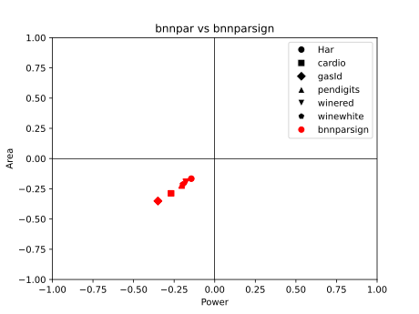

My prior expectation was that splitting the features into two sums to
avoid subtractions would lead to better results than keeping all the
operations for a neuron to a single expression by the reasoning
summarised previously. In fact it turns out that using a single sum
has area and power requirements 20-30% lower than using two.

My explanation for this is that keeping terms in separate expressions
prevents the compiler from effectively locating and reducing shared
subexpressions during synthesis. For example, if a neuron's expression
contains $+x_5+x_6-x_7$ and a different neuron contains $-x_5+x_6+x_7$
then the result of $x_5-x_7$ can be used for both neurons, but if $x_5$
and $x_7$ are not in the same expression, as they would not be in the
positive-negative sum implementation, this arithmetic optimization is
not used by the compiler. Additionally the two sums need comparators to
produce the binarized output of the neuron, whereas in the case the
signed sum this corresponds to the sign bit of the sum which means no
additional hardware.

\newpage

### Minimum range bit-width reduction


The reasoning goes that if the bitwidth that is demanded for the total
sum of the features is reduced, the bitwidth that partial sums it
depends on require lower on the adder graph is also reduced. As a
consequence, adders need to accomodate less bits and less logic ought to
be implemented for them.

At least in theory, the minimal circuit to implement the calculations of
the sums of the first layer with reduced widths for the results should
be strictly equal or smaller than the one with full widths. This is
because given a circuit that implements the full width calculations, the
reduced width results can be taken by selecting the bitrange of that
width from the least significant bits of the full width result. This is
simple wire selection and does not require any additional hardware,
therefore reducing neuron widths can never require additional logic.

So far in the first layer the bitwidth of the
total sum $h_i$ of the neuron is set to be large enough to fit any value
that may come up as the result of $M$ additions and subtractions of 4-bit
unsigned numbers. The assumption is that this range is significantly
wider than the range of values the neuron actually takes during
evaluation of typical samples. This would mean the bitwidth can be
lowered without errors due to overflows or underflows coming up in
actual use of the design, and this lowering would improve performance.

To test this the total sum of each neuron $h_i$ is calculated for each
sample in the dataset. I get the minimum and maximum of these values.
Since all values for the total sum to take are contained in the range
between those two, the arithmetic operations need not accomodate any
range larger than that.  Let $H^i_j$ be the value of $h_i$ when
evaluating the $i$-th sample of the dataset, and $wh_i$ be the bitwidth
of the $i$-th hidden neuron.

$$h_{i max} = \max\limits_{j=0}^{S-1} H^i_j$$
$$h_{i min} = \min\limits_{j=0}^{S-1} H^i_j$$
$$ wh_i = \lceil \log_2(\max(h_{i max},\lvert h_{i min}\rvert -1)) \rceil+1 $$

#### Results and analysis

|           |   bnnparsign area(cm²) |   bnnparw area(cm²) | area change   |   bnnparsign power(mW) |   bnnparw power(mW) | power change   |
|:----------|-----------------------:|--------------------:|:--------------|-----------------------:|--------------------:|:---------------|
| Har       |                  24.52 |               24.25 | -1.1%         |                   78.8 |                77.6 | -1.5%          |
| cardio    |                  33.27 |               33.21 | -0.2%         |                  106.2 |               105.4 | -0.8%          |
| gasId     |                 175.09 |              171.37 | -2.1%         |                  499.1 |               486.9 | -2.4%          |
| pendigits |                  33.38 |               33.97 | +1.8%         |                  108.9 |               109.6 | +0.6%          |
| winered   |                  22.45 |               21.87 | -2.6%         |                   74.6 |                72.3 | -3.1%          |
| winewhite |                  20.47 |               20.36 | -0.5%         |                   68   |                66.7 | -1.9%          |

Table: Results of restricting neuron bitwidths

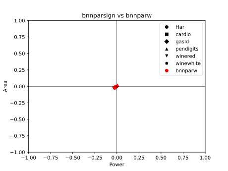

The results are negligible, in the 1-3% range, and in the
case of pendigits they even deteriorate a bit. This deterioration
should not be possible in theory if the synthesised circuits are optimal
implementations of their description. This is at least evidence that the
negligible results on the other datasets can be better if I can get
them into a form the compiler can work better with, though I still think
the main problem is with the approach itself. It seems that the
truncation goes against best practices and blocks the datapath
extraction process for some neurons, so certain optimizations do not get
applied to them and some would be common resources do not get shared. I
have not found a method to work around this limitation at this point.

\newpage

### Naively reducing bitwidths of intermediate results
#### Rationale

Given the eventual goal of applying approximate computation techniques to
the adder graph of the designs a problem, mentioned previously, comes
up. If the approximation, whatever it may be, gets applied separately to
each neuron's sum, almost certainly blocks the datapath extraction
process from performing arithmetic optimizations such as reducing and
sharing common subexpressions across neurons. The result is $M$ separate
approximate adder trees. Even given that the logic reduction gained from
approximate additions for each adder tree is more than enough to offset
the lost benefit of intermediate result sharing, that may be an
unnecessary concession.

To estimate how large the negative effect of an approximation technique
not taking cross-neuron sharing into consideration could be, I reduce
the bitwidths of intermediate results of the sum of each neuron.
Even though this would reasonably help for a single neuron, I expect it
will cause resource sharing to break. Given how large the negative
effect is I can check if this is a problem than ought to be fixed before 
approximation can confidently be applied.

#### Implementation


The cumulative sum along the input features multiplied by the weight of
their connection with the neuron $i$ is calculated for each hidden
neuron and for each sample of the dataset. The maximum and minimum
values over all samples at each step of the cumulative sum for a given
neuron is then calculated. In a similar fashion to the method described
above for reducing the bitwidth of the total result of the neuron's
operations, the operations are written sequentially with the result of
each having it's bitwidth set based on the range of values for the
equivalent step of the sum for all of the dataset.

Let $h_{i,j}$ denote the result of the pre-activation value of the
$i$-th hidden neuron only taking into account the input features $x_0$ to
$x_j$, or equivalently the value of $h_i$ if $x_{j+1}$ to $x_{N-1}$ are
masked to zero.

$$ h_{i,j} =  \sum_{k=0}^{j} x_k W1_{i,k} $$
$$ hmax_{i,j} = \max\limits_{l=0}^{S-1} \sum_{k=0}^{j} D_k^l W1_{i,k} $$
$$ hmin_{i,j} = \min\limits_{l=0}^{S-1} \sum_{k=0}^{j} D_k^l W1_{i,k} $$
$$ wh_{i,j} = \lceil \log_2(\max(hmax_{i,j},\lvert hmin_{i,j}\rvert -1)) \rceil+1 $$

Sometimes due to the order of additions and subtractions the width
needed at a later step is less than the one of an earlier step. This
is because every sample for which there would be an overflow in the
earlier step with the smaller width would at some following feature
underflow back in the range it supports. This has been taken into
account. If a width of a subsequent operation's result is smaller, the
bitwidth of the previous addition/subtraction is simply set to that
smaller value.

$$ wh'_{i,j} = \min\limits_{k=j}^{N-1} wh_{i,j} $$

Consecutive operations that have the same result bitwidth are grouped
together and expressed in verilog as a single sum. I have not confirmed
if this does in fact affect the result of synthesis at all but it seems
to conform closer to the recommendations of the best practices guide.

#### Results and analysis

|           |   bnnparw area(cm²) |   bnnparstepw area(cm²) | area change   |   bnnparw power(mW) |   bnnparstepw power(mW) | power change   |
|:----------|--------------------:|------------------------:|:--------------|--------------------:|------------------------:|:---------------|
| Har       |               24.25 |                   23.16 | -4.5%         |                77.6 |                    73.7 | -5.0%          |
| cardio    |               33.21 |                   39.29 | +18.3%        |               105.4 |                   125.5 | +19.1%         |
| gasId     |              171.37 |                  326.98 | +90.8%        |               486.9 |                   935.2 | +92.1%         |
| pendigits |               33.97 |                   37.09 | +9.2%         |               109.6 |                   120.3 | +9.8%          |
| winered   |               21.87 |                   22.78 | +4.2%         |                72.3 |                    75.3 | +4.1%          |
| winewhite |               20.36 |                   20    | -1.8%         |                66.7 |                    65.8 | -1.3%          |

Table: Results of shrinking intermediate results naively


The results were positive for two of the models with the smallest count
of input features $N$, which means that this method performed better
than the initial expectation. However, the optimization loss from losing 
shared operations shows clear scaling with the number $N$ of input
features. With more elements to sum, more common subexpressions to
optimise ought to come up, so this is keeping with expectations.

At the network with the largest $N$, the one belonging to gasId, which
has 128 sensor features, it has gotten bad enough to almost double the
area and power requirements. This shows that the issue is indeed
considerable when there is more than a handful of inputs, and ways to
work around it shall be searched for.

\newpage

### Preemptive arithmetic optimization


#### Rationale
Based on the results from above I attempt to get the arithmetic
expression that the design computes after synthesis, with the intent
of fitting later approximation techniques to it rather than having the
approximations dictate the graph of operations and forego these
advantages.

Design compiler provides an "*resource and datapath extraction*" report,
which quoting the user guide "analyzes the arithmetic contents of the
design and provides feedback so you can improve the RTL code as
needed". In this report the arithmetic operations that are performed
post-optimization by each datapath block are described in the block's
resource section. From this an addition / subtraction graph from input
elements to layer outputs could be reconstructed with relatively
straightforward parsing.

Unfortunately, the report does not provide a
mapping between the symbols it uses for input and output
variables of the datapath blocks and the corresponding wires in the
original design. Due to this the reconstructed adder graph cannot be
used to implement the network's layers before the inputs and outputs are
otherwise labeled.

Conceivably a method that unfolds all intermediate steps of the
calculation into full explicit sums of input variables for each output
variable could be used to achieve this labeling. After all intemediate
variables / nodes of the adder graph are eliminated (for example, $x =
a + b; y_1 = c + x; y_2 = d - x;$ would be expanded to $y_1 = c + a + b;
y_2 = d - a - b;$) the addition and subtraction operations can be mapped
to a matrix with binary {-1, 1} weights. A permutation matrix that turns
the original weight matrix of the layer into this reconstructed matrix
is then searched for, and the permutations are assigned as the labels of
the input and output elements of the adder graph.

Another path around this problem comes from the inclusion of references
to the operator or operators in the original verilog design that is
implemented by a given arithmetic operation mentioned in a datapath
block's report. These references only point to the line of the verilog
file the operator apears in, so to narrow it down with certainty the HDL
file must beformated in a way that only a single arithmetic operator
occurs per line.Then the variables named as operants in the report can
be matched to the variables associated with the operator in the line or
lines pointed to.

Some early attempts in this direction are made but it becomes clear that
a process that involves the network to be implemented in an HDL,
synthesized, reverse engineered from the synthesised result, implemented
in HDL in a different way and re-synthesised would require considerably
more complex orchestration than first impressions imply. Even if it
panned out without any issues the speed with which modifications to the
designs could be tried out would be slowed down to a degree I was not
comfortable with.

As an alternative I search the literature for algorithms or heuristics
that would perform an equivalent arithmetic optimization to the one
Design Compiler provides. It does not appear too hopeful that a de facto
standard method for such cases exists and perhaps even is the one used
under the compiler's hood, so the operations found are exactly or close
to the same. 


#### Implementation

A formulation of the problem is the following:  Given a list of
expressions of the general form $y_i = x_0 + x_1 - x_2 - ... + x_n$ in
which operants can be shared between the expressions find the minimum
number of additions or subtractions that need to be performed to
evaluate all expressions. 

The problem turns out considerable less well-studied than initially
expected. While the deceptively simple description suggests a
straightforward way to answer it, it is NP-Complete difficult, more
specifically in the MaxSNP family of optimization problems. As a direct
result only approximate solutions are attempted. [@guy] searches for
exact solutions by leveraging SAT solvers, but only manages to get this
to work for very small matrix sizes up to 8 x 8. Not much is else found
on the exact scenario above, but a close-enough problem having to do
with factoring similar lists of expressions of the form $y_i = x_0
\oplus x_1 \oplus ... \oplus x_n$ using the minimum possible XOR
operations is actively worked on thanks to some applications in the
field of cryptographic accelerators. Both belong to the shortest linear
program family of problems.

I choose to try utilising Paar's factoring algorithm [@paar] first. It is
older than most heuristics that have been applied to the XOR factoring
problem, but has the advantage of not exploiting term cancellation.
Thanks to the property $x \oplus x = 0$ some optimal solutions to the
XOR problem include two subexpressions containing the same term $x$
being combined by XOR to produce a desired expression that does not
include $x$. Heuristics developed after Paar's take advantage of this
feature, and while there is a parallel between it and the term
cancellation of opposites in our scenario ($x - x = 0$ or $x + -x = 0$)
I have not managed to find the adjustments needed to apply their
insights to the new domain. Thus I give precedence to the more
straightforward method, that directly translates to using addition in
place of parity.

\newpage

#### Paar's algorithm

It is essentially a greedy algorithm that picks the two elements that
are common in the largest number of expressions each time and adds the
result of their XOR to the list of elements.

Let $N$ be the number of inputs, $M$ be the count of expressions to
evaluate, $x_i$ be the $i$-th input, $y_i$ the $i$-th expression and $A
\in M\times{N}$ be the binary matrix we aim to factor. The value of
$A_{i,j}$ is set to 1 if the term $x_j$ is included in the XOR
expression $y_i$ and 0 otherwise.

For example if $N = 4$ the expression $y_i = x_0 \oplus x_2$ corresponds
to the row $A_i = [1 0 1 0]$.

The following steps are repeatedly applied:

1. Find the two columns $A_{:,i}$ and $A_{:,j}$ that have the bitwise
   AND with the largest weight. This corresponds to the columns with the
   largest dot product, so they can quickly be calculated by $i,j =
   \arg\max\limits_{k>l} (A^T A)_{k,l}$. This corresponds to finding the
   operation between two inputs or intermediate results that occurs the
   most times across all expressions.

2. Append the resulting product column  $A_{:,N} = A_{:,i} \land
   A_{:,j}$ to $A$. Increase $N$ by one to reflect the new width of the
   matrix. Intuitively this translates to including $x_i \oplus x_j$ as
   a new intermediate result $x_N$ to be used in farther operations.

3. Set $A'_{:,i} = A_{:,i} \land \neg A_{:,j}$ and $A'_{:,j} = A_{:,j}
   \land \neg A_{:,i}$. Thusly the dependence of expressions to $x_i$
   and $x_j$ is removed when it is now covered by the inclusion of $x_i
   \oplus x_j$ in them.

In the end only one element in each row has value $1$, and the index $j$ of
the column the only $1$ of the $i$-th row occurs in tells as the input
or intermediate result the $i$-th expression equals, $y_i = x_j$.

Paar's algorithm can work for a group of expressions that consist only
of addition, but the expressions we have to work with include both
additions and subtractions. To reconcile this issue the negative of each
input element is treated as a separate input element that is added where
the original would be subtracted. Given the original weight matrix $W$ with
$W_{i,j} \in {-1, 1}$ denoting whether element $x_j$ is added or
subtracted from the expression $y_i$, we construct the matrix $A$ we pass as
the initial state to the algorithm by first turning all the $-1$
elements to $0$ and then appending the inverse of the matrix to itself,
or $A = \max(0,[W,-W])$.

From this process a list $L$ of successive indices such that $L_n =
(i,j) \iff x_n = x_i + x_j$ is acquired, and the additions implied by
them are hardcoded in the verilog description of the designs.

#### Extension to support subtractions

I try a slight modification to the original procedure so it can be
compatible with expressions including subtractions. The way I
described previously to use negative inputs with Paar's strategy often
has to unnecessarily repeat calculations. For a minimal example, the expressions $y_0 = x_0 - x_1 + x_2, y_1 = x_0 + x_1 - x_2$
would result in 4 operations ($x_3 = x_0 + -x_1, y_0 = x_3 + x_2, x_4 = x_0
+ x_1, y_1 = x_4 + -x_2$), instead of the 3 needed ($x_3 = x_1 - x_2, y_0 = x_0 + x_3,
y_1 = x_0 - x_3$). This can be avoided by taking the ability to subtract
instead of only add intermediate results into account.

In summary this works by using {-1, 0, 1} for the elements of the
matrix $A$, where $A_{i,j} = -1$ when the expression for $y_i$ contains
the negative of the value $x_j$. Instead of counting the number of (1,1)
pairs of elements for columns as before, the count of pairs of elements
that are either (1,1) or (-1,-1) corresponds to the number of times the
sum of the values is used, and the count of pairs of elements
that are either (1,-1) or (-1,1) corresponds to the number of times the
difference of the values is used. As before the operation that occurs in
the most expressions is chosen as the next operation to be implemented.

Finding these two counts for all pairs of columns can still be done with
a matrix multiplication like before so the new approach is not much
slower.

#### Results and analysis

|           |   bnnparsign area(cm²) |   bnnpaar area(cm²) | area change   |   bnnparsign power(mW) |   bnnpaar power(mW) | power change   |
|:----------|-----------------------:|--------------------:|:--------------|-----------------------:|--------------------:|:---------------|
| Har       |                  24.52 |               17.42 | -29.0%        |                   78.8 |                57.2 | -27.4%         |
| cardio    |                  33.27 |               38.74 | +16.4%        |                  106.2 |               124.1 | +16.9%         |
| gasId     |                 175.09 |              281.55 | +60.8%        |                  499.1 |               807.6 | +61.8%         |
| pendigits |                  33.38 |               35.43 | +6.1%         |                  108.9 |               114.6 | +5.2%          |
| winered   |                  22.45 |               18.55 | -17.4%        |                   74.6 |                62.6 | -16.1%         |
| winewhite |                  20.47 |               18.01 | -12.0%        |                   68   |                59.8 | -12.1%         |

Table: Effect of preemptive arithmetic optimization with Paar's heuristic

|           |   bnnpaar area(cm²) |   bnnpaarter area(cm²) | area change   |   bnnpaar power(mW) |   bnnpaarter power(mW) | power change   |
|:----------|--------------------:|-----------------------:|:--------------|--------------------:|-----------------------:|:---------------|
| Har       |               17.42 |                  18.73 | +7.5%         |                57.2 |                   60.8 | +6.3%          |
| cardio    |               38.74 |                  35.97 | -7.2%         |               124.1 |                  116   | -6.5%          |
| gasId     |              281.55 |                 261.38 | -7.2%         |               807.6 |                  759.7 | -5.9%          |
| pendigits |               35.43 |                  32.22 | -9.1%         |               114.6 |                  107.3 | -6.4%          |
| winered   |               18.55 |                  17.47 | -5.8%         |                62.6 |                   59.6 | -4.8%          |
| winewhite |               18.01 |                  16.65 | -7.6%         |                59.8 |                   55.9 | -6.5%          |

Table: Comparison of the modified Paar heuristic to the original


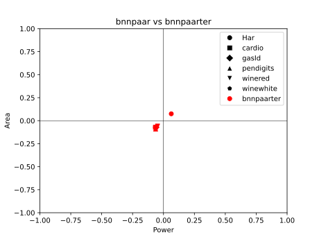

I expected that either:

1. The results of hardwiring the order of operations for calculating the
   pre-activation result of the neurons using Paar's heuristic would be
   considerably worse than the result of letting Design Compiler use the
   results of it's own optimization heuristics, since they ought to have
   implemented the best known ones. In this case trying an alternative
   to preemptively optimise the operations beforehand is most likely
   wasted effort because finding a competitive heuristic would be harder
   than parsing the results of their solution.

2. The results would have a negligible difference, because the
   heuristics used are related and / or the quality of results that can
   be expected by current methods for reasonable compute budgets hits a
   certain ceiling for the various approaches. In this case applying
   approximation techniques to the estimated arithmetic operation graph
   can go ahead.

The results show that although it is not consistant across the networks,
there is an improvement of 20-30% to the area and power estimates of
the smallest ones. This causes suspicion, since if such an old and
common algorithm performed better for some cases of the problem they
would reasonably have simply used it already. I initially look for
ways the original designs could be obstructing datapath extraction more
than they should, but nothing jumps out to me.

There seems to be a scaling in effect where the size of the weight
matrix or the number of total operations are inversely correlated with
how well Paar's algorithm performs compared to the compiler's unknown
solution. I hypothesise that they chose the methods they did for
arithmetic optimization giving more weight to the performance on heavier
workloads, where the savings are more important, or alternatively the
trade-offs these methods consider apply better to heavier loads. This
leaves some wiggle room for improvement in the sizes of the examined
networks.

Unfortunately, the issue I am trying to address has to do with
performance losses from disrupting compiler's arithmetic optimizations
scaling with model size, and the relative performance of the alternative
heuristic scales inversely with that size. This means that the attempted
fix cannot apply to the cases that need it most, so the underlying
problem remains unresolved.

The ternary take on Paar's heuristic outperforms the original by a
relatively consistant ratio with exception of the Har model's network.
This gives me some hope that applying more advanced heuristics used in
Shortest Linear Programs modefied for this particular usecase would
raise the network size threshold for which results can be improved.

\newpage

# Sequential evaluation of layer neurons

## Single input per-cycle update

### Rationale

The classifications considered here are mostly not time critical and do
not require high throughput. Evaluating the quality of a wine every
second or multiple times per second does not offer any more value than
doing it every few minutes. Since time is the less precious resource for
our purposes it can be traded for lowering area and power demands.

A way to approach this trade-off is by extending evaluation of neurons'
values to multiple clock cycles so that the adder graphs needed to
perform all of the numerical operations can be replaced with simpler
adder circuits that get reused between cycles. This requires the inclusion
of memory elements to hold intermediate results of calculations between
cycles.

I first try to make all neurons sequentially evaluate their
pre-activation values by updating their held value on new inputs on
successive clock cycles until they have included all of their input
values into their total. This means that each layer will take as many
cycles to calculate it's outputs as the number of input features it has.
Layers get evaluated successively, so the entire inference will take a
cycle count equal to the sum of all the inputs and hidden features of
the network.

### Implementation

#### First layer


In the first layer each neuron is implemented by an accumulator that
holds a running total of the weighted sum of the input features seem
thus far and an adder-subtractor that given the weight bit of the
connection between the neuron and the input feature currently updated on
as a control either adds of subtracts the newly presented feature with
the previous value of the accumulator to get next value of the
accumulator. In each cycle a new input element is selected for all
neurons of the layer and they either add it or subtract it from their
running totals.

The weights of the layer are stored in a memory. A counter is used to
select the current feature from a multiplexer and the column of the
weight matrix from the weight memory that will provide the control
signals to the adder-subtractors. When the value of the counter reaches
the final value that indexes an input feature, $N-1$, a flag is set that
stops the counter and the accumulators of the current layer from
updating their held values and signals the next layer to start it's own
process. A reset signal is used to bring these memory elements back to
their zeroed initial values when inference of the next set of inputs is
desired. A reset is required to happen before each inference starts.

Let $k$ be the number of cycles since the start of the inference / the
current value of the counter. $h_{i,k}$ be the value of the accumulator
of the $i$-th neuron on the $k$-th cycle, or after updating on the
first $k$ input elements. Clearly $h_{i,0} = 0$ and $h_{i,N-1}$ would be
equal to $h_i$. $x_k$ is the input element selected on the $k$-th cycle
and $h'_{i,k}$ is the output of the adder-subtractor of the $i$-th
neuron at the end of the $k$-th cycle. 

$$ h_{i,k+1} = h'_{i,k} = h_{i,k} + x_k = \sum_{j=0}^{k} x_j$$

Because the output of the add-subtract unit when the last input of the
layer is selected is equal to the pre-activation value of the neuron,
this value does not have to be stored in the accumulator to be used.
Instead the sign bit that determines the binarized output of the neuron
for the next layer can be taken directly from the adder-subtractor's
output. This way the first layer can be evaluated in $N-1$ cycles
instead of $N$, as long as the selected input of the first layer stays
at the last ($N-1$-th) position for the duration of the second layer's
evaluation.

An alternative implementation where the weight matrix was stored in
shifting registers instead of a constant array indexed by the counter was
tested. The memory elements are very expensive in this technology so
this version ended up underperforming the previous by a large margin due
to the required registers.

#### Second layer


The second layer starts after receiving an enable signal from the first
layers halting flag. Because of the linear transformation described in
the start in this layer instead of subtracting one from the running
total when the weighted current input would be -1 instead 0 is added to
the running total, so it remains unchanged. It could be implemented
similar to how the first layer is implemented if the adder-subtractors
are exchanged with XNOR gates, by storing the weights of the layer in a
memory and calculating the XNOR of the weight column $W2_{:,k}$ with the
output bit of the previous layer $s_k$ to add to the running totals on
the $k+1$-th cycle.

Instead , each neuron gets it's own multiplexer over input features,
where the $k$-th data line of the $i$-th neuron's multiplexer is set to
be $s_k$ if the weight $W2_{i,k}$ of the connection between the hidden
feature $s_k$ and the neuron $y_i$ is 1, and $\neg s_k$ in the case it
is -1. This is equivalent to hardcoding the result of the XNOR operation
for that particular neuron as the data line of the multiplexer.

In each cycle the neuron receives a single bit and adds it to the value
in its accumulator. It can therefore be implemented via a counter with
this bit as an enable signal.

The main goal of this approach is to remove the need for storing theweights of the layer and the decoder to select them, not the negligible XNOR gates that would be used.
These multiplexers share their input data lines with a lot of the other
multiplexers, so the hardware cost of their implementation is
considerably cheaper than $C$ separate ones.

### Results and analysis

|           |   bnnparw area(cm²) |   bnnseq area(cm²) | area change   |   bnnparw power(mW) |   bnnseq power(mW) | power change   |
|:----------|--------------------:|-------------------:|:--------------|--------------------:|-------------------:|:---------------|
| Har       |               24.25 |              29.55 | +21.9%        |                77.6 |              132.7 | +71.0%         |
| cardio    |               33.21 |              31.47 | -5.2%         |               105.4 |              143.1 | +35.8%         |
| gasId     |              171.37 |              47.67 | -72.2%        |               486.9 |              216.8 | -55.5%         |
| pendigits |               33.97 |              34.71 | +2.2%         |               109.6 |              139   | +26.8%         |
| winered   |               21.87 |              29.57 | +35.2%        |                72.3 |              131.7 | +82.2%         |
| winewhite |               20.36 |              29.75 | +46.1%        |                66.7 |              128.6 | +92.8%         |

Table: The first attempt at a sequential implementation compared to the combinatorial one

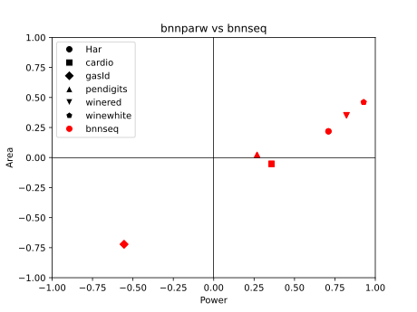

The cost of the adder graph in the fully parallel designs scales
superlinearly with the count of input elements of the layer, at a faster
rate than multiplexers and decoders used in these sequential designs,
and the number of required registers scales about logarithmically.
It is expected then, that the advantage of a sequential to a parallel
design would also scale to the number of input features $N$.

The expense of the sequential elements is also pronounced in this
technology, and since as mentioned before it doesn't increase by much
due to additional inputs, a clear disadvantage is given to the smaller
networks, exaggerating the scaling effect.

Most of the networks under examination are small enough to be in the
range that is disadvantaged by the change, with the smallest ending up
50% larger. Only the largest model's
network, with 128 input features, is clearly gaining anything from this
trade-off, as the sequential design takes up 70% less area. 

Perhaps the upfront cost can be lessened, which would be bring littler
networks into the range that benefits from this sequential design area
wise. Even if the way to achieve this ends up diminishing the scaling
benefits described above, it can be applied only to models with $N$
lower than a threshold, so it would not be an issue.

\newpage

### Removing the weight array


The process used in the second layer in the previous part, where each
neuron gets its own multiplexer over normal and inverted input hidden
features in order to have no need of a weight memory, is here applied to
the inputs of the first layer as well.

For a hidden neuron $h_i$ the $j$-th data line in its multiplexer will
be denoted $x_{i,j}$. The data lines of the multiplexer will be 5 bit
signed integers, so they can represent the values of the 4 bit input
features as well as their negatives. Similarly to how a data line in the
second layer described above would be set to either $s_k$ or $\neg s_k$,
the data lines in the first layer are set as such:

$$
x_{i,j} = \begin{dcases}
    x_j,& \text{if } W1_{i,j} = 1\\
    -x_j,& \text{if } W1_{i,j} = -1
\end{dcases}
$$

The adder-subtractors and the weight array with the decoders that
selected the control signals from them are removed. Since the input is
taken already negated when appropriate, only an adder is needed for the
accumulator.

Although some up-front costs are gone, the extra machinery to negate
each input feature and for the custom multiplexers makes each input more
expensive. The largest network, gasId, is as such almost doubled in
required area, but this change was aimed for the smaller networks. It
manages up to 8% improvement there, which is nowhere near enough to
break even with the parallel version.

\newpage

### Register width reduction

The number of bits the register of the accumulator of each neuron can be
reduced to the minimum required to support the range of values it
encounter in the dataset. This is exactly the same bitwidth reduction as
the one described for the parallel design. Each bit shaved off an
accumulator’s range removes a flip-flop.

Because the registers take up a significant chunk of the resources, the
improvement is more pronounced than in the fully parallel equivalent,
freeing up around 10% of the area and power across the board.

### Accumulator saturation


Since removing flip-flops by reducing the bitwidth of the registers
appears to help alleviate the up-front cost of changing to sequential
evaluation for smaller networks, expending some extra combinatorial
logic to lead to further shortening can be justified. The method to do
that approached here is by saturating the results of the addition
between the previous running total stored in the register and the new
input feature to stay in the bounds of a smaller range.

The result $h_i$ that is found for the neuron $i$ at the end of the
layer's evaluation does not need to be the actual weighted sum of the
input features it is supposed to represent. Since binarization of the
result occurs before it is passed to the next layer, an approximate
result does not lead to an error in the neuron's output $s_i$ as long as
it still has the same sign as the original.

If at some cycle during the layer's evaluation the absolute value of the
running total becomes sufficiently large, it becomes unlikely that the
remaining features will add up to be even larger in the opposite
direction without overshooting the difference by some distance. This
means we can saturate the intermediate results to a range $[-2^r,2^r-1]$
without much risk the final aggregate having the wrong sign.

Take the case where $k$ is the last cycle the value of the accumulator
gets saturated to $-2^r$. In order for an error in the output to occur
because the sign of the accumulated value in the end flips to positive
when it would not if the full range of values was supported, the weighted
sum of the remaining features that will be added in the next cycles must
be larger than $2^r$, but smaller than the true running total.

$$ 2^r \leq \sum_{j=k}^{N-1} \leq \sum_{j=0}^{k-1} $$

The smallest value of $r$ is found for each neuron such as this case or
its equivalent in the opposite direction do not occur for any samples in
the dataset. The bitwidth of the accumulator of that neuron is then set
to $r+1$ and the results of the addition of a feature are saturated to
that range using the DW_addsub_dx module from designware, if and only if
$r+1$ is smaller than the width the neuron was previously reduced to
that fit it's entire range of values. In the case that width is the same
as $r+1$, saturating the values is not allowing the flip-flops of the
accumulator to decrease and there is no benefit to incur the extra logic
of implementing saturation for this neuron.


### Results and analysis

|           |   bnnseq area(cm²) |   bnndsat area(cm²) | area change   |   bnnseq power(mW) |   bnndsat power(mW) | power change   |
|:----------|-------------------:|--------------------:|:--------------|-------------------:|--------------------:|:---------------|
| Har       |              29.55 |               24.02 | -18.7%        |              132.7 |               109.2 | -17.7%         |
| cardio    |              31.47 |               24.77 | -21.3%        |              143.1 |               118.7 | -17.1%         |
| gasId     |              47.67 |               81.05 | +70.0%        |              216.8 |               318.9 | +47.1%         |
| pendigits |              34.71 |               29.79 | -14.2%        |              139   |               121.6 | -12.5%         |
| winered   |              29.57 |               23.02 | -22.2%        |              131.7 |               104.5 | -20.7%         |
| winewhite |              29.75 |               22.43 | -24.6%        |              128.6 |                98.5 | -23.4%         |

Table: Effect of the mentioned improvements to the sequential design

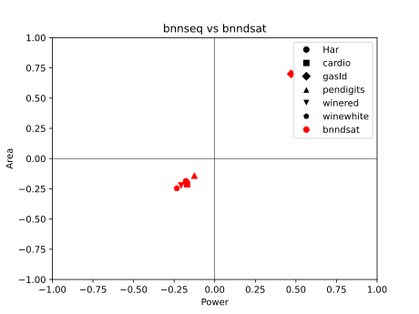

After these improvements, 4 out of the 6 networks demand less area in
the sequential design than in the parallel one. But the impovement is
not substancial enough to justify evaluation taking up many more cycles,
and the power is still not competitive with the parallel designs. This
tells me that this version of sequential designs is not salvageable. A
different process of splitting the workload among cycles must be
constructed from the ground up.

\newpage

## Single adder tree sequential evaluation

### Rationale

Since the previous attempt where all neurons update in parallel
on a single input feature each cycle did not pan out, the clear next
candidate is an arrangement where a single neuron of the layer updates
on all input features in parallel in a given clock cycle. This means
that a single adder tree will calculate the total value of a neuron
$h_i$ by summing up the weighted features in a single cycle, and perform
the same for a different neuron of the same layer in the next cycle.

This way the adder graph that encompasses the calculations required for
the entire layer in the fully parallel version gets reduced to the adder
tree a single neuron's inference demands. This can more than make up for
the encoding of weighting the features appropriately before their
accumulation than must now be done since the operations are not simply
hard-coded into the circuit.

### Implementation


The multiplexing that was described in the previous sequential design 
is rearranged here in the sense that the $M$ multiplexers with $N$ data
lines each turn into $N$ multiplexers of $M$ elements. Instead of a
multiplexer belonging to a certain neuron and selecting the weighted
feature that neuron should increment by this moment, now a multiplexer
corresponds to a specific input feature and selects which "weighting" of
that feature the currently examined neuron needs. It is analogous to
having the axis flipped.

Let's call the value selected to represent the $j$-th input feature on
the $i$-th cycle of the layer's evaluation $x_{i,j}$. The way it is
derived from the original input $x_j$ is as stated before:

$$
x_{i,j} = \begin{dcases}
    x_j,& \text{if } W1_{i,j} = 1\\
    -x_j,& \text{if } W1_{i,j} = -1
\end{dcases}
$$

The functional difference is that the counter is indexing on the value
$i$ instead of $j$. Like before the negation only happens once per
input.

The selected weighted inputs are then parsed by a generic $N$ input
adder tree that provides the sign of their sum, on the $i$-th cycle $s_i
= sign(\sum_{j=0}^{N-1} x_{i,j})$. Only the sign bit needs to be stored
to be available to following calculations by the next layer, the
pre-activation value $h_i$ can be safely discarded. A 1-bit register is
thus indexed by the counter to store the current neuron's output. This
process takes as many cycles to evaluate a layer as count of its
neurons, so $M$ clock cycles for the first layer.

A close to identical system as the previous approach detects when the
last neuron of the layer has finished operations and passes the torch to
the next layer to start. The next layer conditionally inverts the input
features it receives before passing them to multiplexers' data lines on
the logic the first layer negates them.

On the second and final layer results do not need to be stored at all.
Because the output of neurons is calculated one at a time, the argmax
operation can be embedded in this process. Two registers are used, one
holding the largest output of a neuron seen so far $y_{max}$ and the
other the index of the aforementioned neuron in the layer, which is
taken from the value of the cycle counter of the layer.

If the result of the popcount operation on the current weighted inputs
on the $i$-th cycle of the second layer's activity $y_i$ is greater than
the previous best $y_{max}$, the new result is stored as the new best so
far and the index is overwritten by the cycle count $i$. Beyond saving a
lot of flip-flops the overhead of the additional argmax module that had
to be activated after the second layer is removed.

The second layer takes as many cycles as classes to be examined for
prediction. The full inference therefore takes up $M+C$ clock cycles.
Again a reset signal must be given between successive inferences.

### Results and analysis 

|           |   bnnparw area(cm²) |   bnnrolx area(cm²) | area change   |   bnnparw power(mW) |   bnnrolx power(mW) | power change   |
|:----------|--------------------:|--------------------:|:--------------|--------------------:|--------------------:|:---------------|
| Har       |               24.25 |                9.14 | -62.3%        |                77.6 |                39   | -49.7%         |
| cardio    |               33.21 |               11.1  | -66.6%        |               105.4 |                45.5 | -56.8%         |
| gasId     |              171.37 |               42.12 | -75.4%        |               486.9 |               142.4 | -70.8%         |
| pendigits |               33.97 |               10.69 | -68.5%        |               109.6 |                43.5 | -60.3%         |
| winered   |               21.87 |                8.85 | -59.5%        |                72.3 |                38.9 | -46.2%         |
| winewhite |               20.36 |                8.65 | -57.5%        |                66.7 |                37.5 | -43.8%         |

Table: Comparison of single adder tree sequential designs with equivalent combinatorial designs.

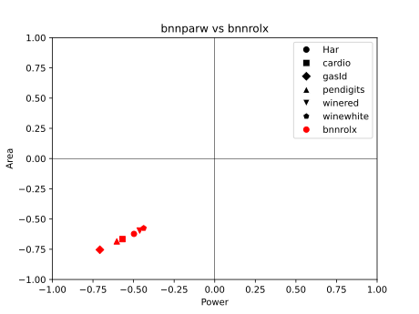

A large improvement on the previous sequential design method, using a
single adder tree gets us 60 - 75% smaller footprints than the fully
parallel circuits. Given the delay of the inference has been multiplied
by a factor between one and two orders of magnitude this trade-off is
kind of underwhelming. Like before an upfront cost in multiplexers /
weight storage has to be paid upfront, and since the sizes of the
networks are on the small side the scaling savings of reusing logic
accross neurons do not deliver in full. The constraint reminds me of
Amdaul's law, where instead of the speedup achievable by providing N
parallel cores being limited by the ratio of the computation that is
sequential, the resource savings are constrained by the ratio of
hardware that can be shared between the N parallel cores.

Combinations of sequential approaches on the two layers where also
tested to confirm that it was an improvement for both of them.

\newpage

### Deconstructing input negation


Negating each input involves a 4 bit increment-by-1 circuit per feature. 
Although it does not sound very alarming it is still an expense that
scales with the input count $N$. The negation operation can be
deconstructed into inverting the input and adding 1 to the result. If
instead of providing the negative of the input as the result of
multiplying by the appropriate weight to the multiplexer the inverse of
all the bits of the input are provided, entire section simplifies into a
1-bit look up table indexed by the cycle counter whose output gets
XOR'ed with all the bits of the input feature. This saves some logic.

In order to not risk errors from this approximation a correction term
$b_i$ needs to be added to the sum, equal to the number of 1s that were
not added to negate in this cycle, or the count of elements of the
weight row that belongs to the currently computed hidden neuron that are
-1.

$$ b_i = \sum_{j \in W1_i} [j = -1] $$
$$ h_i = \sum_{j=0}^{N-1} x_j \oplus \neg bin(W1_{i,j}) + b_i $$

\newpage

### Shifting registers for timekeeping


Instead of having a decoder from the cycle counter's current value $i$
select the register to which the binary post-activation output $s_i$ of
the neuron that was computed will be saved, it is simpler to use a
shifting register. Each cycle the previously held values are shifted one
position to the right and the result of the current evaluation is saved
to the left-most position of the register. After $N$ cycles pass the
right-most position of the register contains the result of the first
neuron's evaluation that has been shifted $N-1$ positions and all
outputs are in their proper place. The flag that halts the operation of
the first layer is then set and the results are frozen in place to be
used by the next layer.

The inclusion of a shifting register where the values set on
initialisation are discarded provides and opportunity to shed the cycle
counter altogether. When the reset signal brings the registers to
their pre-set values we assign the left-most bit to be 1 and all the
rest to 0. The position of the most significant 1 in the register is
shifted once to the right every cycle. By utilising a simple one-hot
equivalent of a priority encoder a $M$ bit signal of a one hot
representation of the current cycle count is produced.

This one hot signal can be used to detect when the final neuron is
evaluated and layer transition flag ought to be set, and can select the
weight row for the at the moment computed from the lookup table without
requiring a decoder from the cycle counter. This lets the counter to be
retired, without requiring extra state keeping elements to preserve its
functionality.

### Tristate weight memory


Every input feature gets the current weight bit from an open bus to
which a tristate buffer for each entry in the feature’s column in
the weight matrix is connected. Each buffer corresponds to a single
element of the weight matrix $W1$. The tri-buffer that holds the value
of $W1_{i,j}$ has its output connected to the same open bus as the other
buffers that hold a weight in $W1_{:,j}$ and activates by the $i$-th bit
of the one-hot select signal from above.

The goal of this is to avoid the nested OR gates that are used to reduce
the selected value of the column into one bit in the standard look up
table implementation.

### Results and analysis

|           |   bnnparw area(cm²) |   bnnrospine area(cm²) | area change   |   bnnparw power(mW) |   bnnrospine power(mW) | power change   |
|:----------|--------------------:|-----------------------:|:--------------|--------------------:|-----------------------:|:---------------|
| Har       |               24.25 |                   7.82 | -67.8%        |                77.6 |                   31.7 | -59.1%         |
| cardio    |               33.21 |                   9.3  | -72.0%        |               105.4 |                   36   | -65.8%         |
| gasId     |              171.37 |                  37.31 | -78.2%        |               486.9 |                  124.4 | -74.5%         |
| pendigits |               33.97 |                   9.08 | -73.3%        |               109.6 |                   35.1 | -68.0%         |
| winered   |               21.87 |                   7.61 | -65.2%        |                72.3 |                   30.9 | -57.3%         |
| winewhite |               20.36 |                   7.49 | -63.2%        |                66.7 |                   30.9 | -53.7%         |

Table: Comparison of the final sequential designs to the final combinatorial designs


These changes give a 10-20% decrease in area and power requirements
compared to the initial single adder tree implementation. With the use
of tristate buffers the power saving goes up to ~35% but at a very harsh
area penalty of 10-30% compared to the first design. I think the
explanation for this is that more tristate buffers are required than OR
gates since logical simplifications cannot be made on them, but the
considerable switching power consumption from the intermediate nets that
connect nested OR gates is removed. This trade-off allows to optimise
for whichever of area and power is the largest bottleneck to the desired
application.

Most importantly for our purposes, none of the models could be powered
by a 30mW Molex battery using a conventional LUT for the weights. After
implementing the LUT using tristate buffers, 5 out of the 6 can be
powered by it. Although not coming cheaply in terms of area, the power
savings were critical for overcoming this barrier.

All in all compared to the fully parallel designs requirements are
reduced $3-5\times$. This opens up the space of implementable
applications. The relative savings would get considerably better for
larger networks given the scaling observed.

\begin{figure}
  \centering
\begin{tikzpicture}
    \filldraw[pattern=north west lines] (0, 0) rectangle (5.8, 5.8);
    \filldraw[pattern=north west lines] (7, 0) rectangle ++(2.9, 2.9);
\end{tikzpicture}
\caption{Actual size comparison of the estimated area of the printed designs for the
pendigits dataset's model. Parallel on left, sequential on right.}
  \label{fig:your-label}
\end{figure}

\newpage

# Ternary weight networks

## Rationale

Ternary Neural Networks (**TNNs**) use weights and activations in the
range of {-1, 0, 1} instead of the {-1, 1} of BNNs. This enables much
greater representational ability, and thus higher accuracies are
achievable.When computed with CPUs or GPUs the inclusion of the 0 makes
the bit-level operations that make BNNs so compute friendly not
applicable, since the activations and weights now take up two bits and
their MAC operations are not reducible to XNORs and popcounts. With
hardware dedicated to running TNNs implemented in FPGAs or ASICs more
optimizations can be made, but the efficiency is still sub-par compared
to binary networks.

In our case the designs are fully bespoke to a single model/set of
weights. This enables the isomorphism between ternary weight networks
and sparse binary weight networks to be exploited, since connections
removed from the sparse network can be omitted from the design upfront,
something that is not doable in the case that all models of a certain
architecture must be supported.

For the single-cycle / fully combinatorial designs this translates to
fewer arithmetic operations to build components for. The model accuracy
and the resulting circuit's area / power demands are both improved in
this way by switching to ternary weights, pretty good deal.

Only the weights but not the activations will be ternarized in this
implementation. The additional model ability achieved by using ternary
activations for the hidden layer on top of the weights was not
significant enough to justify the suspected cost of implementing 2-bit
arithmetic in the subsequent layer.

\newpage

## Fully combinatorial implementation


After training the same datasets with the same parameter counts using
ternary instead of binary weights the equivalent weight matrices $W1 \in
\{-1,0,1\}^{M,N}$ and $W2 \in \{-1,0,1\}^{C,M}$ are used to define the
desired operations similarly to the binary counterparts:

$$
h_i = \sum_{j=0}^{N-1} \begin{dcases}
    + x_j,& \text{if } W1_{i,j} > 0\\
    - x_j,              & \text{if } W1_{i,j} < 0
\end{dcases}
$$

$$
y_i = \sum_{j=0}^{M-1} \begin{dcases}
    s_j,& \text{if } W2_{i,j} > 0\\
    \neg s_j,              & \text{if } W2_{i,j} < 0
\end{dcases}
$$

In the first layer for connections that have weights of 0 neither
addition nor subtraction is actualised for the feature in the neuron's
specified expression. It is simply ignored since it always contributes 0
to the sum.

Some neurons turn out to have all their non-zero weights have the same
sign, either all being 1 or all -1. In such a case since the input
features are all positive the sign of the multiply-accumulate result for
this neuron will always be the same. So the outputs of these neurons are
hardcoded into constants to avoid unnecessary overhead.

In the second layer, as well, connections with weights equal to zero get
neither the hidden feature they connect to nor it's inverse included in
the related output neuron's popcount. The required logic is thus reduced
in both layers by each connection severed.

Remember the linear transformation used to go from sums
weight-activation products of {-1,1} to popcounts of XNORs that now
encode the values that would be -1 as 0. To achieve $-1\to 0$ and $1\to
1$ $f(x) = \frac{(x+1)}{2}$ is that linear transformation. When applied
to an array $v \in \{-1,1\}^M$ binary values the sum is:

$$ \sum_{i=0}^{M-1} f(v_i) = \sum_{i=0}^{M-1} (v_i+1)/2 =
\frac{1}{2}\sum_{i=0}^{M-1} v_i+1 = \frac{1}{2}\sum_{i=0}^{M-1} v_i +
\frac{M}{2} $$

In the last layer, that in this case is the second one, so far the
number of inputs of all output neurons was the same, thus the factor
$\frac{M}{2}$ could be omitted when comparing outputs between the
neurons and the XNOR/popcount results can be used directly for the
argmax calculations.

Now, since the output neurons are treated as sparse binary ones, they no
longer have the same input count and therefore the constant term
$\frac{M}{2}$ is no longer the same for the whole layer. The issue can
also be described as elements with value 0 included in the vector $v$
contributing $f(0) = \frac{1}{2}$ each to the sum after the linear
transfomation, which is not reflected by ignoring them completely as
done here.

In order to fix this issue a correction term equal to $\frac{z_i}{2}$
ought to be added to the result the XNOR/popcount computation gives,
where $z_i$ denotes the number of elements in the weight row of the
$i$-th output neuron $W2_i$. This term can be large compared to the
value of the popcount when a neuron is sparse enough, so instead we can
add $\frac{z_i - \min\limits_{j=0}^{M-1} z_j}{2}$ as a smaller
correction term, so the neuron with the least severed connections gets
nothing added to it's popcount and the rest get theirs based on how many
extra zeroed weights they contain compared to it.

In the design this is done by shifthing the result of the popcount once
to the left and adding the count of zeroes over the minimum as is to
it, giving us $2y_i + (z_i-\min\limits_{j=0}^{M-1} z_j)$. The results
of the neurons can now be compared correctly.

If we were dealing with a layer that was using XNOR and popcount that
was not the final one the correction term $\lceil \frac{z_i -
\min\limits_{j=0}^{M-1} z_j}{2} \rceil$ would instead be used as the
threshold for binarization of the neuron's output instead of 0.

## Results and analysis

|           |   bnnparw area(cm²) |   tnnparsign area(cm²) | area change   |   bnnparw power(mW) |   tnnparsign power(mW) | power change   |
|:----------|--------------------:|-----------------------:|:--------------|--------------------:|-----------------------:|:---------------|
| Har       |               24.25 |                  13.4  | -44.7%        |                77.6 |                   42.7 | -45.0%         |
| cardio    |               33.21 |                  19.21 | -42.2%        |               105.4 |                   62.4 | -40.8%         |
| gasId     |              171.37 |                 101.65 | -40.7%        |               486.9 |                  297.1 | -39.0%         |
| pendigits |               33.97 |                  29.43 | -13.4%        |               109.6 |                   95.8 | -12.6%         |
| winered   |               21.87 |                  11.78 | -46.1%        |                72.3 |                   40   | -44.7%         |
| winewhite |               20.36 |                   9.53 | -53.2%        |                66.7 |                   32.8 | -50.8%         |

Table: Performance of the ternary weight combinatorial implementation compared to the binary combinatorial


Thanks to the removal of terms from the arithmetic operations that
define the design of the layers the area and power requirements were
almost halved compared to the fully combinatorial designs of the binary
models that were trained on the same datasets as the ternary ones. The
accuracy was also improved across the board while at it.

Unfortunately applying bitwidth reduction or pre-synthesis arithmetic
optimization underperformed the original TNN circuits, even for datasets
whose binary network implementations where improved by these methods.
There is nothing to note on the implementation of these since no change
needs to be made to accommodate TNNs. I am not sure what to make of this
yet.

The attempts at sequential designs for ternary weight networks do not
perform to a satisfactory level so they won't be expanded on.

\newpage

# Experimental setup

## Data preparation

The files that comprise the 7 datasets described in the preliminaries
where procured from the UCI repository. Afterwards using the
descriptions of what each feature of the tabular dataset represents
categorical features that could not correspond to a sensor's output are
descarded. Additionally features that are constant or near constant (for
example only 3 samples in the whole dataset have a different value for
this feature from the rest) are removed since they could not provide
useful information.

For each feature the range of values is then normalised in the $[0,1]$
range so the features use similar scales. These values are then
quantised in 4 bit precision by the formula $\lfloor x * (16-\epsilon)
\rfloor$, taking integer values in the range $[0,15]$. This way the data
is treated during training as if seen from a 4-bit ADC interpreting a
sensor's analog output, like it is supposed to be under inference
conditions.

The labels for each sample are enumerated so they take the range
$[0,C-1]$, which will later help with making the selection of the
predicted class's index by the argmax module simpler. All of the
datasets are finally converted into a standard format, that of a CSV
file with one sample per row and feature per column and labels as the last column. 

## Training

The datasets are split randomly with a predetermined seed into a 70-30
split of training and test data.

All the training splits of the datasets are passed from a grid
hyperparameter search using 5 fold cross validation provided by scikit
learn to find the best performing configuration set. This selected
hyperparameter configuration is then used to train the final model. Ten
training runs are performed with the previous training split getting
further divided into a smaller training split and a validation split.
The model originating from the training run of the ten that achieves the
highest validation accuracy is chosen as the result of the whole
training process. The accuracy achieved by this model on the test split
is reported as the accuracy of the learned classifier.

The actual model was initially implemented using the Larq framework for
quantised models and afterwards switched to using the similar Qkeras
framework after it was empirically found to achieve higher performing
classifiers.

Interestingly the models that were trained under the Larq framework
benefited from the inclusion of a batch normalisation layer whereas
models trained with the Qkeras framework had their performance hindered
by it. I have not yet found a convincing explanation for this
difference. I will note here that not using a batch normalisation layer
after the hidden layer is what allows the threshold that the output of
the first layer's neurons are compared to in order to produce their
binarized output to be always zero. So this discrepancy was another
point for the preference of Qkeras over Larq.

## Parameter optimization and encoding

The models resulting from the above process are stored in a
predetermined location that is accessible by the script that uses the
weight matrices and architecture details obtained by the saved model
plus as well as the original dataset in order to compute some derivative
information, such as the minimum required bitwidth of neurons or the
order of operations given by preemptive optimization. These auxiliary
results are then passed to the script that encodes them as well as the
raw weight matrices into a form that can be used as part of template
verilog file.

This can take the form of writing out bespoke verilog instructions to
implement the calculations necessary that are specific to the model.
More commonly this information is formatted as parameters that can be
imported into the verilog template and determine the actualised
primitives and submodules that get instantiated and their connections
via conditionals in generate blocks.

Both styles are equally able to describe the desired actualised design
and either style can be used for any occasion the other can. In practice
generating verilog instructions was found to be more convenient for the
simpler fully parallel designs, and parameterised modules were more
easy to work with for the rest of the cases.

## Design instantiation and functional verification

The formatted custom functionality in either form described above is
embedded into a template verilog module via the use of the icarus verilog
tool as a verilog preprocessor. The result is a verilog module that
describes a custom implementation of the specific model that was used as
input. This is fully standalone and the stored model or derived
parameters are not needed from this point forward.

After the custom module is instantiated it is used to simulate
evaluation of 1000 samples from the dataset it is associated with. The
reason that only 1000 samples are used instead of the full dataset is
simply to speed up the process, since the requirements for exact
execution are not so strict in our case that it is necessary to be
fearful of a potential error that does not materialise once in 1000
samples. Even if execution of the design does not precisely match the
functionality of the original model in some edge cases as long as the
classification accuracy is not measurably affected we are in the clear.

The results of the simulation are compared to those of evaluating the
trained model in it's native framework for these same samples, and if
everything matches up the process can continue. Note that a case where
the design is found to not match the model's results is not expected to
occur during hypothetical execution of the process by an actual user,
the main goal of this simulation is for debugging purposes during
development of the design template.

## Synthesis and requirement evaluation

The custom design is synthesised using Design Compiler. The compilation
is set to prioritise area efficiency and effectively no time constraint
is given in order for timing optimizations not to interfere. The area
estimation is taken from the compiler at this stage.

The netlist that was generated then goes under a gate-level simulation
using Chronologic of the same 1000 dataset samples as the previous
functional simulation to give realistic usage data for the estimation of
the required power.

\newpage

# Results

Graphs and tables are presented here that show the area and power
requirements for the various versions of hardware implementation for the
6 datasets and their trained models. Comparisons for the effect of the
various design decisions outlined above that are not already displayed are also made.

The designs will be referred to by nicknames in the following graphs and
tables. Here is which explanation of each design corresponds to each
nickname:

Design nickname | Link to relevant description
---|---
bnnpar| [Positive negative sum](#positive-negative-sum)
bnnparsign| [Signed sum ](#signed-sum)
bnnparw| [Minimum range bit width reduction](#minimum-range-bit-width-reduction)
bnnparstepw| [Naively reducing bitwidths of intermediate results ](#naively-reducing-bitwidths-of-intermediate-results)
bnnpaar| [Preemptive arithmetic optimization ](#preemptive-arithmetic-optimization)
bnnpaarter| [Extension to support subtractions](#extension-to-support-subtractions)
bnnseq| [Sequential evaluation](#sequential-evaluation-of-layer-neurons)
bnndirect| [Removing the weight array](#removing-the-weight-array)
bnndw| [Register width reduction ](#register-width-reduction)
bnndsat| [Accumulator saturation ](#accumulator-saturation)
bnnrolx| [Single adder tree sequential evaluation](#single-adder-tree-sequential-evaluation)
bnnrolin| [Deconstructing input negation](#deconstructing-input-negation)
bnnrospine| [Shifting registers for timekeeping ](#shifting-registers-for-timekeeping)
bnnrobus| [Tristate weight memory ](#tristate-weight-memory)
tnnparsign| [Ternary weight networks](#ternary-weight-networks)

For comparison with the results of other works *tnnparsign* has been
selected as the representative of parallel designs and *bnnrospine* as
the final sequential design. Although it does not hit the power
requirements of the Molex 30mW battery like *bnnrobus* does using
tristate buffers, it has a better balance between area and power and
thus is a better representative.

\newpage

## Model predictive performance

| Dataset     |    full precision |    BNN |    TNN |  MLPC   |
|:------------|------------------:|-------:|-------:|:--------|
| cardio      |                92 |     88 |     90 | 88      |
| gasId       |                90 |     81 |     88 | -       |
| Har         |                74 |     51 |     52 | -       |
| pendigits   |                99 |     87 |     92 | 94      |
| redwine     |                60 |     54 |     58 | 56      |
| whitewine   |                57 |     51 |     50 | 54      |

Table: Comparison of test split accuracies between the binary neural network models(BNN), ternary models(TNN),
equivalant full precision networks and the multilayer perceptron classifiers evaluated in [@fn21](MLPC).

As shown in the table above the binary and ternary networks achieve
classification accuracies competitive with the ones by higher precision
networks that have been implemented in printed electronics. This shows
that the quality of their prediction should be acceptable for the
applications they support. It should be noted that the number of neurons
used by the BNNs and TNNs is about 10x the count of neurons of the
higher precision networks in the comparison.

## Delay of combinatorial and sequential designs

| dataset   |    combinatorial delay(ms) |    sequential delay(ms) |    sequential cycles |    total sequential delay(ms) |
|:----------|---------------------------:|------------------------:|---------------------:|------------------------------:|
| cardio    |                        142 |                     147 |                   43 |                          6321 |
| gasId     |                        260 |                     181 |                   46 |                          8326 |
| Har       |                        165 |                     135 |                   46 |                          6210 |
| pendigits |                        309 |                     147 |                   50 |                          7350 |
| winered   |                        160 |                     138 |                   46 |                          6348 |
| winewhite |                        143 |                     129 |                   47 |                          6063 |

Table: Comparison of single cycle delay and total inference time between combinatorial and sequential implementations.

As seen in the table above parallel designs can function at 3 to 7 Hz,
whereas sequential designs can only run inference every 6 seconds or
more. For certain applications such as wine quality estimation and gas
identification this is quick enough to get the job done, but for example
written digit identification has much faster changing inputs and this
delay is not acceptable. So whether the delay sacrifice to enable area
and power savings is worth it depends a lot on the specifics of the
usecase.

## Comparative analysis: Cross-Layer Approximation For Printed Machine Learning Circuits [@fn21]

The area and power demands of the final parallel and sequential designs
are compared to the results achieved in [@fn21], described in the
[Related works](#related-works-in-machine-learning-for-printed-circuits)
section at the start, which is considered the starting point for this
work.

The edge in metrics is split across the datasets for the fully
parallel designs. Some models perform better in one and some in the
other. On average it I will call it a tie.

|           |   mlpc area(cm²) |   tnnparsign area(cm²) | area change   |   mlpc power(mW) |   tnnparsign power(mW) | power change   |
|:----------|-----------------:|-----------------------:|:--------------|-----------------:|-----------------------:|:---------------|
| cardio    |               17 |                  19.21 | +13.0%        |               54 |                   62.4 | +15.6%         |
| pendigits |               46 |                  29.43 | -36.0%        |              153 |                   95.8 | -37.4%         |
| winered   |                8 |                  11.78 | +47.2%        |               27 |                   40   | +48.1%         |
| winewhite |               13 |                   9.53 | -26.7%        |               42 |                   32.8 | -21.9%         |

Table: Comparison of final parallel designs with the results from [@fn21]

![Comparison of final parallel designs with the results from [@fn21]](figs2/mlpc_tnnparsign.svg)

Sequential designs take a clear lead in area and power, in the case of
pendigits showing a 5x improvement. Unfortunately the time required to
perform all the cycles of sequential inference makes the circuit too
slow to be useable in cases such as pendigits, so this improvement has
fallen to Goodhart's law.

|           |   mlpc area(cm²) |   bnnrospine area(cm²) | area change   |   mlpc power(mW) |   bnnrospine power(mW) | power change   |
|:----------|-----------------:|-----------------------:|:--------------|-----------------:|-----------------------:|:---------------|
| cardio    |               17 |                   9.3  | -45.3%        |               54 |                   36   | -33.3%         |
| pendigits |               46 |                   9.08 | -80.3%        |              153 |                   35.1 | -77.1%         |
| winered   |                8 |                   7.61 | -4.9%         |               27 |                   30.9 | +14.4%         |
| winewhite |               13 |                   7.49 | -42.4%        |               42 |                   30.9 | -26.4%         |

Table: Comparison of final sequential designs with the results from [@fn21]

![Comparison of final sequential designs with the results from [@fn21]](figs2/mlpc_bnnrospine.svg)

## Further comparison with relevant literature

Here both the parallel and sequential designs are compared to further
relevant works on printed networks that were described in 
[Related works](#related-works-in-machine-learning-for-printed-circuits)
. This includes both the initial bespoke networks from [@fn20] and
improvements made to the results of [@fn21] that were compared to in
greater detail above. This gives a sense of where this work is placed
compared to the current state of the art.

As it appears even with taking two orders of magnitude longer to
compute the products of this work are not competitive with the state of
the art results for the same datasets, in the case of redwine even being
outdone by almost a factor of 10.

|           |   baseline |   mlpc |   crossax |   retrain |   tnnparsign |   bnnrospine |
|:----------|-----------:|-------:|----------:|----------:|-------------:|-------------:|
| cardio    |       33.4 |     17 |      17   |       6.1 |         19.2 |          9.3 |
| winered   |       17.6 |      8 |       8   |       1.1 |         11.8 |          7.6 |
| winewhite |       31.2 |     13 |      13.6 |       6.5 |          9.5 |          7.5 |

Table: Area comparison of the final parallel and sequential designs to the SOTA in printed MLPs.
baseline is [@fn20], mlpc is [@fn21], crossax is [@modelcircuit] and retrain is [@codesign].

|           |   baseline |   mlpc |   crossax |   retrain |   tnnparsign |   bnnrospine |
|:----------|-----------:|-------:|----------:|----------:|-------------:|-------------:|
| cardio    |      124.2 |     54 |      48.9 |      20.8 |         62.4 |         36   |
| winered   |       73.5 |     27 |      18.8 |       3.9 |         40   |         30.9 |
| winewhite |      126.4 |     42 |      43.2 |      21.3 |         32.8 |         30.9 |

Table: Power comparison of the final parallel and sequential designs to the SOTA in printed MLPs.
baseline is [@fn20], mlpc is [@fn21], crossax is [@modelcircuit] and retrain is [@codesign].


## Supplementary results

### Combinatorial designs area comparisons

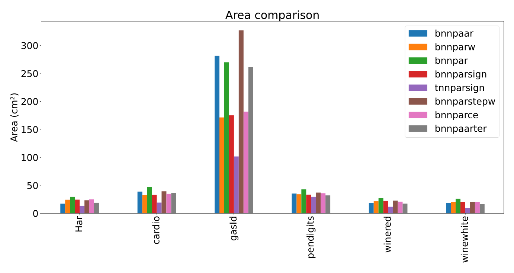

|             |   Har |   cardio |   gasId |   pendigits |   winered |   winewhite |
|:------------|------:|---------:|--------:|------------:|----------:|------------:|
| bnnpaar     | 17.42 |    38.74 |  281.55 |       35.43 |     18.55 |       18.01 |
| bnnparw     | 24.25 |    33.21 |  171.37 |       33.97 |     21.87 |       20.36 |
| bnnpar      | 29.4  |    46.71 |  269.76 |       42.95 |     27.82 |       26.01 |
| bnnparsign  | 24.52 |    33.27 |  175.09 |       33.38 |     22.45 |       20.47 |
| tnnparsign  | 13.4  |    19.21 |  101.65 |       29.43 |     11.78 |        9.53 |
| bnnparstepw | 23.16 |    39.29 |  326.98 |       37.09 |     22.78 |       20    |
| bnnparce    | 24.99 |    34.84 |  181.82 |       35.74 |     20.76 |       20.48 |
| bnnpaarter  | 18.73 |    35.97 |  261.38 |       32.22 |     17.47 |       16.65 |

Table: Comparison of area requirements between the discussed fully
parallel designs.

### Combinatorial designs power comparisons

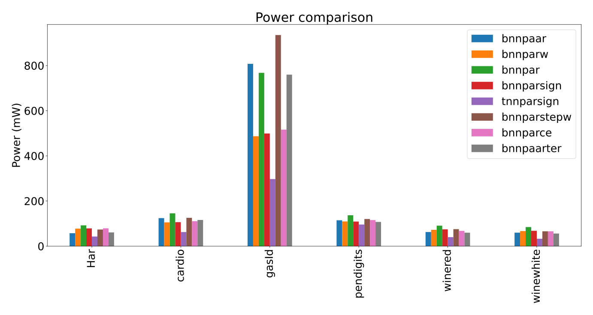

|             |   Har |   cardio |   gasId |   pendigits |   winered |   winewhite |
|:------------|------:|---------:|--------:|------------:|----------:|------------:|
| bnnpaar     |  57.2 |    124.1 |   807.6 |       114.6 |      62.6 |        59.8 |
| bnnparw     |  77.6 |    105.4 |   486.9 |       109.6 |      72.3 |        66.7 |
| bnnpar      |  92.1 |    145.3 |   767.7 |       136.8 |      90.7 |        84.6 |
| bnnparsign  |  78.8 |    106.2 |   499.1 |       108.9 |      74.6 |        68   |
| tnnparsign  |  42.7 |     62.4 |   297.1 |        95.8 |      40   |        32.8 |
| bnnparstepw |  73.7 |    125.5 |   935.2 |       120.3 |      75.3 |        65.8 |
| bnnparce    |  79   |    110.5 |   516.1 |       115.5 |      67.7 |        65.8 |
| bnnpaarter  |  60.8 |    116   |   759.7 |       107.3 |      59.6 |        55.9 |

Table: Comparison of power requirements between the discussed fully
parallel designs.

### Sequential designs area comparisons

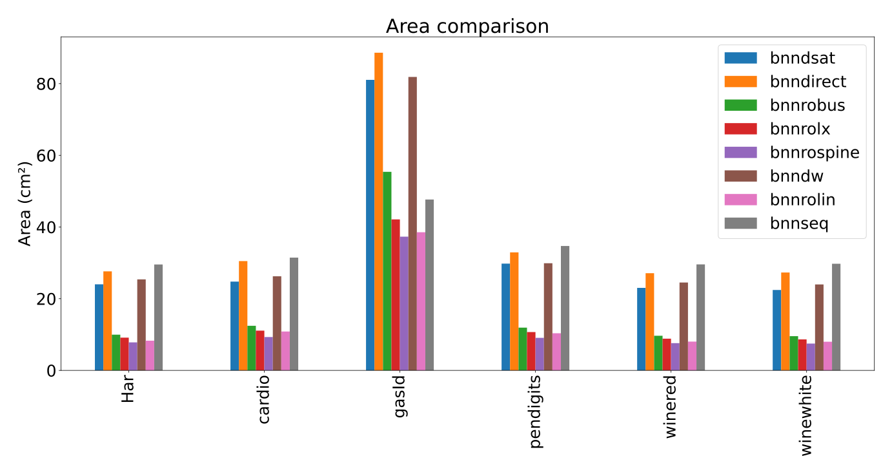

|            |   Har |   cardio |   gasId |   pendigits |   winered |   winewhite |
|:-----------|------:|---------:|--------:|------------:|----------:|------------:|
| bnndsat    | 24.02 |    24.77 |   81.05 |       29.79 |     23.02 |       22.43 |
| bnndirect  | 27.63 |    30.5  |   88.62 |       32.93 |     27.11 |       27.31 |
| bnnrobus   |  9.97 |    12.44 |   55.39 |       11.93 |      9.66 |        9.56 |
| bnnrolx    |  9.14 |    11.1  |   42.12 |       10.69 |      8.85 |        8.65 |
| bnnrospine |  7.82 |     9.3  |   37.31 |        9.08 |      7.61 |        7.49 |
| bnndw      | 25.39 |    26.26 |   81.87 |       29.9  |     24.51 |       23.98 |
| bnnrolin   |  8.29 |    10.85 |   38.54 |       10.37 |      8.04 |        8    |
| bnnseq     | 29.55 |    31.47 |   47.67 |       34.71 |     29.57 |       29.75 |

Table: Comparison of area requirements between the discussed
sequential designs.

### Sequential designs power comparisons

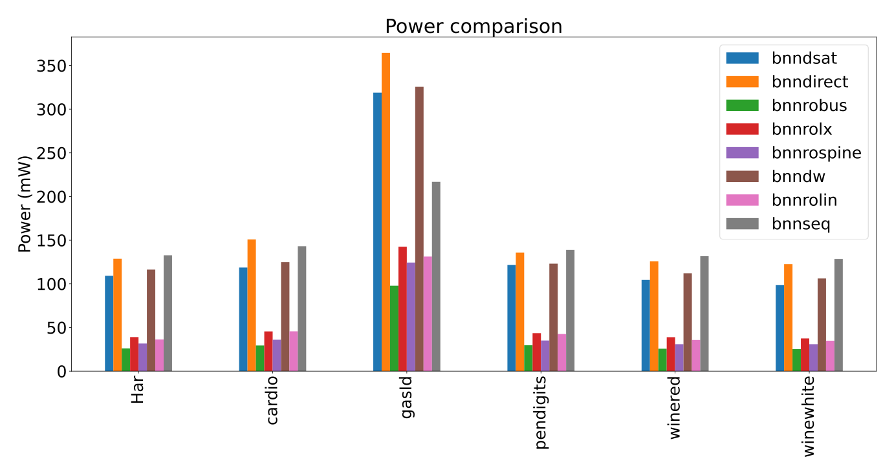

|            |   Har |   cardio |   gasId |   pendigits |   winered |   winewhite |
|:-----------|------:|---------:|--------:|------------:|----------:|------------:|
| bnndsat    | 109.2 |    118.7 |   318.9 |       121.6 |     104.5 |        98.5 |
| bnndirect  | 128.8 |    150.8 |   364.5 |       135.7 |     125.7 |       122.6 |
| bnnrobus   |  26.1 |     29.4 |    97.9 |        29.7 |      25.7 |        25.2 |
| bnnrolx    |  39   |     45.5 |   142.4 |        43.5 |      38.9 |        37.5 |
| bnnrospine |  31.7 |     36   |   124.4 |        35.1 |      30.9 |        30.9 |
| bnndw      | 116.4 |    124.9 |   325.6 |       123.1 |     112.1 |       106.2 |
| bnnrolin   |  36.3 |     45.6 |   131.3 |        42.6 |      35.7 |        34.9 |
| bnnseq     | 132.7 |    143.1 |   216.8 |       139   |     131.7 |       128.6 |

Table: Comparison of power requirements between the discussed 
sequential designs.

\newpage

### Additional table comparisons


|           |   bnnseq area(cm²) |   bnndirect area(cm²) | area change   |   bnnseq power(mW) |   bnndirect power(mW) | power change   |
|:----------|-------------------:|----------------------:|:--------------|-------------------:|----------------------:|:---------------|
| Har       |              29.55 |                 27.63 | -6.5%         |              132.7 |                 128.8 | -2.9%          |
| cardio    |              31.47 |                 30.5  | -3.1%         |              143.1 |                 150.8 | +5.4%          |
| gasId     |              47.67 |                 88.62 | +85.9%        |              216.8 |                 364.5 | +68.1%         |
| pendigits |              34.71 |                 32.93 | -5.1%         |              139   |                 135.7 | -2.4%          |
| winered   |              29.57 |                 27.11 | -8.3%         |              131.7 |                 125.7 | -4.6%          |
| winewhite |              29.75 |                 27.31 | -8.2%         |              128.6 |                 122.6 | -4.7%          |

Table: Effect of using a custom multiplexer per neuron in the first layer

|           |   bnndirect area(cm²) |   bnndw area(cm²) | area change   |   bnndirect power(mW) |   bnndw power(mW) | power change   |
|:----------|----------------------:|------------------:|:--------------|----------------------:|------------------:|:---------------|
| Har       |                 27.63 |             25.39 | -8.1%         |                 128.8 |             116.4 | -9.6%          |
| cardio    |                 30.5  |             26.26 | -13.9%        |                 150.8 |             124.9 | -17.2%         |
| gasId     |                 88.62 |             81.87 | -7.6%         |                 364.5 |             325.6 | -10.7%         |
| pendigits |                 32.93 |             29.9  | -9.2%         |                 135.7 |             123.1 | -9.3%          |
| winered   |                 27.11 |             24.51 | -9.6%         |                 125.7 |             112.1 | -10.8%         |
| winewhite |                 27.31 |             23.98 | -12.2%        |                 122.6 |             106.2 | -13.4%         |

Table: Effect of reducing the width of the first layer's registers

|           |   bnndw area(cm²) |   bnndsat area(cm²) | area change   |   bnndw power(mW) |   bnndsat power(mW) | power change   |
|:----------|------------------:|--------------------:|:--------------|------------------:|--------------------:|:---------------|
| Har       |             25.39 |               24.02 | -5.4%         |             116.4 |               109.2 | -6.2%          |
| cardio    |             26.26 |               24.77 | -5.7%         |             124.9 |               118.7 | -5.0%          |
| gasId     |             81.87 |               81.05 | -1.0%         |             325.6 |               318.9 | -2.1%          |
| pendigits |             29.9  |               29.79 | -0.4%         |             123.1 |               121.6 | -1.2%          |
| winered   |             24.51 |               23.02 | -6.1%         |             112.1 |               104.5 | -6.8%          |
| winewhite |             23.98 |               22.43 | -6.5%         |             106.2 |                98.5 | -7.3%          |

Table: Effect of applying saturation to the first layer's registers

\newpage

|           |   bnnrolx area(cm²) |   bnnrolin area(cm²) | area change   |   bnnrolx power(mW) |   bnnrolin power(mW) | power change   |
|:----------|--------------------:|---------------------:|:--------------|--------------------:|---------------------:|:---------------|
| Har       |                9.14 |                 8.29 | -9.3%         |                39   |                 36.3 | -6.9%          |
| cardio    |               11.1  |                10.85 | -2.3%         |                45.5 |                 45.6 | +0.2%          |
| gasId     |               42.12 |                38.54 | -8.5%         |               142.4 |                131.3 | -7.8%          |
| pendigits |               10.69 |                10.37 | -3.0%         |                43.5 |                 42.6 | -2.1%          |
| winered   |                8.85 |                 8.04 | -9.2%         |                38.9 |                 35.7 | -8.2%          |
| winewhite |                8.65 |                 8    | -7.5%         |                37.5 |                 34.9 | -6.9%          |

Table: Effect of deconstructing negation

|           |   bnnrolin area(cm²) |   bnnrospine area(cm²) | area change   |   bnnrolin power(mW) |   bnnrospine power(mW) | power change   |
|:----------|---------------------:|-----------------------:|:--------------|---------------------:|-----------------------:|:---------------|
| Har       |                 8.29 |                   7.82 | -5.7%         |                 36.3 |                   31.7 | -12.7%         |
| cardio    |                10.85 |                   9.3  | -14.3%        |                 45.6 |                   36   | -21.1%         |
| gasId     |                38.54 |                  37.31 | -3.2%         |                131.3 |                  124.4 | -5.3%          |
| pendigits |                10.37 |                   9.08 | -12.4%        |                 42.6 |                   35.1 | -17.6%         |
| winered   |                 8.04 |                   7.61 | -5.3%         |                 35.7 |                   30.9 | -13.4%         |
| winewhite |                 8    |                   7.49 | -6.4%         |                 34.9 |                   30.9 | -11.5%         |

Table: Effect of replacing the cycle counter with shifting registers

|           |   bnnrospine area(cm²) |   bnnrobus area(cm²) | area change   |   bnnrospine power(mW) |   bnnrobus power(mW) | power change   |
|:----------|-----------------------:|---------------------:|:--------------|-----------------------:|---------------------:|:---------------|
| Har       |                   7.82 |                 9.97 | +27.5%        |                   31.7 |                 26.1 | -17.7%         |
| cardio    |                   9.3  |                12.44 | +33.8%        |                   36   |                 29.4 | -18.3%         |
| gasId     |                  37.31 |                55.39 | +48.5%        |                  124.4 |                 97.9 | -21.3%         |
| pendigits |                   9.08 |                11.93 | +31.4%        |                   35.1 |                 29.7 | -15.4%         |
| winered   |                   7.61 |                 9.66 | +26.9%        |                   30.9 |                 25.7 | -16.8%         |
| winewhite |                   7.49 |                 9.56 | +27.6%        |                   30.9 |                 25.2 | -18.4%         |

Table: Effect of using tristate buffers for the weight memory

### Additional graph comparisons

The following graphs show the area and power measurements of the models reified via the second design normalised on the equivalent metrics from the first design type.

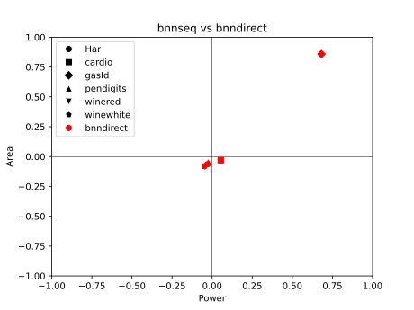

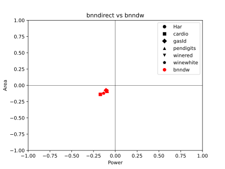

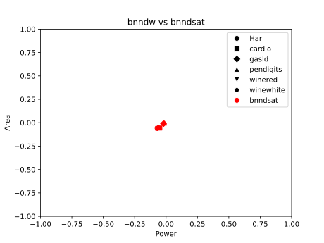

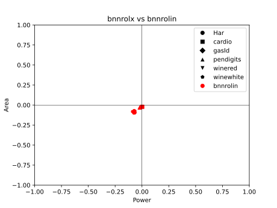

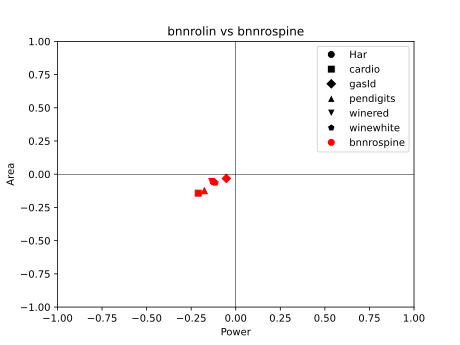

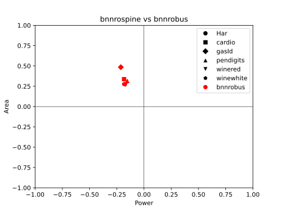

\newpage

# Bibliography
