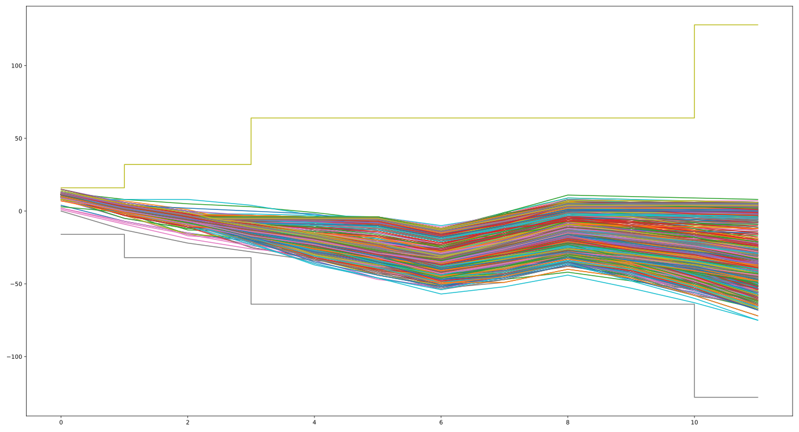

% Δυαδικά νευρωνικά δίκτυα για τυπωμένα ηλεκτρονικά
% Παναγιώτης Παπανικολάου
% 7 Ιουλίου 2023

---
header-includes:
 - \usepackage{fontawesome5}
 - \usecolortheme{whale}
 - \renewcommand{\footnotesize}{\fontsize{9pt}{10pt}\selectfont}
---

## Τυπωμένα ηλεκτρονικά \faIcon{print} \faIcon{microchip}
- Κανονική εκτύπωση με ειδικά μελάνια
- Αντένες, αισθητήρες, LED, transistors, μπαταρίες...
- Πολύ φτηνά \faIcon{thumbs-up}
- Πολύ μεγάλη έκταση/κατανάλωση  \faIcon{thumbs-down}

{width=40%}
{width=40%}
{width=40%}

## Ubiquitous computing \faIcon{globe}
### Υπολογιστικά στοιχεία **στα πάντα**.
{width=40%}
{width=40%}

### Εκτυπωμένo machine learning
- Πολλές εφαρμογές classification
- Δύσκολα υλοποιήσιμο

## Δυαδικά νευρωνικά δίκτυα(ΒΝΝ) \faIcon{network-wired}
- Weights/activations $\in \{-1,1\}$ (1 bit)
- Multiply-accumulate $\to$ XNOR-popcount
- Χαμηλές απαιτήσεις \faIcon{thumbs-up}
- Λιγότερο αξιόπιστα \faIcon{thumbs-down}

{ width=70% }

## Προηγούμενες εργασίες \faIcon{history}

- Αναλογικοί νευρώνες  [^fn1]

- Bespoke decision trees, SVMs  [^fn2]

- Bespoke approximate MLPs  [^fn3]

- Stochastic computing  [^fn4]

- Sea of gates  [^fn5]

[^fn1]: Weller et al, Programmable neuromorphic circuit based on printed electrolyte-gated transistors, in: (Asp-Dac)
[^fn2]: Weller et al, Printed machine learning classifiers, in: Annu. Int. Symp. Microarchitecture (Micro)
[^fn3]: Armeniakos et al, Cross-layer approximation for printed machine learning circuits, in: (Date)
[^fn4]: Weller et al,Printed stochastic computing neural networks, in: (Date)
[^fn5]: Iordanou et al, Tiny classifier circuits: Evolving accelerators for tabular data, (2023).

## Στόχος \faIcon{bullseye}

### Εξέταση ΒΝΝ ως προς την υποστήριξη τυπωμένου ML \faIcon{tasks}

### Υλοποίηση framework για αυτόματη δημιουργία τυπωμένου ΒΝΝ από dataset \faIcon{project-diagram}

## Model accuracy \faIcon{tasks}

| Dataset     |              FP32 |    BNN |    TNN |  MLPC   |
|:------------|------------------:|-------:|-------:|:--------|
| Cardio    \faIcon{heartbeat}                           |                92 |     88 |     90 | 88      |
| GasId     \faIcon{smog}                                |                90 |     81 |     88 | -       |
| Har       \faIcon{edit}                                |                74 |     51 |     52 | -       |
| Pendigits \faIcon{walking}                             |                99 |     87 |     92 | 94      |
| Redwine   \textcolor{red}{\faIcon{wine-glass-alt}}     |                60 |     54 |     58 | 56      |
| Whitewine \textcolor{yellow}{\faIcon{wine-glass-alt}}  |                57 |     51 |     50 | 54      |

## Παράλληλη υλοποίηση \faIcon{layer-group}

## Παράλληλη υλοποίηση \faIcon{layer-group}
### Απόπειρες βελτιστοποίησης
- Ελάχιστο πλάτος αθροίσματος για υποστήριξη dataset {height=25%} {height=25%}

- Αριθμητική βελτιστοποίηση πριν τη σύνθεση {height=25%}

## Ακολουθιακή υλοποίηση \faIcon{step-forward}
### Η καθυστέριση δεν είναι απαραίτητα σημαντική
Υπολογισμός νέου νευρώνα κάθε κύκλο

## Βελτιώσεις στην ακολουθιακή υλοποίηση \faIcon{step-forward}
- $-x \iff \neg x + 1$
- Αφαίρεση counter

## Tristate buffer memory \faIcon{battery-three-quarters}
- Μείωση ισχύος από OR, μεγαλύτερο εμβαδό
- <30mW(Μπαταρία Molex) για 5/6 model

## Delays \faIcon{stopwatch}

| dataset   |    combinatorial delay(ms) |    sequential delay(ms) |    sequential cycles |    total sequential delay(ms) |
|:----------|---------------------------:|------------------------:|---------------------:|------------------------------:|
| cardio    |                        142 |                     147 |                   43 |                          6321 |
| gasId     |                        260 |                     181 |                   46 |                          8326 |
| Har       |                        165 |                     135 |                   46 |                          6210 |
| pendigits |                        309 |                     147 |                   50 |                          7350 |
| winered   |                        160 |                     138 |                   46 |                          6348 |
| winewhite |                        143 |                     129 |                   47 |                          6063 |

## Ternary weight networks \faIcon{network-wired}
- Βάρη $\in \{-1,0,1\}$ αντί $\{-1,1\}$
- Αφαίρεση συνδέσεων με βάρος 0 \faIcon{cut}
- Καλύτερη ακρίβεια και έως $2\times$ μικρότερα κόστη \faIcon{trophy}

## Συγκρίσεις \faIcon{balance-scale-right}
{height=44%}
{height=44%}
