---
header-includes:
 - \usepackage{fvextra}
 - \usepackage{mathtools}
 - \usepackage{amsmath}
 - \usepackage{tikz}
 - \DefineVerbatimEnvironment{Highlighting}{Verbatim}{breaklines,commandchars=\\\{\}}
 - \usepackage{float}
 - \floatplacement{figure}{H}
 - \makeatletter
 - \def\fps@figure{H}
 - \makeatother
---

# Proposed framework


As outlined in the ubiquitous computing section, the deliverable of this
thesis is meant to be a framework that allows a labeled set of sensor
data to produce a fully functional printed circuit that implements a
classifier for this dataset. Due to lack of access to equipment the
actual printing is not viable in this context and the scope will be
restricted to the dataset \to netlist part of the process.

The classifier architecture will in particular be a Binary Neural
Network(BNN), explained in the preliminaries. It may not necessarily be
the most suitable architecture in every case, but it was created with
the purpose to reduce resource consumption, which is the core concern.
It was thus chosen as the niche I will be carving here.

The rough sequence of processes performing that transformation
comprises of the following:

1. Hyperparameter search: In order for a hands-off training process to
   be applicable to a vast space of possible sensor datasets for which
   printed classifiers may be desired a single generic configuration of
   training hyperparameters wont cut it. So a search must be performed
   to find a set suitable to the data distribution at hand.
2. Model training: After a useable hyperparameter configuration is found
   a model is trained under them and evaluated. If the test split
   accuracy is sufficient for the user's needs the rest of the process
   may take place. The weights and network architecture of the final
   model are passed to be processed.
3. Parameter optimization: Some pieces of information derived from the
   weights and dataset can be used to help the design avoid unnecessary
   computations. For an extreme but applied example, if a neuron never
   changes it's output based on its input activations it can be flagged
   to be replaced with a static constant assignment.
4. Parameter encoding: The weights, measures of the network architecture
   and derived assisting information are either used to produce verilog
   code that performs the computations they imply or formatted such that
   they can be read and parsed by the control mechanisms of verilog.
5. Design instantiation: A template for the type of design that ought to
   be produced gets the snippets of custom functionality and/or the
   formatted parameters needed to derive that functionality using
   generate blocks imported into it. The result is a design that is
   bespoke to the exact trained model under question.
6. Verification: A behavioural simulation of the design is performed to
   confirm that classifier accuracy is satisfactorily preserved.
7. Synthesis: An optimised netlist is produced from the HDL
   specification. A farther gate level simulation is performed to
   guarantee functionality.
8. Metric estimation: Area and power estimates are taken from the
   synthesis and simulation tools using information from the printed
   components PDK. If these demands seem to be supported by the budget
   of the usecase the user may place a printing order.

Parts of the wider procedure out of scope of this framework are:

- Printed sensor availability
- Access to printed sensor data for labeling
- Examination of other promising architectures
- Design of masks for placement of printed components
- Inclusion of sensor, ADC and output indicator resource consumption in
  reported estimates. 

The rest of the thesis will almost entirely deal with the design of
efficient bespoke BNN classifier hardware. This includes parts 3 and 5
of the process listed above. The rest, although time consuming to
implement, have no parts of interest to report on and will be summarised
in the experimental setup section.

The points that I think are helpful to be impressed upfront in order for
my following talk of HDL implementations to be comprehensible are:

- Over the course of working on the presented designs 6 models that
  correspond to 6 of the 7 datasets shown above are consistently used to
  test and compare results. The one dataset of the 7 that didn't make
  the cut was Arrhythmia, because the learned strategy of the model
  wasn't acceptable.

- All of these networks have one hidden layer that takes 4 bit inputs
  that are received from the ADCs connected to the respective sensors
  and one output layer that receives 1 bit binary inputs from the
  previous layer and produces a score for how likely each class is. An
  argmax module is also included in all of the following implementations
  to provide the index of the predicted class and is also included in
  the area/power estimates.

- All these networks have exactly 40 hidden neurons in the first layer.
  This is not reflective of an actual limitation of the framework. A
  first batch of models that were used to evaluate the designs and were
  meant to be replaced at some point ended up staying until the end.
  Initially they were kept out of inertia and past some point replacing
  them would require re-evaluating every type of design implementation
  with every new model in order for result comparisons to be
  informative, which would take a substantial usage of synthesis time
  and would halt further progress for a while.

- During synthesis a practically unlimited timing budget is allowed so
  timing optimizations do not take place and trade off against more
  important to the project goals.

- The power draw estimate is done with a gate level simulation of the
  synthesised circuit evaluating 1000 samples of the dataset to
  reproduce a realistic usage environment. The clock frequency is set to
  the critical timing frequency of the circuit reported by the synthesis
  tool.

\newpage

# Symbol definitions
- $N$ = the number of input features,  
- $M$ = the number of hidden neurons (in our case it is always 40),  
- $C$ = the number of output neurons/ number of classes  
- $S$ be the number of samples in the dataset,
- $x_i$ be the ith input feature,  
- $x_i$ be the i^*th*^ input feature,  
- $D^i$ be the i-th sample of the dataset,
- $D^i_j$ be the value the j_th_ input feature takes on the i_th_ sample
  of the dataset,
- $h_i$ be the i_th_ hidden neuron, also used to denote it's output value
before binarization,  
- $s_i$ be the i_th_ hidden neuron's output after binarization, so $s_i =
h_i \ge 0$,  
- $y_i$ be the i_th output neuron, also used to denote it's output value,  
- $W1$ = the weight matrix of the first layer,  
- $W2$ = the weight matrix of the second layer,  

Rows represent neurons and columns represent input activations,
so $W1_{i,j}$ is the weight of the first layer that corresponds to the
connection between the input feature $x_j$ and the neuron $h_i$.

\newpage

# Combinatorial fully connected implementations
Two initial approaches for implementing the fully connected BNNs
in a fully combinatorial single-cycle datapath are compared.
Only the first layer differs between them, the second layer stays
unchanged.

## Positive-Negative Sum

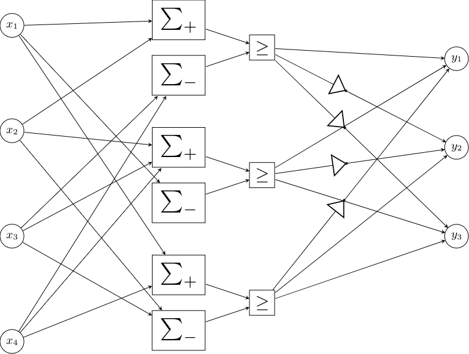

For each neuron in the first layer two sums are calculated. $\Sigma^+_i$
is the sum of the input features for which the connection with the i_th_
hidden neuron has a positive weight , whereas $\Sigma^-_i$ the sum of
those that have a negative weight associated. The two sums are then
compared and if the positive sum is greater than or equal to the
negative the output of the neuron is 1, otherwise 0.
$$ \Sigma^+_i = \sum_{j=0}^{N-1} x_j [W1_{i,j} > 0] $$
$$ \Sigma^-_i = \sum_{j=0}^{N-1} x_j [W1_{i,j} < 0] $$
$$ h_i = \Sigma^+_i \ge \Sigma^-_i $$

Sample code snippet:
```{.verilog}
assign positives[0] = + feature_array[1] + feature_array[2] + ... + feature_array[10];
assign negatives[0] = + feature_array[0] + feature_array[3] + feature_array[5];
assign hidden[0] = positives[0] >= negatives[0];
```

The reasoning behind splitting the sums is that keeping the operations
to only using unsigned positive numbers and only using addition and not
subtraction means simpler operations are required, and that may lead to
a smaller footprint.

For each neuron of the output layer it's value is calculated by summing
the output of hidden neurons. The binary output of the hidden neuron $s_j$is added as-is to the sum of the output neuron $y_i$ in the case that the weight of their connection $W2_{i,j}$ is positive and it's binary inverse is added to the sum if $W2_{i,j}$ is negative. This is equivalant to the sum of the xnor between the output vector of the hidden layer and the weight vector of the output neuron.

$$
y_i = \sum_{j=0}^{M-1} \begin{dcases}
    s_j,& \text{if } W2_{i,j} > 0\\
    \neg s_j,              & \text{if } W2_{i,j} < 0
\end{dcases}
$$

Code sample:

```{.verilog}
assign scores[0*SUM_BITS+:SUM_BITS] = + hidden_n[0] + hidden[1] + hidden[2] + ... + hidden_n[39];
```


## Signed sum

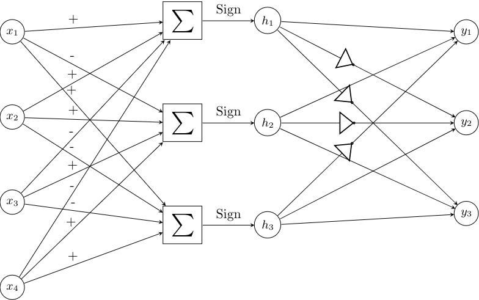

In this version a single sum is calculated for each neuron. If the
connection between input feature $x_j$ and hidden neuron $h_i$ has
weight $W1_{i,j} = 1$ it is added to the sum, otherwise it is subtracted
from it. Basically adding the feature multiplied by either 1 or -1 is
hard-coded as the resulting addition or subtraction correspondingly.
The result is then compared to zero to give the binarized output of the
neuron. Since the result is a signed number, this just means taking the
sign bit.

$$
h_i = \sum_{j=0}^{N-1} \begin{dcases}
    + x_j,& \text{if } W1_{i,j} > 0\\
    - x_j,              & \text{if } W1_{i,j} < 0
\end{dcases}
$$

Code sample:
```{.verilog}
wire signed [8:0] intra_0;
assign intra_0 = - feature_array[0] + feature_array[1] + ... + feature_array[10];
assign hidden[0] = intra_0 >= 0;
```

The second layer's implementation is not changed from how it is
described above.

## Results and analysis

|           |   bnnpar area(cm²) |   bnnparsign area(cm²) | area change   |   bnnpar power(mW) |   bnnparsign power(mW) | power change   |
|:----------|-------------------:|-----------------------:|:--------------|-------------------:|-----------------------:|:---------------|
| Har       |              29.4  |                  24.52 | -16.6%        |               92.1 |                   78.8 | -14.4%         |
| cardio    |              46.71 |                  33.27 | -28.8%        |              145.3 |                  106.2 | -26.9%         |
| gasId     |             269.76 |                 175.09 | -35.1%        |              767.7 |                  499.1 | -35.0%         |
| pendigits |              42.95 |                  33.38 | -22.3%        |              136.8 |                  108.9 | -20.4%         |
| winered   |              27.82 |                  22.45 | -19.3%        |               90.7 |                   74.6 | -17.8%         |
| winewhite |              26.01 |                  20.47 | -21.3%        |               84.6 |                   68   | -19.6%         |

Table: Comparison of single signed sum to double unsigned sums approaches


My prior expectation was that splitting the features into two sums to
avoid subtractions would lead to better results than keeping all the
operations for a neuron to a single expression by the reasoning
summarised previously. In fact it turns out that using a single sum
has area and power requirements 20-30% lower than using two.

My explanation for this is that keeping terms in separate expressions
prevents the compiler from effectively locating and reducing shared
subexpressions during synthesis. For example, if a neuron's expression
contains $+x_5+x_6-x_7$ and a different neuron contains $-x_5+x_6+x_7$
then the result of $x_5-x_7$ can be used for both neurons, but if $x_5$
and $x_7$ are not in the same expression, as they would not be in the
positive-negative sum implementation, this arithmetic optimization is
not used by the compiler. Additionally the two sums need comparators to
produce the binarized output of the neuron, whereas in the case the
signed sum this corresponds to the sign bit of the sum which means no
additional hardware.

\newpage

# Minimum range bit-width reduction


The reasoning goes that if the bitwidth that is demanded for the total
sum of the features is reduced, the bitwidth that partial sums it
depends on require lower on the adder graph is also reduced. As a
consequence, adders need to accomodate less bits and less logic ought to
be implemented for them.

At least in theory, the minimal circuit to implement the calculations of
the sums of the first layer with reduced widths for the results should
be strictly equal or smaller than the one with full widths. This is
because given a circuit that implements the full width calculations, the
reduced width results can be taken by selecting the bitrange of that
width from the least significant bits of the full width result. This is
simple wire selection and does not require any additional hardware,
therefore reducing neuron widths can never require additional logic.

So far in the first layer the bitwidth of the
total sum $h_i$ of the neuron is set to be large enough to fit any value
that may come up as the result of $M$ additions and subtractions of 4-bit
unsigned numbers. The assumption is that this range is significantly
wider than the range of values the neuron actually takes during
evaluation of typical samples. This would mean the bitwidth can be
lowered without errors due to overflows or underflows coming up in
actual use of the design, and this lowering would improve performance.

To test this the total sum of each neuron $h_i$ is calculated for each
sample in the dataset. I get the minimum and maximum of these values.
Since all values for the total sum to take are contained in the range
between those two, the arithmetic operations need not accomodate any
range larger than that.  Let $H^i_j$ be the value of $h_i$ when
evaluating the j_th_ sample of the dataset, and $wh_i$ be the bitwidth
of the i_th_ hidden neuron.

$$h_{i max} = \max\limits_{j=0}^{S-1} H^i_j$$
$$h_{i min} = \min\limits_{j=0}^{S-1} H^i_j$$
$$ wh_i = \lceil \log_2(\max(h_{i max},\lvert h_{i min}\rvert -1)) \rceil+1 $$

## Results and analysis

|           |   bnnparsign area(cm²) |   bnnparw area(cm²) | area change   |   bnnparsign power(mW) |   bnnparw power(mW) | power change   |
|:----------|-----------------------:|--------------------:|:--------------|-----------------------:|--------------------:|:---------------|
| Har       |                  24.52 |               24.25 | -1.1%         |                   78.8 |                77.6 | -1.5%          |
| cardio    |                  33.27 |               33.21 | -0.2%         |                  106.2 |               105.4 | -0.8%          |
| gasId     |                 175.09 |              171.37 | -2.1%         |                  499.1 |               486.9 | -2.4%          |
| pendigits |                  33.38 |               33.97 | +1.8%         |                  108.9 |               109.6 | +0.6%          |
| winered   |                  22.45 |               21.87 | -2.6%         |                   74.6 |                72.3 | -3.1%          |
| winewhite |                  20.47 |               20.36 | -0.5%         |                   68   |                66.7 | -1.9%          |

Table: Results of restricting neuron bitwidths


The results are negligible, in the 1-3% range, and in the
case of pendigits they even deteriorate a bit. This deterioration
should not be possible in theory if the synthesised circuits are optimal
implementations of their description. This is at least evidence that the
negligible results on the other datasets can be better if I can get
them into a form the compiler can work better with, though I still think
the main problem is with the approach itself. It seems that the
truncation goes against best practices and blocks the datapath
extraction process for some neurons, so certain optimizations do not get
applied to them and some would be common resources do not get shared. I
have not found a method to work around this limitation at this point.

\newpage

# Range centering

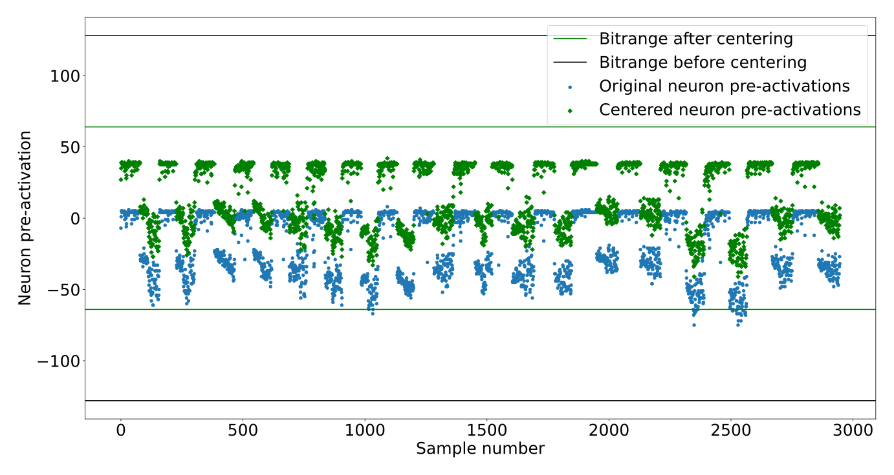

## Rationale

Unfortunately I make a mistake when initialy evaluating the results of
limiting the bitwidth of neurons in the previous part. The blunder is
accidentaly comparing the results with the positive-negative sums full
width circuit instead of the single signed sum version that the reduced
width circuits are based on. This causes me to falsely believe that
reducing the bitwidths of computations is much more effective than in
reality. Based on this misanderstanding I pursue finding ways to further
reduce the ranges of values each neuron's total has to support. After
realising the mistaken assumption I don't think those efforts were
justified. The first of these is the attempt to "center" the range of
values so the maximum and minimum values are at an equal distance from
zero.

The range of values a neuron of the first layer can take can be
significantly unbalanced. What this means is that if for example the
feature the hidden neuron tracks occurs infrequently, it will equally
infrequently take positive values, and this suggests that the negative
values it takes can get much large in an absolute sense than the
positive ones get a chance to. If the absolute minimum or maximum value
is multiple times larger than the other one, let's say $h_{i max} = 10
h_{i min}$, then the range of values the bitwidth of the neuron must
support is up to twice as large as the one of the equivalant range
balanced so it's maximum value is as far from zero as it's minimum.

Therefore by subtracting the value that lies at the middle of the range
from the result, the bitwidth of the neuron's sum can be further
reduced. That requires an additional constant subtraction operation for
the calculation of the sum and an additional comparison operation, since
the result needs to be compared to the same constant for binarization
unlike being compared to zero that needs no additional hardware.
However, the hope is that if the width of enough intermediate results of
the adder graph and thus the number of full adders is reduced as a
result it will be enough to more than make up for the cost.

Example: if the highest value the total of the neuron takes
is 300 and the lowest is -100, we need a 10 bit signed integer to fit
all values. If we subtract their average(100) the values will be in
the range -200 to 200, so they fit in a 9 bit signed integer.

$$h_{i max} = \max\limits_{j=0}^{S-1} H^i_j$$
$$h_{i min} = \min\limits_{j=0}^{S-1} H^i_j$$
$$h_{i mid} = \lceil \frac{h_{i max} + h_{i min}}{2} \rceil $$
$$ h'_i = h_i - h_{i mid} $$
$$ wh'_i = \lceil \log_2(\lceil \frac{h_{i max} - h_{i min}}{2} \rceil) \rceil+1 $$

The additional operations are only included in the design for neurons
that this method decreases the bitwidth compared the one calculated from
the "unbalanced" range. For the rest there is no reason to incur the
overhead for no benefit so they are declared the same as they are using
minimum range bit-width reduction.

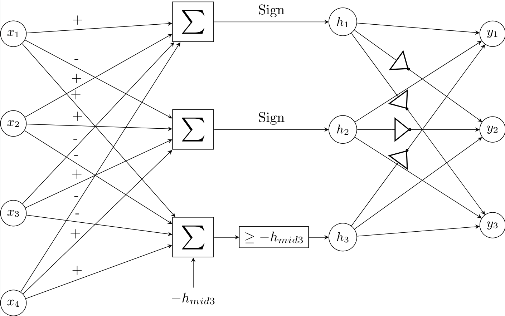

## Results and analysis

|           |   bnnparw area(cm²) |   bnnparce area(cm²) | area change   |   bnnparw power(mW) |   bnnparce power(mW) | power change   |
|:----------|--------------------:|---------------------:|:--------------|--------------------:|---------------------:|:---------------|
| Har       |               24.25 |                24.99 | +3.1%         |                77.6 |                 79   | +1.8%          |
| cardio    |               33.21 |                34.84 | +4.9%         |               105.4 |                110.5 | +4.8%          |
| gasId     |              171.37 |               181.82 | +6.1%         |               486.9 |                516.1 | +6.0%          |
| pendigits |               33.97 |                35.74 | +5.2%         |               109.6 |                115.5 | +5.4%          |
| winered   |               21.87 |                20.76 | -5.1%         |                72.3 |                 67.7 | -6.4%          |
| winewhite |               20.36 |                20.48 | +0.6%         |                66.7 |                 65.8 | -1.3%          |

Table: Results of range centering

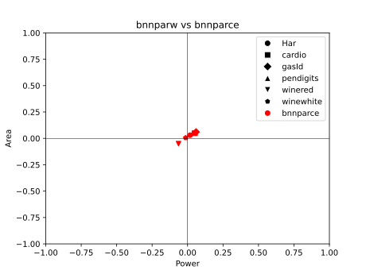

The results show that the hardware requirements of the additional
operations were not covered by the reduced bitwidths and area and power
demands considerably increased. Given the actual results of how much
reducing bitwidths helps from above this is not surprising. In fact it
seems counter-intuitive that for the winered dataset's model it lead to a
6% improvement.

Notably, this was the model that had the most benefit
from the previous bitwidth reduction as well. I estimate this model's
operations in the first layer lend themslves less to arithmetic
optimizations compared to the rest, and thus hindering that optimization
process is not as rough a sacrifice.

It also seems probable that subtracting a simpler constant than the
actual value at the middle of the range $h_{i mid}$, for example the
nearest power of two, would lessen the computational burden of the
additional subtraction and comparison, but not enough to be worth
implementing.

\newpage

# Naively reducing bitwidths of intermediate results
## Rationale

Given the eventual goal of applying approximate computation techniques to
the adder graph of the designs a problem, mentioned previously, comes
up. If the approximation, whatever it may be, gets applied separately to
each neuron's sum, almost certainly blocks the datapath extraction
process from performing arithmetic optimizations such as reducing and
sharing common subexpressions across neurons. The result is $M$ separate
approximate adder trees. Even given that the logic reduction gained from
approximate additions for each adder tree is more than enough to offset
the lost benefit of intermediate result sharing, that may be an
unnecessary concession.

To estimate how large the negative effect of an approximation technique
not taking cross-neuron sharing into consideration could be, I reduce
the bitwidths of intermediate results of the sum of each neuron.
Even though this would reasonably help for a single neuron, I expect it
will cause resource sharing to break. Given how large the negative
effect is I can check if this is a problem than ought to be fixed before 
approximation can confidently be applied.

## Implementation


The cumulative sum along the input features multiplied by the weight of
their connection with the neuron $i$ is calculated for each hidden
neuron and for each sample of the dataset. The maximum and minimum
values over all samples at each step of the cumulative sum for a given
neuron is then calculated. In a similar fashion to the method described
above for reducing the bitwidth of the total result of the neuron's
operations, the operations are written sequentially with the result of
each having it's bitwidth set based on the range of values for the
equivalent step of the sum for all of the dataset.

Let $h_{i,j}$ denote the result of the pre-activation value of the
$i$-th hidden neuron only taking into account the input features $x_0$ to
$x_j$, or equivalently the value of $h_i$ if $x_{j+1}$ to $x_{N-1}$ are
masked to zero.

$$ h_{i,j} =  \sum_{k=0}^{j} x_k W1_{i,k} $$
$$ hmax_{i,j} = \max\limits_{l=0}^{S-1} \sum_{k=0}^{j} D_k^l W1_{i,k} $$
$$ hmin_{i,j} = \min\limits_{l=0}^{S-1} \sum_{k=0}^{j} D_k^l W1_{i,k} $$
$$ wh_{i,j} = \lceil \log_2(\max(hmax_{i,j},\lvert hmin_{i,j}\rvert -1)) \rceil+1 $$

Sometimes due to the order of additions and subtractions the width
needed at a later step is less than the one of an earlier step. This
is because every sample for which there would be an overflow in the
earlier step with the smaller width would at some following feature
underflow back in the range it supports. This has been taken into
account. If a width of a subsequent operation's result is smaller, the
bitwidth of the previous addition/subtraction is simply set to that
smaller value.

$$ wh'_{i,j} = \min\limits_{k=j}^{N-1} wh_{i,j} $$

Consecutive operations that have the same result bitwidth are grouped
together and expressed in verilog as a single sum. I have not confirmed
if this does in fact affect the result of synthesis at all but it seems
to conform closer to the recommendations of the best practices guide.

## Results and analysis

|           |   bnnparw area(cm²) |   bnnparstepw area(cm²) | area change   |   bnnparw power(mW) |   bnnparstepw power(mW) | power change   |
|:----------|--------------------:|------------------------:|:--------------|--------------------:|------------------------:|:---------------|
| Har       |               24.25 |                   23.16 | -4.5%         |                77.6 |                    73.7 | -5.0%          |
| cardio    |               33.21 |                   39.29 | +18.3%        |               105.4 |                   125.5 | +19.1%         |
| gasId     |              171.37 |                  326.98 | +90.8%        |               486.9 |                   935.2 | +92.1%         |
| pendigits |               33.97 |                   37.09 | +9.2%         |               109.6 |                   120.3 | +9.8%          |
| winered   |               21.87 |                   22.78 | +4.2%         |                72.3 |                    75.3 | +4.1%          |
| winewhite |               20.36 |                   20    | -1.8%         |                66.7 |                    65.8 | -1.3%          |

Table: Results of shrinking intermediate results naively


The results were positive for two of the models with the smallest count
of input features $N$, which means that this method performed better
than the initial expectation. However, the optimization loss from losing 
shared operations shows clear scaling with the number $N$ of input
features. With more elements to sum, more common subexpressions to
optimise ought to come up, so this is keeping with expectations.

At the network with the largest $N$, the one belonging to gasId, which
has 128 sensor features, it has gotten bad enough to almost double the
area and power requirements. This shows that the issue is indeed
considerable when there is more than a handful of inputs, and ways to
work around it shall be searched for.

\newpage

# Preemptive arithmetic optimization

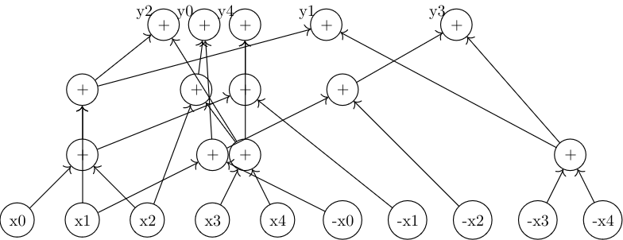

## Rationale
Based on the results from above I attempt to get the arithmetic
expression that the design computes after synthesis, with the intent
of fitting later approximation techniques to it rather than having the
approximations dictate the graph of operations and forego these
advantages.

Design compiler provides an "*resource and datapath extraction*" report,
which quoting the user guide "analyzes the arithmetic contents of the
design and provides feedback so you can improve the RTL code as
needed". In this report the arithmetic operations that are performed
post-optimization by each datapath block are described in the block's
resource section. From this an addition / subtraction graph from input
elements to layer outputs could be reconstructed with relatively
straightforward parsing.

Unfortunately, the report does not provide a
mapping between the symbols it uses for input and output
variables of the datapath blocks and the corresponding wires in the
original design. Due to this the reconstructed adder graph cannot be
used to implement the network's layers before the inputs and outputs are
otherwise labeled.

Conceivably a method that unfolds all intermediate steps of the
calculation into full explicit sums of input variables for each output
variable could be used to achieve this labeling. After all intemediate
variables / nodes of the adder graph are eliminated (for example, $x =
a + b; y_1 = c + x; y_2 = d - x;$ would be expanded to $y_1 = c + a + b;
y_2 = d - a - b;$) the addition and subtraction operations can be mapped
to a matrix with binary {-1, 1} weights. A permutation matrix that turns
the original weight matrix of the layer into this reconstructed matrix
is then searched for, and the permutations are assigned as the labels of
the input and output elements of the adder graph.

Another path around this problem comes from the inclusion of references
to the operator or operators in the original verilog design that is
implemented by a given arithmetic operation mentioned in a datapath
block's report. These references only point to the line of the verilog
file the operator apears in, so to narrow it down with certainty the HDL
file must beformated in a way that only a single arithmetic operator
occurs per line.Then the variables named as operants in the report can
be matched to the variables associated with the operator in the line or
lines pointed to.

Some early attempts in this direction are made but it becomes clear that
a process that involves the network to be implemented in an HDL,
synthesized, reverse engineered from the synthesised result, implemented
in HDL in a different way and re-synthesised would require considerably
more complex orchestration than first impressions imply. Even if it
panned out without any issues the speed with which modifications to the
designs could be tried out would be slowed down to a degree I was not
comfortable with.

As an alternative I search the literature for algorithms or heuristics
that would perform an equivalent arithmetic optimization to the one
Design Compiler provides. It does not appear too hopeful that a de facto
standard method for such cases exists and perhaps even is the one used
under the compiler's hood, so the operations found are exactly or close
to the same. 


## Implementation

A formulation of the problem is the following:  Given a list of
expressions of the general form $y_i = x_0 + x_1 - x_2 - ... + x_n$ in
which operants can be shared between the expressions find the minimum
number of additions or subtractions that need to be performed to
evaluate all expressions. 

The problem turns out considerable less well-studied than initially
expected. While the deceptively simple description suggests a
straightforward way to answer it, it is NP-Complete difficult, more
specifically in the MaxSNP family of optimization problems. As a direct
result only approximate solutions are attempted. [guy] searches for
exact solutions by leveraging SAT solvers, but only manages to get this
to work for very small matrix sizes up to 8 x 8. Not much is else found
on the exact scenario above, but a close-enough problem having to do
with factoring similar lists of expressions of the form $y_i = x_0
\oplus x_1 \oplus ... \oplus x_n$ using the minimum possible XOR
operations is actively worked on thanks to some applications in the
field of cryptographic accelerators. Both belong to the shortest linear
program family of problems.

I choose to try utilising Paar's factoring algorithm [paar] first. It is
older than most heuristics that have been applied to the XOR factoring
problem, but has the advantage of not exploiting term cancellation.
Thanks to the property $x \oplus x = 0$ some optimal solutions to the
XOR problem include two subexpressions containing the same term $x$
being combined by XOR to produce a desired expression that does not
include $x$. Heuristics developed after Paar's take advantage of this
feature, and while there is a parallel between it and the term
cancellation of opposites in our scenario ($x - x = 0$ or $x + -x = 0$)
I have not managed to find the adjustments needed to apply their
insights to the new domain. Thus I give precedence to the more
straightforward method, that directly translates to using addition in
place of parity.

\newpage

## Paar's algorithm

It is essentially a greedy algorithm that picks the two elements that
are common in the largest number of expressions each time and adds the
result of their XOR to the list of elements.

Let $N$ be the number of inputs, $M$ be the count of expressions to
evaluate, $x_i$ be the $i$-th input, $y_i$ the $i$-th expression and $A
\in M\times{N}$ be the binary matrix we aim to factor. The value of
$A_{i,j}$ is set to 1 if the term $x_j$ is included in the XOR
expression $y_i$ and 0 otherwise.

For example if $N = 4$ the expression $y_i = x_0 \oplus x_2$ corresponds
to the row $A_i = [1 0 1 0]$.

The following steps are repeatedly applied:

1. Find the two columns $A_{:,i}$ and $A_{:,j}$ that have the bitwise
   AND with the largest weight. This corresponds to the columns with the
   largest dot product, so they can quickly be calculated by $i,j =
   \arg\max\limits_{k>l} (A^T A)_{k,l}$. This corresponds to finding the
   operation between two inputs or intermediate results that occurs the
   most times across all expressions.

2. Append the resulting product column  $A_{:,N} = A_{:,i} \land
   A_{:,j}$ to $A$. Increase $N$ by one to reflect the new width of the
   matrix. Intuitively this translates to including $x_i \oplus x_j$ as
   a new intermediate result $x_N$ to be used in farther operations.

3. Set $A'_{:,i} = A_{:,i} \land \neg A_{:,j}$ and $A'_{:,j} = A_{:,j}
   \land \neg A_{:,i}$. Thusly the dependence of expressions to $x_i$
   and $x_j$ is removed when it is now covered by the inclusion of $x_i
   \oplus x_j$ in them.

In the end only one element in each row has value $1$, and the index $j$ of
the column the only $1$ of the $i$-th row occurs in tells as the input
or intermediate result the $i$-th expression equals, $y_i = x_j$.

Paar's algorithm can work for a group of expressions that consist only
of addition, but the expressions we have to work with include both
additions and subtractions. To reconcile this issue the negative of each
input element is treated as a separate input element that is added where
the original would be subtracted. Given the original weight matrix $W$ with
$W_{i,j} \in {-1, 1}$ denoting whether element $x_j$ is added or
subtracted from the expression $y_i$, we construct the matrix $A$ we pass as
the initial state to the algorithm by first turning all the $-1$
elements to $0$ and then appending the inverse of the matrix to itself,
or $A = \max(0,[W,-W])$.

From this process a list $L$ of successive indices such that $L_n =
(i,j) \iff x_n = x_i + x_j$ is acquired, and the additions implied by
them are hardcoded in the verilog description of the designs.

## Extension to support subtractions

I try a slight modification to the original procedure so it can be
compatible with expressions including subtractions. The way I
described previously to use negative inputs with Paar's strategy often
has to unnecessarily repeat calculations. For a minimal example, the expressions $y_0 = x_0 - x_1 + x_2, y_1 = x_0 + x_1 - x_2$
would result in 4 operations ($x_3 = x_0 + -x_1, y_0 = x_3 + x_2, x_4 = x_0
+ x_1, y_1 = x_4 + -x_2$), instead of the 3 needed ($x_3 = x_1 - x_2, y_0 = x_0 + x_3,
y_1 = x_0 - x_3$). This can be avoided by taking the ability to subtract
instead of only add intermediate results into account.

In summary this works by using {-1, 0, 1} for the elements of the
matrix $A$, where $A_{i,j} = -1$ when the expression for $y_i$ contains
the negative of the value $x_j$. Instead of counting the number of (1,1)
pairs of elements for columns as before, the count of pairs of elements
that are either (1,1) or (-1,-1) corresponds to the number of times the
sum of the values is used, and the count of pairs of elements
that are either (1,-1) or (-1,1) corresponds to the number of times the
difference of the values is used. As before the operation that occurs in
the most expressions is chosen as the next operation to be implemented.

Finding these two counts for all pairs of columns can still be done with
a matrix multiplication like before so the new approach is not much
slower.

## Results and analysis

|           |   bnnparsign area(cm²) |   bnnpaar area(cm²) | area change   |   bnnparsign power(mW) |   bnnpaar power(mW) | power change   |
|:----------|-----------------------:|--------------------:|:--------------|-----------------------:|--------------------:|:---------------|
| Har       |                  24.52 |               17.42 | -29.0%        |                   78.8 |                57.2 | -27.4%         |
| cardio    |                  33.27 |               38.74 | +16.4%        |                  106.2 |               124.1 | +16.9%         |
| gasId     |                 175.09 |              281.55 | +60.8%        |                  499.1 |               807.6 | +61.8%         |
| pendigits |                  33.38 |               35.43 | +6.1%         |                  108.9 |               114.6 | +5.2%          |
| winered   |                  22.45 |               18.55 | -17.4%        |                   74.6 |                62.6 | -16.1%         |
| winewhite |                  20.47 |               18.01 | -12.0%        |                   68   |                59.8 | -12.1%         |

Table: Effect of preemptive arithmetic optimization with Paar's heuristic

|           |   bnnpaar area(cm²) |   bnnpaarter area(cm²) | area change   |   bnnpaar power(mW) |   bnnpaarter power(mW) | power change   |
|:----------|--------------------:|-----------------------:|:--------------|--------------------:|-----------------------:|:---------------|
| Har       |               17.42 |                  18.73 | +7.5%         |                57.2 |                   60.8 | +6.3%          |
| cardio    |               38.74 |                  35.97 | -7.2%         |               124.1 |                  116   | -6.5%          |
| gasId     |              281.55 |                 261.38 | -7.2%         |               807.6 |                  759.7 | -5.9%          |
| pendigits |               35.43 |                  32.22 | -9.1%         |               114.6 |                  107.3 | -6.4%          |
| winered   |               18.55 |                  17.47 | -5.8%         |                62.6 |                   59.6 | -4.8%          |
| winewhite |               18.01 |                  16.65 | -7.6%         |                59.8 |                   55.9 | -6.5%          |

Table: Comparison of the modified Paar heuristic to the original


I expected that either:

1. The results of hardwiring the order of operations for calculating the
   pre-activation result of the neurons using Paar's heuristic would be
   considerably worse than the result of letting Design Compiler use the
   results of it's own optimization heuristics, since they ought to have
   implemented the best known ones. In this case trying an alternative
   to preemptively optimise the operations beforehand is most likely
   wasted effort because finding a competitive heuristic would be harder
   than parsing the results of their solution.

2. The results would have a negligible difference, because the
   heuristics used are related and / or the quality of results that can
   be expected by current methods for reasonable compute budgets hits a
   certain ceiling for the various approaches. In this case applying
   approximation techniques to the estimated arithmetic operation graph
   can go ahead.

The results show that although it is not consistant across the networks,
there is an improvement of 20-30% to the area and power estimates of
the smallest ones. This causes suspicion, since if such an old and
common algorithm performed better for some cases of the problem they
would reasonably have simply used it already. I initially look for
ways the original designs could be obstructing datapath extraction more
than they should, but nothing jumps out to me.

There seems to be a scaling in effect where the size of the weight
matrix or the number of total operations are inversely correlated with
how well Paar's algorithm performs compared to the compiler's unknown
solution. I hypothesise that they chose the methods they did for
arithmetic optimization giving more weight to the performance on heavier
workloads, where the savings are more important, or alternatively the
trade-offs these methods consider apply better to heavier loads. This
leaves some wiggle room for improvement in the sizes of the examined
networks.

Unfortunately, the issue I am trying to address has to do with
performance losses from disrupting compiler's arithmetic optimizations
scaling with model size, and the relative performance of the alternative
heuristic scales inversely with that size. This means that the attempted
fix cannot apply to the cases that need it most, so the underlying
problem remains unresolved.

The ternary take on Paar's heuristic outperforms the original by a
relatively consistant ratio with exception of the Har model's network.
This gives me some hope that applying more advanced heuristics used in
Shortest Linear Programs modefied for this particular usecase would
raise the network size threshold for which results can be improved.

\newpage

# Sequential evaluation

## Rationale

The classifications considered here are mostly not time critical and do
not require high throughput. Evaluating the quality of a wine every
second or multiple times per second does not offer any more value than
doing it every few minutes. Since time is the less precious resource for
our purposes it can be traded for lowering area and power demands.

A way to approach this trade-off is by extending evaluation of neurons'
values to multiple clock cycles so that the adder graphs needed to
perform all of the numerical operations can be replaced with simpler
adder circuits that get reused between cycles. This requires the inclusion
of memory elements to hold intermediate results of calculations between
cycles.

I first try to make all neurons sequentially evaluate their
pre-activation values by updating their held value on new inputs on
successive clock cycles until they have included all of their input
values into their total. This means that each layer will take as many
cycles to calculate it's outputs as the number of input features it has.
Layers get evaluated successively, so the entire inference will take a
cycle count equal to the sum of all the inputs and hidden features of
the network.

## Implementation

### First layer

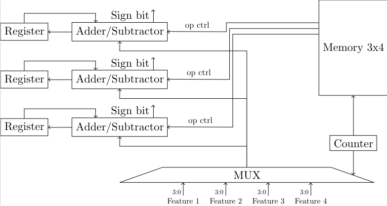

In the first layer each neuron is implemented by an accumulator that
holds a running total of the weighted sum of the input features seem
thus far and an adder-subtractor that given the weight bit of the
connection between the neuron and the input feature currently updated on
as a control either adds of subtracts the newly presented feature with
the previous value of the accumulator to get next value of the
accumulator. In each cycle a new input element is selected for all
neurons of the layer and they either add it or subtract it from their
running totals.

The weights of the layer are stored in a memory. A counter is used to
select the current feature from a multiplexer and the column of the
weight matrix from the weight memory that will provide the control
signals to the adder-subtractors. When the value of the counter reaches
the final value that indexes an input feature, $N-1$, a flag is set that
stops the counter and the accumulators of the current layer from
updating their held values and signals the next layer to start it's own
process. A reset signal is used to bring these memory elements back to
their zeroed initial values when inference of the next set of inputs is
desired. A reset is required to happen before each inference starts.

Let $k$ be the number of cycles since the start of the inference / the
current value of the counter. $h_{i,k}$ be the value of the accumulator
of the $i$-th neuron on the $k$-th cycle, or after updating on the
first $k$ input elements. Clearly $h_{i,0} = 0$ and $h_{i,N-1}$ would be
equal to $h_i$. $x_k$ is the input element selected on the $k$-th cycle
and $h'_{i,k}$ is the output of the adder-subtractor of the $i$-th
neuron at the end of the $k$-th cycle. 

$$ h_{i,k+1} = h'_{i,k} = h_{i,k} + x_k = \sum_{j=0}^{k} x_j$$

Because the output of the add-subtract unit when the last input of the
layer is selected is equal to the pre-activation value of the neuron,
this value does not have to be stored in the accumulator to be used.
Instead the sign bit that determines the binarized output of the neuron
for the next layer can be taken directly from the adder-subtractor's
output. This way the first layer can be evaluated in $N-1$ cycles
instead of $N$, as long as the selected input of the first layer stays
at the last ($N-1$-th) position for the duration of the second layer's
evaluation.

An alternative implementation where the weight matrix was stored in
shifting registers instead of a constant array indexed by the counter was
tested. The memory elements are very expensive in this technology so
this version ended up underperforming the previous by a large margin due
to the required registers.

### Second layer

The second layer starts after receiving an enable signal from the first
layers halting flag. Because of the linear transformation described in
the start in this layer instead of subtracting one from the running
total when the weighted current input would be -1 instead 0 is added to
the running total, so it remains unchanged. It could be implemented
similar to how the first layer is implemented if the adder-subtractors
are exchanged with XNOR gates, by storing the weights of the layer in a
memory and calculating the XNOR of the weight column $W2_{:,k}$ with the
output bit of the previous layer $s_k$ to add to the running totals on
the $k+1$-th cycle.

Instead , each neuron gets it's own multiplexer over input features,
where the $k$-th data line of the $i$-th neuron's multiplexer is set to
be $s_k$ if the weight $W2_{i,k}$ of the connection between the hidden
feature $s_k$ and the neuron $y_i$ is 1, and $\neg s_k$ in the case it
is -1. This is equivalent to hardcoding the result of the XNOR operation
for that particular neuron as the data line of the multiplexer.

In each cycle the neuron receives a single bit and adds it to the value
in its accumulator. It can therefore be implemented via a counter with
this bit as an enable signal.

The main goal of this approach is to remove the need for storing theweights of the layer and the decoder to select them, not the negligible XNOR gates that would be used.
These multiplexers share their input data lines with a lot of the other
multiplexers, so the hardware cost of their implementation is
considerably cheaper than $C$ separate ones.

## Results and analysis

The cost of the adder graph in the fully parallel designs scales
superlinearly with the count of input elements of the layer, at a faster
rate than multiplexers and decoders used in these sequential designs,
and the number of required registers scales about logarithmically.
It is expected then, that the advantage of a sequential to a parallel
design would also scale to the number of input features $N$.

The expense of the sequential elements is also pronounced in this
technology, and since as mentioned before it doesn't increase by much
due to additional inputs, a clear disadvantage is given to the smaller
networks, exaggerating the scaling effect.

Most of the networks under examination are small enough to be in the
range that is disadvantaged by the change, with the smallest ending up
50% larger. Only the largest model's
network, with 128 input features, is clearly gaining anything from this
trade-off, as the sequential design takes up 70% less area. 

Perhaps the upfront cost can be lessened, which would be bring littler
networks into the range that benefits from this sequential design area
wise. Even if the way to achieve this ends up diminishing the scaling
benefits described above, it can be applied only to models with $N$
lower than a threshold, so it would not be an issue.

\newpage

## Removing the weight array


The process used in the second layer in the previous part, where each
neuron gets its own multiplexer over normal and inverted input hidden
features in order to have no need of a weight memory, is here applied to
the inputs of the first layer as well.

For a hidden neuron $h_i$ the $j$-th data line in its multiplexer will
be denoted $x_{i,j}$. The data lines of the multiplexer will be 5 bit
signed integers, so they can represent the values of the 4 bit input
features as well as their negatives. Similarly to how a data line in the
second layer described above would be set to either $s_k$ or $\neg s_k$,
the data lines in the first layer are set as such:

$$
x_{i,j} = \begin{dcases}
    x_j,& \text{if } W1_{i,j} = 1\\
    -x_j,& \text{if } W1_{i,j} = -1
\end{dcases}
$$

The adder-subtractors and the weight array with the decoders that
selected the control signals from them are removed. Since the input is
taken already negated when appropriate, only an adder is needed for the
accumulator.

Although some up-front costs are gone, the extra machinery to negate
each input feature and for the custom multiplexers makes each input more
expensive. The largest network, gasId, is as such almost doubled in
required area, but this change was aimed for the smaller networks. It
manages up to 8% improvement there, which is nowhere near enough to
break even with the parallel version.

\newpage

## Register width reduction

The number of bits the register of the accumulator of each neuron can be
reduced to the minimum required to support the range of values it
encounter in the dataset. This is exactly the same bitwidth reduction as
the one described for the parallel design. Each bit shaved off an
accumulator’s range removes a flip-flop.

Because the registers take up a significant chunk of the resources, the
improvement is more pronounced than in the fully parallel equivalent,
freeing up around 10% of the area and power across the board.

## Accumulator saturation


Since removing flip-flops by reducing the bitwidth of the registers
appears to help alleviate the up-front cost of changing to sequential
evaluation for smaller networks, expending some extra combinatorial
logic to lead to further shortening can be justified. The method to do
that approached here is by saturating the results of the addition
between the previous running total stored in the register and the new
input feature to stay in the bounds of a smaller range.

The result $h_i$ that is found for the neuron $i$ at the end of the
layer's evaluation does not need to be the actual weighted sum of the
input features it is supposed to represent. Since binarization of the
result occurs before it is passed to the next layer, an approximate
result does not lead to an error in the neuron's output $s_i$ as long as
it still has the same sign as the original.

If at some cycle during the layer's evaluation the absolute value of the
running total becomes sufficiently large, it becomes unlikely that the
remaining features will add up to be even larger in the opposite
direction without overshooting the difference by some distance. This
means we can saturate the intermediate results to a range $[-2^r,2^r-1]$
without much risk the final aggregate having the wrong sign.

Take the case where $k$ is the last cycle the value of the accumulator
gets saturated to $-2^r$. In order for an error in the output to occur
because the sign of the accumulated value in the end flips to positive
when it would not if the full range of values was supported, the weighted
sum of the remaining features that will be added in the next cycles must
be larger than $2^r$, but smaller than the true running total.

$$ 2^r \leq \sum_{j=k}^{N-1} \leq \sum_{j=0}^{k-1} $$

The smallest value of $r$ is found for each neuron such as this case or
its equivalent in the opposite direction do not occur for any samples in
the dataset. The bitwidth of the accumulator of that neuron is then set
to $r+1$ and the results of the addition of a feature are saturated to
that range using the DW_addsub_dx module from designware, if and only if
$r+1$ is smaller than the width the neuron was previously reduced to
that fit it's entire range of values. In the case that width is the same
as $r+1$, saturating the values is not allowing the flip-flops of the
accumulator to decrease and there is no benefit to incur the extra logic
of implementing saturation for this neuron.

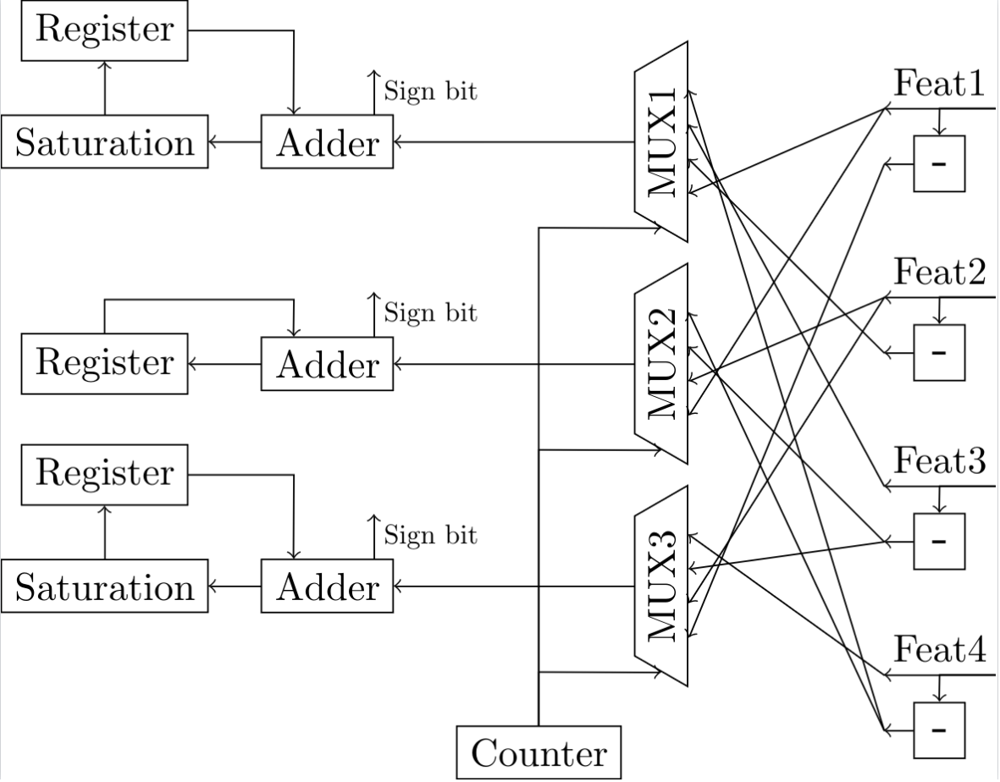

## Results and analysis

After these improvements, 4 out of the 6 networks demand less area in
the sequential design than in the parallel one. But the impovement is
not substancial enough to justify evaluation taking up many more cycles,
and the power is still not competitive with the parallel designs. This
tells me that this version of sequential designs is not salvageable. A
different process of splitting the workload among cycles must be
constructed from the ground up.

\newpage

# Single adder tree sequential evaluation

## Rationale

Since the previous attempt where all neurons update in parallel
on a single input feature each cycle did not pan out, the clear next
candidate is an arrangement where a single neuron of the layer updates
on all input features in parallel in a given clock cycle. This means
that a single adder tree will calculate the total value of a neuron
$h_i$ by summing up the weighted features in a single cycle, and perform
the same for a different neuron of the same layer in the next cycle.

This way the adder graph that encompasses the calculations required for
the entire layer in the fully parallel version gets reduced to the adder
tree a single neuron's inference demands. This can more than make up for
the encoding of weighting the features appropriately before their
accumulation than must now be done since the operations are not simply
hard-coded into the circuit.

## Implementation

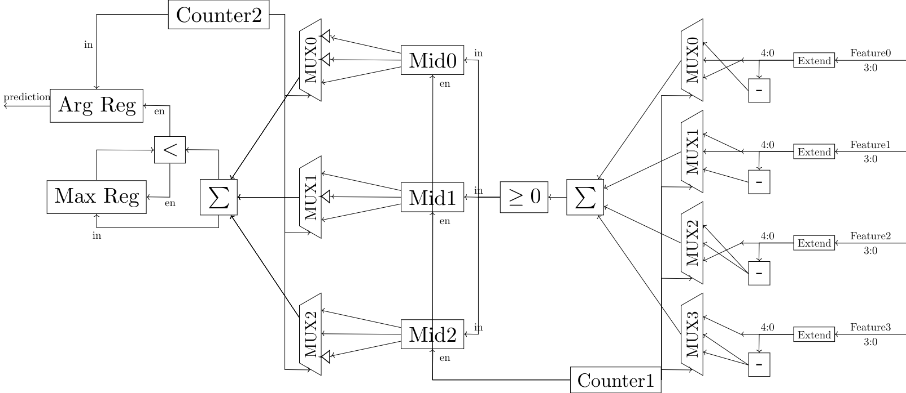

The multiplexing that was described in the previous sequential design 
is rearranged here in the sense that the $M$ multiplexers with $N$ data
lines each turn into $N$ multiplexers of $M$ elements. Instead of a
multiplexer belonging to a certain neuron and selecting the weighted
feature that neuron should increment by this moment, now a multiplexer
corresponds to a specific input feature and selects which "weighting" of
that feature the currently examined neuron needs. It is analogous to
having the axis flipped.

Let's call the value selected to represent the $j$-th input feature on
the $i$-th cycle of the layer's evaluation $x_{i,j}$. The way it is
derived from the original input $x_j$ is as stated before:

$$
x_{i,j} = \begin{dcases}
    x_j,& \text{if } W1_{i,j} = 1\\
    -x_j,& \text{if } W1_{i,j} = -1
\end{dcases}
$$

The functional difference is that the counter is indexing on the value
$i$ instead of $j$. Like before the negation only happens once per
input.

The selected weighted inputs are then parsed by a generic $N$ input
adder tree that provides the sign of their sum, on the $i$-th cycle $s_i
= sign(\sum_{j=0}^{N-1} x_{i,j})$. Only the sign bit needs to be stored
to be available to following calculations by the next layer, the
pre-activation value $h_i$ can be safely discarded. A 1-bit register is
thus indexed by the counter to store the current neuron's output. This
process takes as many cycles to evaluate a layer as count of its
neurons, so $M$ clock cycles for the first layer.

A close to identical system as the previous approach detects when the
last neuron of the layer has finished operations and passes the torch to
the next layer to start. The next layer conditionally inverts the input
features it receives before passing them to multiplexers' data lines on
the logic the first layer negates them.

On the second and final layer results do not need to be stored at all.
Because the output of neurons is calculated one at a time, the argmax
operation can be embedded in this process. Two registers are used, one
holding the largest output of a neuron seen so far $y_{max}$ and the
other the index of the aforementioned neuron in the layer, which is
taken from the value of the cycle counter of the layer.

If the result of the popcount operation on the current weighted inputs
on the $i$-th cycle of the second layer's activity $y_i$ is greater than
the previous best $y_{max}$, the new result is stored as the new best so
far and the index is overwritten by the cycle count $i$. Beyond saving a
lot of flip-flops the overhead of the additional argmax module that had
to be activated after the second layer is removed.

The second layer takes as many cycles as classes to be examined for
prediction. The full inference therefore takes up $M+C$ clock cycles.
Again a reset signal must be given between successive inferences.

## Results and analysis 

A large improvement on the previous sequential design method, using a
single adder tree gets us 60 - 75% smaller footprints than the fully
parallel circuits. Given the delay of the inference has been multiplied
by a factor between one and two orders of magnitude this trade-off is
kind of underwhelming. Like before an upfront cost in multiplexers /
weight storage has to be paid upfront, and since the sizes of the
networks are on the small side the scaling savings of reusing logic
accross neurons do not deliver in full. The constraint reminds me of
Amdaul's law, where instead of the speedup achievable by providing N
parallel cores being limited by the ratio of the computation that is
sequential, the resource savings are constrained by the ratio of
hardware that can be shared between the N parallel cores.

Combinations of sequential approaches on the two layers where also
tested to confirm that it was an improvement for both of them.

\newpage

# Deconstructing input negation

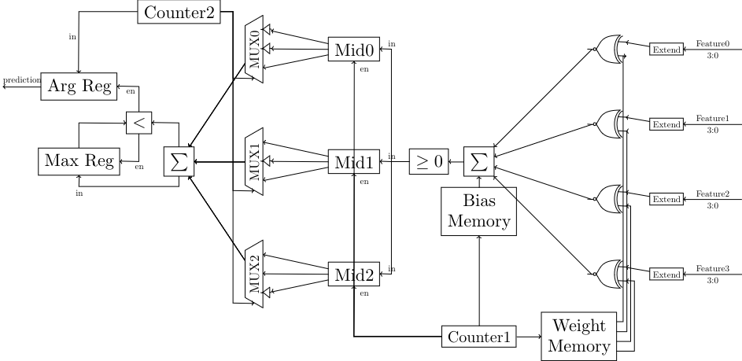

Negating each input involves a 4 bit increment-by-1 circuit per feature. 
Although it does not sound very alarming it is still an expense that
scales with the input count $N$. The negation operation can be
deconstructed into inverting the input and adding 1 to the result. If
instead of providing the negative of the input as the result of
multiplying by the appropriate weight to the multiplexer the inverse of
all the bits of the input are provided, entire section simplifies into a
1-bit look up table indexed by the cycle counter whose output gets
XOR'ed with all the bits of the input feature. This saves some logic.

In order to not risk errors from this approximation a correction term
$b_i$ needs to be added to the sum, equal to the number of 1s that were
not added to negate in this cycle, or the count of elements of the
weight row that belongs to the currently computed hidden neuron that are
-1.

$$ b_i = \sum_{j \in W1_i} [j = -1] $$
$$ h_i = \sum_{j=0}^{N-1} x_j \oplus \neg bin(W1_{i,j}) + b_i $$

\newpage

# Shifting registers for timekeeping

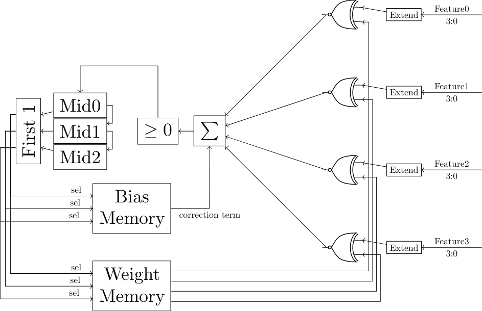

Instead of having a decoder from the cycle counter's current value $i$
select the register to which the binary post-activation output $s_i$ of
the neuron that was computed will be saved, it is simpler to use a
shifting register. Each cycle the previously held values are shifted one
position to the right and the result of the current evaluation is saved
to the left-most position of the register. After $N$ cycles pass the
right-most position of the register contains the result of the first
neuron's evaluation that has been shifted $N-1$ positions and all
outputs are in their proper place. The flag that halts the operation of
the first layer is then set and the results are frozen in place to be
used by the next layer.

The inclusion of a shifting register where the values set on
initialisation are discarded provides and opportunity to shed the cycle
counter altogether. When the reset signal brings the registers to
their pre-set values we assign the left-most bit to be 1 and all the
rest to 0. The position of the most significant 1 in the register is
shifted once to the right every cycle. By utilising a simple one-hot
equivalent of a priority encoder a $M$ bit signal of a one hot
representation of the current cycle count is produced.

This one hot signal can be used to detect when the final neuron is
evaluated and layer transition flag ought to be set, and can select the
weight row for the at the moment computed from the lookup table without
requiring a decoder from the cycle counter. This lets the counter to be
retired, without requiring extra state keeping elements to preserve its
functionality.

## Tristate weight memory


Every input feature gets the current weight bit from an open bus to
which a tristate buffer for each entry in the feature’s column in
the weight matrix is connected. Each buffer corresponds to a single
element of the weight matrix $W1$. The tri-buffer that holds the value
of $W1_{i,j}$ has its output connected to the same open bus as the other
buffers that hold a weight in $W1_{:,j}$ and activates by the $i$-th bit
of the one-hot select signal from above.

The goal of this is to avoid the nested OR gates that are used to reduce
the selected value of the column into one bit in the standard look up
table implementation.

## Results and analysis

|           |   bnnparw area(cm²) |   bnnrospine area(cm²) | area change   |   bnnparw power(mW) |   bnnrospine power(mW) | power change   |
|:----------|--------------------:|-----------------------:|:--------------|--------------------:|-----------------------:|:---------------|
| Har       |               24.25 |                   7.82 | -67.8%        |                77.6 |                   31.7 | -59.1%         |
| cardio    |               33.21 |                   9.3  | -72.0%        |               105.4 |                   36   | -65.8%         |
| gasId     |              171.37 |                  37.31 | -78.2%        |               486.9 |                  124.4 | -74.5%         |
| pendigits |               33.97 |                   9.08 | -73.3%        |               109.6 |                   35.1 | -68.0%         |
| winered   |               21.87 |                   7.61 | -65.2%        |                72.3 |                   30.9 | -57.3%         |
| winewhite |               20.36 |                   7.49 | -63.2%        |                66.7 |                   30.9 | -53.7%         |

Table: Comparison of the final sequential designs to the final combinatorial designs


These changes give a 10-20% decrease in area and power requirements
compared to the initial single adder tree implementation. With the use
of tristate buffers the power saving goes up to ~35% but at a very harsh
area penalty of 10-30% compared to the first design. I think the
explanation for this is that more tristate buffers are required than OR
gates since logical simplifications cannot be made on them, but the
considerable switching power consumption from the intermediate nets that
connect nested OR gates is removed. This trade-off allows to optimise
for whichever of area and power is the largest bottleneck to the desired
application.

All in all compared to the fully parallel designs requirements are
reduced $3-5\times$. This opens up the space of implementable applications. The relative savings would get considerably better for larger networks given the scaling observed.

\begin{tikzpicture}
    \draw (0, 0) rectangle (5.8, 5.8);
    \draw (7, 0) rectangle ++(2.9, 2.9);
\end{tikzpicture}

Actual size comparison of the estimated area of the printed designs for
the pendigits dataset's model. Parallel on left, sequential on right.

\newpage

# Ternary weight networks

## Rationale

Ternary Neural Networks (**TNNs**) use weights and activations in the
range of {-1, 0, 1} instead of the {-1, 1} of BNNs. This enables much
greater representational ability, and thus higher accuracies are
achievable.When computed with CPUs or GPUs the inclusion of the 0 makes
the bit-level operations that make BNNs so compute friendly not
applicable, since the activations and weights now take up two bits and
their MAC operations are not reducible to XNORs and popcounts. With
hardware dedicated to running TNNs implemented in FPGAs or ASICs more
optimizations can be made, but the efficiency is still sub-par compared
to binary networks.

In our case the designs are fully bespoke to a single model/set of
weights. This enables the isomorphism between ternary weight networks
and sparse binary weight networks to be exploited, since connections
removed from the sparse network can be omitted from the design upfront,
something that is not doable in the case that all models of a certain
architecture must be supported.

For the single-cycle / fully combinatorial designs this translates to
fewer arithmetic operations to build components for. The model accuracy
and the resulting circuit's area / power demands are both improved in
this way by switching to ternary weights, pretty good deal.

Only the weights but not the activations will be ternarized in this
implementation. The additional model ability achieved by using ternary
activations for the hidden layer on top of the weights was not
significant enough to justify the suspected cost of implementing 2-bit
arithmetic in the subsequent layer.

\newpage

## Fully combinatorial implementation

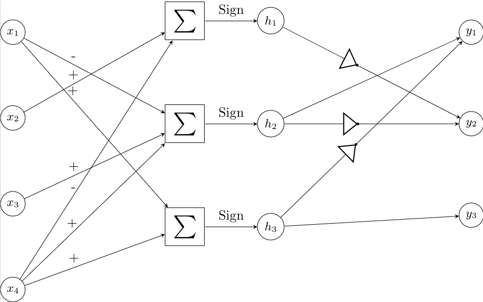

After training the same datasets with the same parameter counts using
ternary instead of binary weights the equivalent weight matrices $W1 \in
\{-1,0,1\}^{M,N}$ and $W2 \in \{-1,0,1\}^{C,M}$ are used to define the
desired operations similarly to the binary counterparts:

$$
h_i = \sum_{j=0}^{N-1} \begin{dcases}
    + x_j,& \text{if } W1_{i,j} > 0\\
    - x_j,              & \text{if } W1_{i,j} < 0
\end{dcases}
$$

$$
y_i = \sum_{j=0}^{M-1} \begin{dcases}
    s_j,& \text{if } W2_{i,j} > 0\\
    \neg s_j,              & \text{if } W2_{i,j} < 0
\end{dcases}
$$

In the first layer for connections that have weights of 0 neither
addition nor subtraction is actualised for the feature in the neuron's
specified expression. It is simply ignored since it always contributes 0
to the sum.

Some neurons turn out to have all their non-zero weights have the same
sign, either all being 1 or all -1. In such a case since the input
features are all positive the sign of the multiply-accumulate result for
this neuron will always be the same. So the outputs of these neurons are
hardcoded into constants to avoid unnecessary overhead.

In the second layer, as well, connections with weights equal to zero get
neither the hidden feature they connect to nor it's inverse included in
the related output neuron's popcount. The required logic is thus reduced
in both layers by each connection severed.

Remember the linear transformation used to go from sums
weight-activation products of {-1,1} to popcounts of XNORs that now
encode the values that would be -1 as 0. To achieve $-1\to 0$ and $1\to
1$ $f(x) = \frac{(x+1)}{2}$ is that linear transformation. When applied
to an array $v \in \{-1,1\}^M$ binary values the sum is:

$$ \sum_{i=0}^{M-1} f(v_i) = \sum_{i=0}^{M-1} (v_i+1)/2 =
\frac{1}{2}\sum_{i=0}^{M-1} v_i+1 = \frac{1}{2}\sum_{i=0}^{M-1} v_i +
\frac{M}{2} $$

In the last layer, that in this case is the second one, so far the
number of inputs of all output neurons was the same, thus the factor
$\frac{M}{2}$ could be omitted when comparing outputs between the
neurons and the XNOR/popcount results can be used directly for the
argmax calculations.

Now, since the output neurons are treated as sparse binary ones, they no
longer have the same input count and therefore the constant term
$\frac{M}{2}$ is no longer the same for the whole layer. The issue can
also be described as elements with value 0 included in the vector $v$
contributing $f(0) = \frac{1}{2}$ each to the sum after the linear
transfomation, which is not reflected by ignoring them completely as
done here.

In order to fix this issue a correction term equal to $\frac{z_i}{2}$
ought to be added to the result the XNOR/popcount computation gives,
where $z_i$ denotes the number of elements in the weight row of the
$i$-th output neuron $W2_i$. This term can be large compared to the
value of the popcount when a neuron is sparse enough, so instead we can
add $\frac{z_i - \min\limits_{j=0}^{M-1} z_j}{2}$ as a smaller
correction term, so the neuron with the least severed connections gets
nothing added to it's popcount and the rest get theirs based on how many
extra zeroed weights they contain compared to it.

In the design this is done by shifthing the result of the popcount once
to the left and adding the count of zeroes over the minimum as is to
it, giving us $2y_i + (z_i-\min\limits_{j=0}^{M-1} z_j)$. The results
of the neurons can now be compared correctly.

If we were dealing with a layer that was using XNOR and popcount that
was not the final one the correction term $\lceil \frac{z_i -
\min\limits_{j=0}^{M-1} z_j}{2} \rceil$ would instead be used as the
threshold for binarization of the neuron's output instead of 0.

## Results and analysis

|           |   bnnparw area(cm²) |   tnnparsign area(cm²) | area change   |   bnnparw power(mW) |   tnnparsign power(mW) | power change   |
|:----------|--------------------:|-----------------------:|:--------------|--------------------:|-----------------------:|:---------------|
| Har       |               24.25 |                  13.4  | -44.7%        |                77.6 |                   42.7 | -45.0%         |
| cardio    |               33.21 |                  19.21 | -42.2%        |               105.4 |                   62.4 | -40.8%         |
| gasId     |              171.37 |                 101.65 | -40.7%        |               486.9 |                  297.1 | -39.0%         |
| pendigits |               33.97 |                  29.43 | -13.4%        |               109.6 |                   95.8 | -12.6%         |
| winered   |               21.87 |                  11.78 | -46.1%        |                72.3 |                   40   | -44.7%         |
| winewhite |               20.36 |                   9.53 | -53.2%        |                66.7 |                   32.8 | -50.8%         |

Table: Performance of the ternary weight combinatorial implementation compared to the binary combinatorial


Thanks to the removal of terms from the arithmetic operations that
define the design of the layers the area and power requirements were
almost halved compared to the fully combinatorial designs of the binary
models that were trained on the same datasets as the ternary ones. The
accuracy was also improved across the board while at it.

Unfortunately applying bitwidth reduction or pre-synthesis arithmetic
optimization underperformed the original TNN circuits, even for datasets
whose binary network implementations where improved by these methods.
There is nothing to note on the implementation of these since no change
needs to be made to accommodate TNNs. I am not sure what to make of this
yet.

The attempts at sequential designs for ternary weight networks do not
perform to a satisfactory level so they won't be expanded on.

\newpage

# Experimental setup

## Data preparation

The files that comprise the 7 datasets described in the preliminaries
where procured from the UCI repository. Afterwards using the
descriptions of what each feature of the tabular dataset represents
categorical features that could not correspond to a sensor's output are
descarded. Additionally features that are constant or near constant (for
example only 3 samples in the whole dataset have a different value for
this feature from the rest) are removed since they could not provide
useful information.

For each feature the range of values is then normalised in the $[0,1]$
range so the features use similar scales. These values are then
quantised in 4 bit precision by the formula $\lfloor x * (16-\epsilon)
\rfloor$, taking integer values in the range $[0,15]$. This way the data
is treated during training as if seen from a 4-bit ADC interpreting a
sensor's analog output, like it is supposed to be under inference
conditions.

The labels for each sample are enumerated so they take the range
$[0,C-1]$, which will later help with making the selection of the
predicted class's index by the argmax module simpler. All of the
datasets are finally converted into a standard format, that of a CSV
file with one sample per row and feature per column and labels as the last column. 

## Training

The datasets are split randomly with a predetermined seed into a 70-30
split of training and test data.

All the training splits of the datasets are passed from a grid
hyperparameter search using 5 fold cross validation provided by scikit
learn to find the best performing configuration set. This selected
hyperparameter configuration is then used to train the final model. Ten
training runs are performed with the previous training split getting
further divided into a smaller training split and a validation split.
The model originating from the training run of the ten that achieves the
highest validation accuracy is chosen as the result of the whole
training process. The accuracy achieved by this model on the test split
is reported as the accuracy of the learned classifier.

The actual model was initially implemented using the Larq framework for
quantised models and afterwards switched to using the similar Qkeras
framework after it was empirically found to achieve higher performing
classifiers.

Interestingly the models that were trained under the Larq framework
benefited from the inclusion of a batch normalisation layer whereas
models trained with the Qkeras framework had their performance hindered
by it. I have not yet found a convincing explanation for this
difference. I will note here that not using a batch normalisation layer
after the hidden layer is what allows the threshold that the output of
the first layer's neurons are compared to in order to produce their
binarized output to be always zero. So this discrepancy was another
point for the preference of Qkeras over Larq.

### Dataset accuracies table graphs

## Parameter optimization and encoding

The models resulting from the above process are stored in a
predetermined location that is accessible by the script that uses the
weight matrices and architecture details obtained by the saved model
plus as well as the original dataset in order to compute some derivative
information, such as the minimum required bitwidth of neurons or the
order of operations given by preemptive optimization. These auxiliary
results are then passed to the script that encodes them as well as the
raw weight matrices into a form that can be used as part of template
verilog file.

This can take the form of writing out bespoke verilog instructions to
implement the calculations necessary that are specific to the model.
More commonly this information is formatted as parameters that can be
imported into the verilog template and determine the actualised
primitives and submodules that get instantiated and their connections
via conditionals in generate blocks.

Both styles are equally able to describe the desired actualised design
and either style can be used for any occasion the other can. In practice
generating verilog instructions was found to be more convenient for the
simpler fully parallel designs, and parameterised modules were more
easy to work with for the rest of the cases.

## Design instantiation and functional verification

The formatted custom functionality in either form described above is
embedded into a template verilog module via the use of the icarus verilog
tool as a verilog preprocessor. The result is a verilog module that
describes a custom implementation of the specific model that was used as
input. This is fully standalone and the stored model or derived
parameters are not needed from this point forward.

After the custom module is instantiated it is used to simulate
evaluation of 1000 samples from the dataset it is associated with. The
reason that only 1000 samples are used instead of the full dataset is
simply to speed up the process, since the requirements for exact
execution are not so strict in our case that it is necessary to be
fearful of a potential error that does not materialise once in 1000
samples. Even if execution of the design does not precisely match the
functionality of the original model in some edge cases as long as the
classification accuracy is not measurably affected we are in the clear.

The results of the simulation are compared to those of evaluating the
trained model in it's native framework for these same samples, and if
everything matches up the process can continue. Note that a case where
the design is found to not match the model's results is not expected to
occur during hypothetical execution of the process by an actual user,
the main goal of this simulation is for debugging purposes during
development of the design template.

## Synthesis and requirement evaluation

The custom design is synthesised using Design Compiler. The compilation
is set to prioritise area efficiency and effectively no time constraint
is given in order for timing optimizations not to interfere. The area
estimation is taken from the compiler at this stage.

The netlist that was generated then goes under a gate-level simulation
using Chronologic of the same 1000 dataset samples as the previous
functional simulation to give realistic usage data for the estimation of
the required power.

\newpage

# Results

Graphs and tables are presented here that show the area and power
requirements for the various versions of hardware implementation for the
6 datasets and their trained models. Comparisons for the effect of the
various design decisions outlined above are also made.

The designs will be referred to by nicknames in the following graphs and
tables. Here is which explanation of each design corresponds to each
nickname:

Design nickname | Link to relevant description
---|---
bnnpar| [Combinatorial fully connected implementations](#combinatorial-fully-connected-implementations)
bnnpar| [Positive negative sum](#positive-negative-sum)
bnnparsign| [Signed sum ](#signed-sum)
bnnparw| [Minimum range bit width reduction](#minimum-range-bit-width-reduction)
bnnparce| [Range centering](#range-centering)
bnnparstepw| [Naively reducing bitwidths of intermediate results ](#naively-reducing-bitwidths-of-intermediate-results)
bnnpaar| [Preemptive arithmetic optimization ](#preemptive-arithmetic-optimization)
bnnpaarter| [Extension to support subtractions](#extension-to-support-subtractions)
bnnseq| [Sequential evaluation](#sequential-evaluation)
bnndirect| [Removing the weight array](#removing-the-weight-array)
bnndw| [Register width reduction ](#register-width-reduction)
bnndsat| [Accumulator saturation ](#accumulator-saturation)
bnnrolx| [Single adder tree sequential evaluation](#single-adder-tree-sequential-evaluation)
bnnrolin| [Deconstructing input negation](#deconstructing-input-negation)
bnnrospine| [Shifting registers for timekeeping ](#shifting-registers-for-timekeeping)
bnnrobus| [Tristate weight memory ](#tristate-weight-memory)
tnnparsign| [Ternary weight networks](#ternary-weight-networks)

\newpage

## Combinatorial designs area comparisons


|             |   Har |   cardio |   gasId |   pendigits |   winered |   winewhite |
|:------------|------:|---------:|--------:|------------:|----------:|------------:|
| bnnpaar     | 17.42 |    38.74 |  281.55 |       35.43 |     18.55 |       18.01 |
| bnnparw     | 24.25 |    33.21 |  171.37 |       33.97 |     21.87 |       20.36 |
| bnnpar      | 29.4  |    46.71 |  269.76 |       42.95 |     27.82 |       26.01 |
| bnnparsign  | 24.52 |    33.27 |  175.09 |       33.38 |     22.45 |       20.47 |
| tnnparsign  | 13.4  |    19.21 |  101.65 |       29.43 |     11.78 |        9.53 |
| bnnparstepw | 23.16 |    39.29 |  326.98 |       37.09 |     22.78 |       20    |
| bnnparce    | 24.99 |    34.84 |  181.82 |       35.74 |     20.76 |       20.48 |
| bnnpaarter  | 18.73 |    35.97 |  261.38 |       32.22 |     17.47 |       16.65 |

Table: What

## Combinatorial designs power comparisons


|             |   Har |   cardio |   gasId |   pendigits |   winered |   winewhite |
|:------------|------:|---------:|--------:|------------:|----------:|------------:|
| bnnpaar     |  57.2 |    124.1 |   807.6 |       114.6 |      62.6 |        59.8 |
| bnnparw     |  77.6 |    105.4 |   486.9 |       109.6 |      72.3 |        66.7 |
| bnnpar      |  92.1 |    145.3 |   767.7 |       136.8 |      90.7 |        84.6 |
| bnnparsign  |  78.8 |    106.2 |   499.1 |       108.9 |      74.6 |        68   |
| tnnparsign  |  42.7 |     62.4 |   297.1 |        95.8 |      40   |        32.8 |
| bnnparstepw |  73.7 |    125.5 |   935.2 |       120.3 |      75.3 |        65.8 |
| bnnparce    |  79   |    110.5 |   516.1 |       115.5 |      67.7 |        65.8 |
| bnnpaarter  |  60.8 |    116   |   759.7 |       107.3 |      59.6 |        55.9 |

## Sequential designs area comparisons


|            |   Har |   cardio |   gasId |   pendigits |   winered |   winewhite |
|:-----------|------:|---------:|--------:|------------:|----------:|------------:|
| bnndsat    | 24.02 |    24.77 |   81.05 |       29.79 |     23.02 |       22.43 |
| bnndirect  | 27.63 |    30.5  |   88.62 |       32.93 |     27.11 |       27.31 |
| bnnrobus   |  9.97 |    12.44 |   55.39 |       11.93 |      9.66 |        9.56 |
| bnnrolx    |  9.14 |    11.1  |   42.12 |       10.69 |      8.85 |        8.65 |
| bnnrospine |  7.82 |     9.3  |   37.31 |        9.08 |      7.61 |        7.49 |
| bnndw      | 25.39 |    26.26 |   81.87 |       29.9  |     24.51 |       23.98 |
| bnnrolin   |  8.29 |    10.85 |   38.54 |       10.37 |      8.04 |        8    |
| bnnseq     | 29.55 |    31.47 |   47.67 |       34.71 |     29.57 |       29.75 |

## Sequential designs power comparisons


|            |   Har |   cardio |   gasId |   pendigits |   winered |   winewhite |
|:-----------|------:|---------:|--------:|------------:|----------:|------------:|
| bnndsat    | 109.2 |    118.7 |   318.9 |       121.6 |     104.5 |        98.5 |
| bnndirect  | 128.8 |    150.8 |   364.5 |       135.7 |     125.7 |       122.6 |
| bnnrobus   |  26.1 |     29.4 |    97.9 |        29.7 |      25.7 |        25.2 |
| bnnrolx    |  39   |     45.5 |   142.4 |        43.5 |      38.9 |        37.5 |
| bnnrospine |  31.7 |     36   |   124.4 |        35.1 |      30.9 |        30.9 |
| bnndw      | 116.4 |    124.9 |   325.6 |       123.1 |     112.1 |       106.2 |
| bnnrolin   |  36.3 |     45.6 |   131.3 |        42.6 |      35.7 |        34.9 |
| bnnseq     | 132.7 |    143.1 |   216.8 |       139   |     131.7 |       128.6 |


\newpage

## Additional table comparisons


|           |   bnnseq area(cm²) |   bnndirect area(cm²) | area change   |   bnnseq power(mW) |   bnndirect power(mW) | power change   |
|:----------|-------------------:|----------------------:|:--------------|-------------------:|----------------------:|:---------------|
| Har       |              29.55 |                 27.63 | -6.5%         |              132.7 |                 128.8 | -2.9%          |
| cardio    |              31.47 |                 30.5  | -3.1%         |              143.1 |                 150.8 | +5.4%          |
| gasId     |              47.67 |                 88.62 | +85.9%        |              216.8 |                 364.5 | +68.1%         |
| pendigits |              34.71 |                 32.93 | -5.1%         |              139   |                 135.7 | -2.4%          |
| winered   |              29.57 |                 27.11 | -8.3%         |              131.7 |                 125.7 | -4.6%          |
| winewhite |              29.75 |                 27.31 | -8.2%         |              128.6 |                 122.6 | -4.7%          |

Table: Effect of using a custom multiplexer per neuron in the first layer

|           |   bnndirect area(cm²) |   bnndw area(cm²) | area change   |   bnndirect power(mW) |   bnndw power(mW) | power change   |
|:----------|----------------------:|------------------:|:--------------|----------------------:|------------------:|:---------------|
| Har       |                 27.63 |             25.39 | -8.1%         |                 128.8 |             116.4 | -9.6%          |
| cardio    |                 30.5  |             26.26 | -13.9%        |                 150.8 |             124.9 | -17.2%         |
| gasId     |                 88.62 |             81.87 | -7.6%         |                 364.5 |             325.6 | -10.7%         |
| pendigits |                 32.93 |             29.9  | -9.2%         |                 135.7 |             123.1 | -9.3%          |
| winered   |                 27.11 |             24.51 | -9.6%         |                 125.7 |             112.1 | -10.8%         |
| winewhite |                 27.31 |             23.98 | -12.2%        |                 122.6 |             106.2 | -13.4%         |

Table: Effect of reducing the width of the first layer's registers

|           |   bnndw area(cm²) |   bnndsat area(cm²) | area change   |   bnndw power(mW) |   bnndsat power(mW) | power change   |
|:----------|------------------:|--------------------:|:--------------|------------------:|--------------------:|:---------------|
| Har       |             25.39 |               24.02 | -5.4%         |             116.4 |               109.2 | -6.2%          |
| cardio    |             26.26 |               24.77 | -5.7%         |             124.9 |               118.7 | -5.0%          |
| gasId     |             81.87 |               81.05 | -1.0%         |             325.6 |               318.9 | -2.1%          |
| pendigits |             29.9  |               29.79 | -0.4%         |             123.1 |               121.6 | -1.2%          |
| winered   |             24.51 |               23.02 | -6.1%         |             112.1 |               104.5 | -6.8%          |
| winewhite |             23.98 |               22.43 | -6.5%         |             106.2 |                98.5 | -7.3%          |

Table: Effect of applying saturation to the first layer's registers

\newpage

|           |   bnnrolx area(cm²) |   bnnrolin area(cm²) | area change   |   bnnrolx power(mW) |   bnnrolin power(mW) | power change   |
|:----------|--------------------:|---------------------:|:--------------|--------------------:|---------------------:|:---------------|
| Har       |                9.14 |                 8.29 | -9.3%         |                39   |                 36.3 | -6.9%          |
| cardio    |               11.1  |                10.85 | -2.3%         |                45.5 |                 45.6 | +0.2%          |
| gasId     |               42.12 |                38.54 | -8.5%         |               142.4 |                131.3 | -7.8%          |
| pendigits |               10.69 |                10.37 | -3.0%         |                43.5 |                 42.6 | -2.1%          |
| winered   |                8.85 |                 8.04 | -9.2%         |                38.9 |                 35.7 | -8.2%          |
| winewhite |                8.65 |                 8    | -7.5%         |                37.5 |                 34.9 | -6.9%          |

Table: Effect of deconstructing negation

|           |   bnnrolin area(cm²) |   bnnrospine area(cm²) | area change   |   bnnrolin power(mW) |   bnnrospine power(mW) | power change   |
|:----------|---------------------:|-----------------------:|:--------------|---------------------:|-----------------------:|:---------------|
| Har       |                 8.29 |                   7.82 | -5.7%         |                 36.3 |                   31.7 | -12.7%         |
| cardio    |                10.85 |                   9.3  | -14.3%        |                 45.6 |                   36   | -21.1%         |
| gasId     |                38.54 |                  37.31 | -3.2%         |                131.3 |                  124.4 | -5.3%          |
| pendigits |                10.37 |                   9.08 | -12.4%        |                 42.6 |                   35.1 | -17.6%         |
| winered   |                 8.04 |                   7.61 | -5.3%         |                 35.7 |                   30.9 | -13.4%         |
| winewhite |                 8    |                   7.49 | -6.4%         |                 34.9 |                   30.9 | -11.5%         |

Table: Effect of replacing the cycle counter with shifting registers

|           |   bnnrospine area(cm²) |   bnnrobus area(cm²) | area change   |   bnnrospine power(mW) |   bnnrobus power(mW) | power change   |
|:----------|-----------------------:|---------------------:|:--------------|-----------------------:|---------------------:|:---------------|
| Har       |                   7.82 |                 9.97 | +27.5%        |                   31.7 |                 26.1 | -17.7%         |
| cardio    |                   9.3  |                12.44 | +33.8%        |                   36   |                 29.4 | -18.3%         |
| gasId     |                  37.31 |                55.39 | +48.5%        |                  124.4 |                 97.9 | -21.3%         |
| pendigits |                   9.08 |                11.93 | +31.4%        |                   35.1 |                 29.7 | -15.4%         |
| winered   |                   7.61 |                 9.66 | +26.9%        |                   30.9 |                 25.7 | -16.8%         |
| winewhite |                   7.49 |                 9.56 | +27.6%        |                   30.9 |                 25.2 | -18.4%         |

Table: Effect of using tristate buffers for the weight memory

## Additional graph comparisons

The following graphs show the area and power measurements of the models reified via the second design normalised on the equivalent metrics from the first design type.


