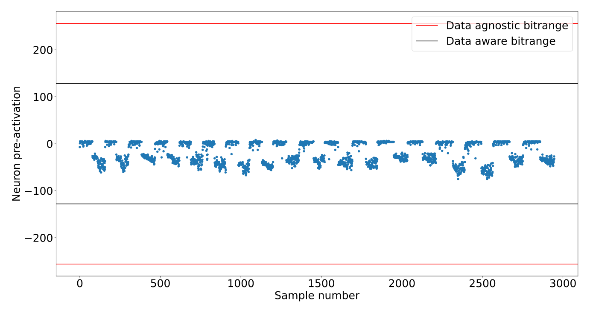

---
header-includes:
 - \usepackage{fvextra}
 - \usepackage{mathtools}
 - \usepackage{amsmath}
 - \DefineVerbatimEnvironment{Highlighting}{Verbatim}{breaklines,commandchars=\\\{\}}
---

# Symbol definitions
- $N$ = the number of input features,  
- $M$ = the number of hidden neurons (in our case it is always 40),  
- $C$ = the number of output neurons/ number of classes  
- $S$ be the number of samples in the dataset,
- $x_i$ be the ith input feature,  
- $x_i$ be the i^*th*^ input feature,  
- $D^i$ be the i-th sample of the dataset,
- $D^i_j$ be the value the j_th_ input feature takes on the i_th_ sample
  of the dataset,
- $h_i$ be the i_th_ hidden neuron, also used to denote it's output value
before binarization,  
- $s_i$ be the i_th_ hidden neuron's output after binarization, so $s_i =
h_i \ge 0$,  
- $y_i$ be the i_th output neuron, also used to denote it's output value,  
- $W1$ = the weight matrix of the first layer,  
- $W2$ = the weight matrix of the second layer,  

Rows represent neurons and columns represent input activations,
so $W1_{i,j}$ is the weight of the first layer that corresponds to the
connection between the input feature $x_j$ and the neuron $h_i$.

\newpage

# Combinatorial fully connected implementations
Two initial approaches for implementing the fully connected BNNs
in a fully combinatorial single-cycle datapath are compared.
Only the first layer differs between them, the second layer stays
unchanged.

## Positive-Negative Sum


For each neuron in the first layer two sums are calculated. $\Sigma^+_i$
is the sum of the input features for which the connection with the i_th_
hidden neuron has a positive weight , whereas $\Sigma^-_i$ the sum of
those that have a negative weight associated. The two sums are then
compared and if the positive sum is greater than or equal to the
negative the output of the neuron is 1, otherwise 0.
$$ \Sigma^+_i = \sum_{j=0}^{N-1} x_j [W1_{i,j} > 0] $$
$$ \Sigma^-_i = \sum_{j=0}^{N-1} x_j [W1_{i,j} < 0] $$
$$ h_i = \Sigma^+_i \ge \Sigma^-_i $$

Sample code snippet:
```{.verilog}
assign positives[0] = + feature_array[1] + feature_array[2] + ... + feature_array[10];
assign negatives[0] = + feature_array[0] + feature_array[3] + feature_array[5];
assign hidden[0] = positives[0] >= negatives[0];
```

The reasoning behind splitting the sums is that keeping the operations
to only using unsigned positive numbers and only using addition and not
subtraction means simpler operations are required, and that may lead to
a smaller footprint.

For each neuron of the output layer it's value is calculated by summing
the output of hidden neurons. The binary output of the hidden neuron $s_j$is added as-is to the sum of the output neuron $y_i$ in the case that the weight of their connection $W2_{i,j}$ is positive and it's binary inverse is added to the sum if $W2_{i,j}$ is negative. This is equivalant to the sum of the xnor between the output vector of the hidden layer and the weight vector of the output neuron.

$$
y_i = \sum_{j=0}^{M-1} \begin{dcases}
    s_j,& \text{if } W2_{i,j} > 0\\
    \neg s_j,              & \text{if } W2_{i,j} < 0
\end{dcases}
$$

Code sample:

```{.verilog}
assign scores[0*SUM_BITS+:SUM_BITS] = + hidden_n[0] + hidden[1] + hidden[2] + ... + hidden_n[39];
```

## Signed sum


In this version a single sum is calculated for each neuron. If the
connection between input feature $x_j$ and hidden neuron $h_i$ has
weight $W1_{i,j} = 1$ it is added to the sum, otherwise it is subtracted
from it. Basically adding the feature multiplied by either 1 or -1 is
hard-coded as the resulting addition or subtraction correspondingly.
The result is then compared to zero to give the binarized output of the
neuron. Since the result is a signed number, this just means taking the
sign bit.

$$
h_i = \sum_{j=0}^{N-1} \begin{dcases}
    + x_j,& \text{if } W1_{i,j} > 0\\
    - x_j,              & \text{if } W1_{i,j} < 0
\end{dcases}
$$

Code sample:
```{.verilog}
wire signed [8:0] intra_0;
assign intra_0 = - feature_array[0] + feature_array[1] + ... + feature_array[10];
assign hidden[0] = intra_0 >= 0;
```

The second layer's implementation is not changed from how it is
described above.

## Discussion
My prior expectation was that splitting the features into two sums to
avoid subtractions would lead to better results than keeping all the
operations for a neuron to a single expression by the reasoning
summarised previously. In fact it turns out that using a single sum
has area and power requirements 20-30% lower than using two.

My explanation for this is that keeping terms in separate expressions
prevents the compiler from effectively locating and reducing shared
subexpressions during synthesis. For example, if a neuron's expression
contains $+x_5+x_6-x_7$ and a different neuron contains $-x_5+x_6+x_7$
then the result of $x_5-x_7$ can be used for both neurons, but if $x_5$
and $x_7$ are not in the same expression, as they would not be in the
positive-negative sum implementation, this arithmetic optimization is
not used by the compiler. Additionally the two sums need comparators to
produce the binarized output of the neuron, whereas in the case the
signed sum this corresponds to the sign bit of the sum which means no
additional hardware.

# Minimum range bit-width reduction



The reasoning goes that if the bitwidth that is demanded for the total
sum of the features is reduced, the bitwidth that partial sums it
depends on require lower on the adder graph is also reduced. As a
consequence, adders need to accomodate less bits and less logic ought to
be implemented for them.

At least in theory, the minimal circuit to implement the calculations of
the sums of the first layer with reduced widths for the results should
be strictly equal or smaller than the one with full widths. This is
because given a circuit that implements the full width calculations, the
reduced width results can be taken by selecting the bitrange of that
width from the least significant bits of the full width result. This is
simple wire selection and does not require any additional hardware,
therefore reducing neuron widths can never require additional logic.

So far in the first layer the bitwidth of the
total sum $h_i$ of the neuron is set to be large enough to fit any value
that may come up as the result of $M$ additions and subtractions of 4-bit
unsigned numbers. The assumption is that this range is significantly
wider than the range of values the neuron actually takes during
evaluation of typical samples. This would mean the bitwidth can be
lowered without errors due to overflows or underflows coming up in
actual use of the design, and this lowering would improve performance.

To test this the total sum of each neuron $h_i$ is calculated for each
sample in the dataset. I get the minimum and maximum of these values.
Since all values for the total sum to take are contained in the range
between those two, the arithmetic operations need not accomodate any
range larger than that.  Let $H^i_j$ be the value of $h_i$ when
evaluating the j_th_ sample of the dataset, and $wh_i$ be the bitwidth
of the i_th_ hidden neuron.

$$h_{i max} = \max\limits_{j=0}^{S-1} H^i_j$$
$$h_{i min} = \min\limits_{j=0}^{S-1} H^i_j$$
$$ wh_i = \lceil \log_2(\max(h_{i max},\lvert h_{i min}\rvert -1)) \rceil+1 $$

## Discussion

The results are negligible, in the 1-3% range, and in the
case of pendigits they even deteriorate a bit. This deterioration
should not be possible in theory if the synthesised circuits are optimal
implementations of their description. This is at least evidence that the
negligible results on the other datasets can be better if I can get
them into a form the compiler can work better with, though I still think
the main problem is with the approach itself. It seems that the
truncation goes against best practices and blocks the datapath
extraction process for some neurons, so certain optimizations do not get
applied to them and some would be common resources do not get shared. I
have not found a method to work around this limitation at this point.

# Range centering


## Rationale

Unfortunately I make a mistake when initialy evaluating the results of
limiting the bitwidth of neurons in the previous part. The blunder is
accidentaly comparing the results with the positive-negative sums full
width circuit instead of the single signed sum version that the reduced
width circuits are based on. This causes me to falsely believe that
reducing the bitwidths of computations is much more effective than in
reality. Based on this misanderstanding I pursue finding ways to further
reduce the ranges of values each neuron's total has to support. After
realising the mistaken assumption I don't think those efforts were
justified. The first of these is the attempt to "center" the range of
values so the maximum and minimum values are at an equal distance from
zero.

The range of values a neuron of the first layer can take can be
significantly unbalanced. What this means is that if for example the
feature the hidden neuron tracks occurs infrequently, it will equally
infrequently take positive values, and this suggests that the negative
values it takes can get much large in an absolute sense than the
positive ones get a chance to. If the absolute minimum or maximum value
is multiple times larger than the other one, let's say $h_{i max} = 10
h_{i min}$, then the range of values the bitwidth of the neuron must
support is up to twice as large as the one of the equivalant range
balanced so it's maximum value is as far from zero as it's minimum.

Therefore by subtracting the value that lies at the middle of the range
from the result, the bitwidth of the neuron's sum can be further
reduced. That requires an additional constant subtraction operation for
the calculation of the sum and an additional comparison operation, since
the result needs to be compared to the same constant for binarization
unlike being compared to zero that needs no additional hardware.
However, the hope is that if the width of enough intermediate results of
the adder graph and thus the number of full adders is reduced as a
result it will be enough to more than make up for the cost.

Example: if the highest value the total of the neuron takes
is 300 and the lowest is -100, we need a 10 bit signed integer to fit
all values. If we subtract their average(100) the values will be in
the range -200 to 200, so they fit in a 9 bit signed integer.

$$h_{i max} = \max\limits_{j=0}^{S-1} H^i_j$$
$$h_{i min} = \min\limits_{j=0}^{S-1} H^i_j$$
$$h_{i mid} = \lceil \frac{h_{i max} + h_{i min}}{2} \rceil $$
$$ h'_i = h_i - h_{i mid} $$
$$ wh'_i = \lceil \log_2(\lceil \frac{h_{i max} - h_{i min}}{2} \rceil) \rceil+1 $$

The additional operations are only included in the design for neurons
that this method decreases the bitwidth compared the one calculated from
the "unbalanced" range. For the rest there is no reason to incur the
overhead for no benefit so they are declared the same as they are using
minimum range bit-width reduction.

## Discussion
The results show that the hardware requirements of the additional
operations were not covered by the reduced bitwidths and area and power
demands considerably increased. Given the actual results of how much
reducing bitwidths helps from above this is not surprising. In fact it
seems counter-intuitive that for the winered dataset's model it lead to a
6% improvement.

Notably, this was the model that had the most benefit
from the previous bitwidth reduction as well. I estimate this model's
operations in the first layer lend themslves less to arithmetic
optimizations compared to the rest, and thus hindering that optimization
process is not as rough a sacrifice.

It also seems probable that subtracting a simpler constant than the
actual value at the middle of the range $h_{i mid}$, for example the
nearest power of two, would lessen the computational burden of the
additional subtraction and comparison, but not enough to be worth
implementing.

# Naively reducing bitwidths of intermediate results
## Rationale

Given the eventual goal of applying approximate computation techniques to
the adder graph of the designs a problem, mentioned previously, comes
up. If the approximation, whatever it may be, gets applied separately to
each neuron's sum, almost certainly blocks the datapath extraction
process from performing arithmetic optimizations such as reducing and
sharing common subexpressions across neurons. The result is $M$ separate
approximate adder trees. Even given that the logic reduction gained from
approximate additions for each adder tree is more than enough to offset
the lost benefit of intermediate result sharing, that may be an
unnecessary concession.

To estimate how large the negative effect of an approximation technique
not taking cross-neuron sharing into consideration could be, I reduce
the bitwidths of intermediate results of the sum of each neuron.
Even though this would reasonably help for a single neuron, I expect it
will cause resource sharing to break. Given how large the negative
effect is I can check if this is a problem than ought to be fixed before 
approximation can confidently be applied.

## Implementation


The cumulative sum along the input features multiplied by the weight of
their connection with the neuron $i$ is calculated for each hidden
neuron and for each sample of the dataset. The maximum and minimum
values over all samples at each step of the cumulative sum for a given
neuron is then calculated. In a similar fashion to the method described
above for reducing the bitwidth of the total result of the neuron's
operations, the operations are written sequentially with the result of
each having it's bitwidth set based on the range of values for the
equivalent step of the sum for all of the dataset.

Let $h_{i,j}$ denote the result of the pre-activation value of the
$i$-th hidden neuron only taking into account the input features $x_0$ to
$x_j$, or equivalently the value of $h_i$ if $x_{j+1}$ to $x_{N-1}$ are
masked to zero.

$$ h_{i,j} =  \sum_{k=0}^{j} x_k W1_{i,k} $$
$$ hmax_{i,j} = \max\limits_{l=0}^{S-1} \sum_{k=0}^{j} D_k^l W1_{i,k} $$
$$ hmin_{i,j} = \min\limits_{l=0}^{S-1} \sum_{k=0}^{j} D_k^l W1_{i,k} $$
$$ wh_{i,j} = \lceil \log_2(\max(hmax_{i,j},\lvert hmin_{i,j}\rvert -1)) \rceil+1 $$

Sometimes due to the order of additions and subtractions the width
needed at a later step is less than the one of an earlier step. This
is because every sample for which there would be an overflow in the
earlier step with the smaller width would at some following feature
underflow back in the range it supports. This has been taken into
account. If a width of a subsequent operation's result is smaller, the
bitwidth of the previous addition/subtraction is simply set to that
smaller value.

$$ wh'_{i,j} = \min\limits_{k=j}^{N-1} wh_{i,j} $$

Consecutive operations that have the same result bitwidth are grouped
together and expressed in verilog as a single sum. I have not confirmed
if this does in fact affect the result of synthesis at all but it seems
to conform closer to the recommendations of the best practices guide.

## Discussion

The results were positive for two of the models with the smallest count
of input features $N$, which means that this method performed better
than the initial expectation. However, the optimization loss from losing 
shared operations shows clear scaling with the number $N$ of input
features. With more elements to sum, more common subexpressions to
optimise ought to come up, so this is keeping with expectations.

At the network with the largest $N$, the one belonging to gasId, which
has 128 sensor features, it has gotten bad enough to almost double the
area and power requirements. This shows that the issue is indeed
considerable when there is more than a handful of inputs, and ways to
work around it shall be searched for.
