# GENERAL INFO
All bnns follow a similar architecture that consists
of an input layer with 4 bit features, a hidden layer
with 40 neurons and an output layer followed by argmax.
The inputs of first layer of the model are not binarized,
as that does not leave enough representational ability to
enable classification. The outputs of the last layer are also
not binarized as they are compared to determine the most propable class.

Designs and models labeled "bnn" are fully connected.
Weights and hidden neuron activations are either 1 or -1.
Designs and models labeled "tnn" have weights in {-1, 0, 1}.
Hidden activations are left as binary, so they are ternary weight
networks and not full ternary networks.
Instead of using arithmetic with ternary weights they are implemented
as sparse bnns, where weights with a value of 0 mean a missing connection.

The first layer is implemented as additions and subtractions of the
input features. The second layer is implemented as the sum of the
binarized activations xnored by the weights.

Models have been trained with binary and ternary weights for six small
datasets with sensor features. For each of the following designs the
model of each dataset has been implemented and has been tested to make
sure the verilog design picks the same class as the model in python for
the first 1000 samples of the dataset.
They have been synthesized and the resuting area and power are given for
each. If a design is based on a previous design the metrics for both are
shown for comparison.

Since bnns are easier to try things with some designs for bnns have no
tnn equivelant yet.

When a design is derived from an earlier design it will be annotated as
**EARLIER DESIGN -> NEW DESIGN**.

Due to a self-imposed deadline only the descriptions for bnn designs
are completed. The descriptions for tnn designs will follow soon.


## METRICS
### Area in microns
|             |       gasId |   winewhite |     cardio |   pendigits |        Har |    winered |
|:------------|------------:|------------:|-----------:|------------:|-----------:|-----------:|
| bnndw       |  8186903514 |  2398069796 | 2625544276 |  2989958945 | 2538763759 | 2451240647 |
| bnnpaar     | 28155004994 |  1801300497 | 3873514668 |  3542788838 | 1742276623 | 1855123140 |
| bnndsat     |  8104696944 |  2243047476 | 2476688256 |  2978862895 | 2401863926 | 2301503726 |
| bnnrobus    |  5539426651 |   955878036 | 1244282486 |  1192648308 |  997044886 |  966295906 |
| bnnromem    |  3787005725 |   795724384 |  973538254 |   954620558 |  815933049 |  795551471 |
| bnnromesx   |  3784003792 |   797892993 | 1002634724 |   947374667 |  837521356 |  812703088 |
| bnnparstepw | 32698398388 |  1999572812 | 3928792766 |  3709266179 | 2315518878 | 2278159189 |
| bnnpaarter  | 26137614509 |  1665255587 | 3596909349 |  3222330307 | 1872808096 | 1747020576 |
| bnnparpnw   | 26940613850 |  2586857731 | 4581533966 |  4301046264 | 2915795216 | 2779674503 |
| bnnpaarx    | 28161515912 |  1819920659 | 3878707190 |  3551930192 | 1733307035 | 1843638582 |
| bnnparser   | 17136617736 |  2036496895 | 3321122892 |  3396546062 | 2425075600 | 2186536366 |
| bnnrospinor |  3710576970 |   747786913 |  934543087 |   881331046 |  775932821 |  757033635 |
| bnnpar      | 26976191700 |  2600670967 | 4671425747 |  4294613522 | 2939539015 | 2782322518 |
| bnndsatin   |  7747969288 |  2356646791 | 2810682089 |  3109779691 | 2545317224 | 2429171177 |
| bnnroll     |  4296589691 |  1034974561 | 1118415523 |  1313186365 | 1030487839 | 1020139925 |
| bnnparsign  | 17509279782 |  2047349412 | 3327450493 |  3338288839 | 2451830762 | 2245461263 |
| bnnroclk    |  3740279945 |   757164887 |  978063287 |   944926916 |  813471167 |  781711587 |
| bnnroperm   |  3767065181 |   785042623 |  956446441 |   935021870 |  814428053 |  787104215 |
| bnnrospine  |  3731008262 |   748739199 |  930476830 |   907653792 |  781939782 |  760587951 |
| bnnromesh   |  3762552965 |   778943884 |  967400533 |   943117202 |  811382778 |  799002613 |
| bnndirect   |  8862217257 |  2731200293 | 3049513878 |  3293137497 | 2763413176 | 2711150360 |
| bnnparw     | 17136617736 |  2036496895 | 3321122892 |  3396546062 | 2425075600 | 2186536366 |
| bnnrolx     |  4212096283 |   864705835 | 1109597201 |  1069429557 |  914303937 |  885090188 |
| bnnromex    |  3797082992 |   796969544 |  975525744 |   966093815 |  822660672 |  810091571 |
| bnnseq      |  4767284030 |  2974950246 | 3146979597 |  3471397032 | 2954896914 | 2957271954 |
| bnnrolin    |  3854120055 |   799945409 | 1085099120 |  1036541150 |  829139916 |  804058285 |
| bnnparce    | 18182298639 |  2047575794 | 3484390096 |  3573660077 | 2499410773 | 2076451308 |


### Power in Watt
|             |   gasId |   winewhite |   cardio |   pendigits |    Har |   winered |
|:------------|--------:|------------:|---------:|------------:|-------:|----------:|
| bnndw       |  0.3256 |      0.1062 |   0.1249 |      0.1231 | 0.1164 |    0.1121 |
| bnnpaar     |  0.8076 |      0.0598 |   0.1241 |      0.1146 | 0.0572 |    0.0626 |
| bnndsat     |  0.3189 |      0.0985 |   0.1187 |      0.1216 | 0.1092 |    0.1045 |
| bnnrobus    |  0.0979 |      0.0252 |   0.0294 |      0.0297 | 0.0261 |    0.0257 |
| bnnromem    |  0.13   |      0.0349 |   0.0408 |      0.0382 | 0.0351 |    0.0352 |
| bnnromesx   |  0.1355 |      0.0354 |   0.042  |      0.0404 | 0.0369 |    0.0359 |
| bnnparstepw |  0.9352 |      0.0658 |   0.1255 |      0.1203 | 0.0737 |    0.0753 |
| bnnpaarter  |  0.7597 |      0.0559 |   0.116  |      0.1073 | 0.0608 |    0.0596 |
| bnnparpnw   |  0.7683 |      0.0826 |   0.1428 |      0.1371 | 0.0916 |    0.09   |
| bnnpaarx    |  0.809  |      0.0612 |   0.1244 |      0.115  | 0.0565 |    0.0619 |
| bnnparser   |  0.4869 |      0.0667 |   0.1054 |      0.1096 | 0.0776 |    0.0723 |
| bnnrospinor |  0.1218 |      0.0306 |   0.0362 |      0.0341 | 0.0315 |    0.0308 |
| bnnpar      |  0.7677 |      0.0846 |   0.1453 |      0.1368 | 0.0921 |    0.0907 |
| bnndsatin   |  0.3076 |      0.1028 |   0.1303 |      0.1264 | 0.1145 |    0.1089 |
| bnnroll     |  0.1435 |      0.0428 |   0.0469 |      0.0506 | 0.0436 |    0.0435 |
| bnnparsign  |  0.4991 |      0.068  |   0.1062 |      0.1089 | 0.0788 |    0.0746 |
| bnnroclk    |  0.1318 |      0.0344 |   0.0406 |      0.0392 | 0.0363 |    0.0355 |
| bnnroperm   |  0.1317 |      0.0339 |   0.0391 |      0.0385 | 0.0352 |    0.0347 |
| bnnrospine  |  0.1244 |      0.0309 |   0.036  |      0.0351 | 0.0317 |    0.0309 |
| bnnromesh   |  0.1296 |      0.0341 |   0.0401 |      0.0387 | 0.0353 |    0.0348 |
| bnndirect   |  0.3645 |      0.1226 |   0.1508 |      0.1357 | 0.1288 |    0.1257 |
| bnnparw     |  0.4869 |      0.0667 |   0.1054 |      0.1096 | 0.0776 |    0.0723 |
| bnnrolx     |  0.1424 |      0.0375 |   0.0455 |      0.0435 | 0.039  |    0.0389 |
| bnnromex    |  0.1313 |      0.0353 |   0.0409 |      0.0389 | 0.0358 |    0.0356 |
| bnnseq      |  0.2168 |      0.1286 |   0.1431 |      0.139  | 0.1327 |    0.1317 |
| bnnrolin    |  0.1313 |      0.0349 |   0.0456 |      0.0426 | 0.0363 |    0.0357 |
| bnnparce    |  0.5161 |      0.0658 |   0.1105 |      0.1155 | 0.079  |    0.0677 |


# BNNPAR


In bnnpar the arithmetic operations for each neuron are written out in
verilog. For first layer neurons the features that correspond to
positive weights are split from those that correspond to negative weights,
the sum of each is calculated seperately and the two sums are compared to
get the sign of the total sum, which is the output of the neuron. Here is an example:
```
assign positives[0] = + feature_array[1] + feature_array[2] + ... + feature_array[10];
assign negatives[0] = + feature_array[0] + feature_array[3] + feature_array[5];
assign hidden[0] = positives[0] >= negatives[0];
```
For second layer neurons the hidden features that correspond to positive
weights are summed as is and those that correspond to negative weights the
inverse is added to the sum. This is equivelant to adding the result of
the xnor of the activation with the weight. Example("hidden_n" the inverse
of the array of hidden features, which is "hidden"):
```
assign scores[0*SUM_BITS+:SUM_BITS] = + hidden_n[0] + hidden[1] + hidden[2] + ... + hidden_n[39];
```
# BNNPAR -> BNNPARSIGN

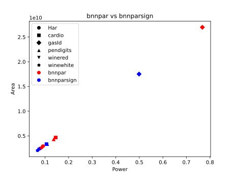

|           |   bnnpar area |   bnnparsign area | area change   |   bnnpar power |   bnnparsign power | power change   |
|:----------|--------------:|------------------:|:--------------|---------------:|-------------------:|:---------------|
| Har       |         29.4  |             24.52 | -16.6%        |           92.1 |               78.8 | -14.4%         |
| cardio    |         46.71 |             33.27 | -28.8%        |          145.3 |              106.2 | -26.9%         |
| gasId     |        269.76 |            175.09 | -35.1%        |          767.7 |              499.1 | -35.0%         |
| pendigits |         42.95 |             33.38 | -22.3%        |          136.8 |              108.9 | -20.4%         |
| winered   |         27.82 |             22.45 | -19.3%        |           90.7 |               74.6 | -17.8%         |
| winewhite |         26.01 |             20.47 | -21.3%        |           84.6 |               68   | -19.6%         |

The difference from bnnpar is all the input features are added together
in the first layer instead of split in positives and negatives. Features
that correspond to weights of the neuron that are 1 are added and those
of weights that are -1 are subtracted. Example:
```
wire signed [8:0] intra_0;
assign intra_0 = - feature_array[0] + feature_array[1] + ... + feature_array[10];
assign hidden[0] = intra_0 >= 0;
```
It results to a significant improvement compared to spliting the features.
I expected the oposite to happen, thinking that only using additions would
lead to more partial results being same between neurons and thus 
increasing sharing hardware. I assume the reason it is better is  that having all variables in the same expression per neuron allows for more 
posibilities in rearanging them to share subexpressions.

# BNNPARSIGN -> BNNPARW
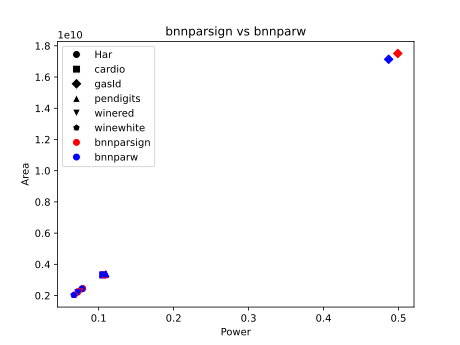

|           |   bnnparsign area |   bnnparw area | area change   |   bnnparsign power |   bnnparw power | power change   |
|:----------|------------------:|---------------:|:--------------|-------------------:|----------------:|:---------------|
| Har       |             24.52 |          24.25 | -1.1%         |               78.8 |            77.6 | -1.5%          |
| cardio    |             33.27 |          33.21 | -0.2%         |              106.2 |           105.4 | -0.8%          |
| gasId     |            175.09 |         171.37 | -2.1%         |              499.1 |           486.9 | -2.4%          |
| pendigits |             33.38 |          33.97 | +1.8%         |              108.9 |           109.6 | +0.6%          |
| winered   |             22.45 |          21.87 | -2.6%         |               74.6 |            72.3 | -3.1%          |
| winewhite |             20.47 |          20.36 | -0.5%         |               68   |            66.7 | -1.9%          |

Bnnparw differs with bnnparsign only in the number of bits that are
used for the result of the operations of the hidden neurons.
In bnnparsign all total sums have the maximum width a series of sums and
subtractions of as many 5-bit integers as the inputs could take. In bnnparw each neuron gets assigned the minimum bitwidth needed to fit all the
results it encounters in evaluating all the samples of the dataset. The
bitwidth used for the operations is thus reduced. Unfortunately this
truncation can block datapath extraction, leading the results to be
worse for pendigits.
Bnnparpnw is the equivelant for bnnpar, where the minimum bitwidth for the
positive and negative components of the neuron sum is used.

# BNNPARW -> BNNPARCE


|           |   bnnparw area |   bnnparce area | area change   |   bnnparw power |   bnnparce power | power change   |
|:----------|---------------:|----------------:|:--------------|----------------:|-----------------:|:---------------|
| Har       |          24.25 |           24.99 | +3.1%         |            77.6 |             79   | +1.8%          |
| cardio    |          33.21 |           34.84 | +4.9%         |           105.4 |            110.5 | +4.8%          |
| gasId     |         171.37 |          181.82 | +6.1%         |           486.9 |            516.1 | +6.0%          |
| pendigits |          33.97 |           35.74 | +5.2%         |           109.6 |            115.5 | +5.4%          |
| winered   |          21.87 |           20.76 | -5.1%         |            72.3 |             67.7 | -6.4%          |
| winewhite |          20.36 |           20.48 | +0.6%         |            66.7 |             65.8 | -1.3%          |

For each hidden neuron the average of the maximum and minimum value it's
total sum can take is subtracted from the sum in order to make the range
of values centered on zero and thus reduce the bitwidth needed for it.
Example: if the highest value the total of the neuron takes is 300 and
the lowest is -100, we need a 10 bit signed integer to fit all values.
If we subtract their average(100) the values will be in the range -200
to 200, so they fit in a 9 bit signed integer.
RESULTS
Subtracting the closest power of two that gets the range of values to
a reduced bitwidth may do better.

# BNNPARW -> BNNPARSTEPW
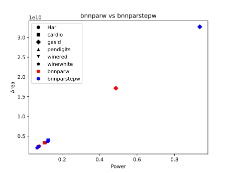

|           |   bnnparw area |   bnnparstepw area | area change   |   bnnparw power |   bnnparstepw power | power change   |
|:----------|---------------:|-------------------:|:--------------|----------------:|--------------------:|:---------------|
| Har       |          24.25 |              23.16 | -4.5%         |            77.6 |                73.7 | -5.0%          |
| cardio    |          33.21 |              39.29 | +18.3%        |           105.4 |               125.5 | +19.1%         |
| gasId     |         171.37 |             326.98 | +90.8%        |           486.9 |               935.2 | +92.1%         |
| pendigits |          33.97 |              37.09 | +9.2%         |           109.6 |               120.3 | +9.8%          |
| winered   |          21.87 |              22.78 | +4.2%         |            72.3 |                75.3 | +4.1%          |
| winewhite |          20.36 |              20    | -1.8%         |            66.7 |                65.8 | -1.3%          |

For each hidden neuron we add/subtract the features in order for each
sample of the dataset. For each step of the process we find what the
minimum bitwidth to hold each of the values is.
For example we will need 5 bits for the just the first feature, 6 for
feature 1 + feature 2, 7 bits for feature 1 + feature 2 - feature 3 and
so on.

Sometimes due to the order of additions and subtractions the width needed
at a later step is less than the one of an earlier step. This is because
every sample for which there would be an overflow in the earlier step
with the smaller width would at some following feature underflow back in
the range it supports. This has been taken into account.

I expected this one to do worse than bnnparw and it did.
Truncating subexpressions impeded datapath extraction and so the results
were negative for most datasets, althougth Har and winewhite improved a
bit.

# BNNPARSIGN -> BNNPAAR, BNNPAARX, BNNPAARTER
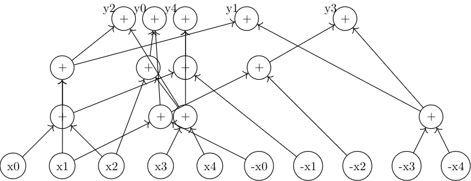


|           |   bnnparsign area |   bnnpaar area | area change   |   bnnparsign power |   bnnpaar power | power change   |
|:----------|------------------:|---------------:|:--------------|-------------------:|----------------:|:---------------|
| Har       |             24.52 |          17.42 | -29.0%        |               78.8 |            57.2 | -27.4%         |
| cardio    |             33.27 |          38.74 | +16.4%        |              106.2 |           124.1 | +16.9%         |
| gasId     |            175.09 |         281.55 | +60.8%        |              499.1 |           807.6 | +61.8%         |
| pendigits |             33.38 |          35.43 | +6.1%         |              108.9 |           114.6 | +5.2%          |
| winered   |             22.45 |          18.55 | -17.4%        |               74.6 |            62.6 | -16.1%         |
| winewhite |             20.47 |          18.01 | -12.0%        |               68   |            59.8 | -12.1%         |

Since bnnstepw didn't work I thought finding the order of operations
Design Compiler uses after optimization and truncating widths there
may fare better. I first tried to get the arithmetic
operations that are used after optimization from the
analysis of datapath extraction report it provides. It turned out to
be harder than expected and having to synthesize twice is suboptimal
so I searched for an algorithm to do a similar arithmetic optimization
beforehand.

Paar's algorithm, found in [1] is used. It is explained well
in that paper so I won't repeat the explanation here. Paar's algorithm
considers the case where elements are only added, so to make it work
for our case where there are also subtractions the negatives of input
features are treated as seperate additional elements, so the operations
for all neurons can be written with additions only.

By running it on the weight matrix of the first layer we get a series
of additions between pairs of input features and/or intermediate results
that calculate the total sum of each neuron. The additions are
implemented in the same order in the design with an array to hold the
intermediate results. Bitwidths for intermediate and final results
were left at the default width from bnnparsign, custom widths were
not implemented.
Designs that have only the first layer implementing the operations
found from the algorithm are called bnnpaar and those that have
both layers are bnnpaarx.

Paar's algorithm was also expanded to work with subtractions.
The implementation will be described seperately. Since it also uses
subtraction it gives shorter series of operations. Designs using
the ternary expansion in the first layer are called bnnpaarter.

I expected the results to be worse for all designs since Design
Compiler would use the best available heuristics, so the fact
hardcoding the order of operations with Paar's algorithm and the
ternary expansion had up to 30% area reduction for some designs,
even though it was worse for cardio and gasId, makes me suspect
I have somehow crippled the datapath extraction of bnnparsign,
though I don't see what could be a problem.

# BNNSEQ
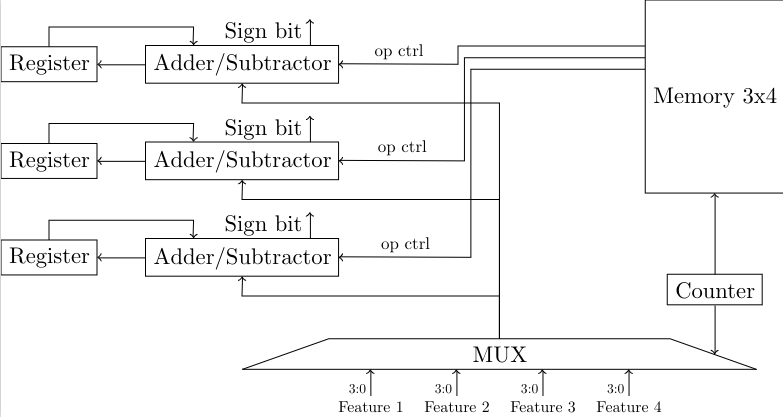
This implements the layers sequentialy in regards to the inputs of the
layer, meaning each neuron has an accumulator and each cycle it is 
active it adds/subtracts the an input feature. All neurons update
on the the same feature on the same cycle.
Features get chosen to be the current sample in order.
In the first layer a counter and multiplexer is used to pick the current
sample. Features are picked in order. The column of binary weights that
corresponds to the feature also gets picked from the weight matrix.
Each accumulator receives as input the current feature and the weight bit
of it's neuron and feature and depending on the weight bit either adds or
subtracts the feature from it's running total.

Once the counter reaches the last feature a flag that signals the first
layer is done is set. This enables the second layer to start
accumulating and freezes the first layer.
Instead of choosing the weight bit that corresponds to each hidden
feature and neuron and adding their xnor the second layer hardcodes
the vector from which a neuron recieves it's inputs so it has the output
of the previous layer in the position of an activation if the
activation's weight with the neuron is 1 and it's inverse otherwise.

That way the accumulators of the second layer are simply counters with
an enable signal that is set to the bit they would have to add.
The results of the second layer are passed to an argmax module that
returns the predicted class.

A design where shift registers where used to hold the weights
instead of indexing a constant array with the counter was also attempted
but turned out to be far worse.

# BNNSEQ -> BNNDIRECT


|           |   bnnseq area |   bnndirect area | area change   |   bnnseq power |   bnndirect power | power change   |
|:----------|--------------:|-----------------:|:--------------|---------------:|------------------:|:---------------|
| Har       |         29.55 |            27.63 | -6.5%         |          132.7 |             128.8 | -2.9%          |
| cardio    |         31.47 |            30.5  | -3.1%         |          143.1 |             150.8 | +5.4%          |
| gasId     |         47.67 |            88.62 | +85.9%        |          216.8 |             364.5 | +68.1%         |
| pendigits |         34.71 |            32.93 | -5.1%         |          139   |             135.7 | -2.4%          |
| winered   |         29.57 |            27.11 | -8.3%         |          131.7 |             125.7 | -4.6%          |
| winewhite |         29.75 |            27.31 | -8.2%         |          128.6 |             122.6 | -4.7%          |

The difference of bnndirect with bnnseq is it also uses a hardcoded
input vector for each neuron in the first layer instead of just the second.
For each 4-bit input feature and every neuron a 5-bit signed seqment of the
neuron's custom input vector is set to either the feature or the negative
of the feature.

It improves area and power except in the case of gasId, which has an order
of magnitude more input features than other datasets and thus scales
differently.

# BNNDIRECT -> BNNDW
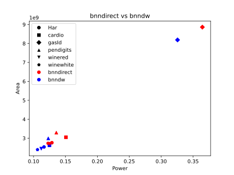

|           |   bnndirect area |   bnndw area | area change   |   bnndirect power |   bnndw power | power change   |
|:----------|-----------------:|-------------:|:--------------|------------------:|--------------:|:---------------|
| Har       |            27.63 |        25.39 | -8.1%         |             128.8 |         116.4 | -9.6%          |
| cardio    |            30.5  |        26.26 | -13.9%        |             150.8 |         124.9 | -17.2%         |
| gasId     |            88.62 |        81.87 | -7.6%         |             364.5 |         325.6 | -10.7%         |
| pendigits |            32.93 |        29.9  | -9.2%         |             135.7 |         123.1 | -9.3%          |
| winered   |            27.11 |        24.51 | -9.6%         |             125.7 |         112.1 | -10.8%         |
| winewhite |            27.31 |        23.98 | -12.2%        |             122.6 |         106.2 | -13.4%         |

Bnndw is bnndirect with first layer accumulators getting their bitwidth
set to the minimum needed similarly to bnnparw.
The gains are more pronounced than the parallel case since the registers
take up a significant portion of the resources and each bit shaved off
an accumulator's range removes a flip-flop.

# BNNDW -> BNNDSAT

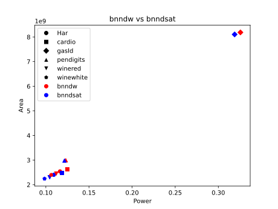

|           |   bnndw area |   bnndsat area | area change   |   bnndw power |   bnndsat power | power change   |
|:----------|-------------:|---------------:|:--------------|--------------:|----------------:|:---------------|
| Har       |        25.39 |          24.02 | -5.4%         |         116.4 |           109.2 | -6.2%          |
| cardio    |        26.26 |          24.77 | -5.7%         |         124.9 |           118.7 | -5.0%          |
| gasId     |        81.87 |          81.05 | -1.0%         |         325.6 |           318.9 | -2.1%          |
| pendigits |        29.9  |          29.79 | -0.4%         |         123.1 |           121.6 | -1.2%          |
| winered   |        24.51 |          23.02 | -6.1%         |         112.1 |           104.5 | -6.8%          |
| winewhite |        23.98 |          22.43 | -6.5%         |         106.2 |            98.5 | -7.3%          |

In bnndsat saturation is used in combination with bnndw's truncation to
reduce the number of registers farther. Using the DW_addsub_dx module
from designware the result of adding a sample to the value of the
accumulator is set to the maximum value the accumulator can hold in the
case it would otherwise overflow and similarly to the minimum value it can
fit in case of underflow.

The bitwidth needed to have the final value after all samples are added
have the correct sign using saturation is shrunk for many neurons.
For neurons where saturation doesn't reduce the number of bits in the
accumulator simple truncation is used instead to avoid the overhead.

(Note: for some reason the simulation module of DW_addsub_dx slowed
simulation with iverilog by two orders of magnitude.)

# BNNROLIN

Also a sequential design, this time the outputs of the layer being
the dynamic dimension instead of the inputs as in bnnseq. This means
that each layer has a single adder tree that computes the output of a
single neuron of the layer per cycle.

In the first layer a custom input vector per neuron is used again like
bnndirect. The adder sums the entire vector of the neuron and the sign
of the result is stored to a register corresponding to the layers output.
Instead of having the negative of the input feature in positions of the
vector that have weight -1 the inverse of it's 5-bit expansion is used.
With the idea that the negative in 2's compliment is the inverse plus 1,
we add a correction term equal to the number of negative weights of the
neuron to the sum to get the correct result.
The correction terms are stored at an array of constants and are indexed
by the counter like the input vectors.
This was measured to be more efficient.

After the counter of the first layer reaches the last neuron the next
layer is activated in a similar fashion with previous sequential designs.
Unlike the first layer the second doesn't need to store the outputs of all
it's neurons. Since it is the last layer we can store only the largest value
seen thus far in a register and only overwrite it when the result of the
current neuron is larger. Along with this the value of the counter (which
corresponds to the index of the neuron) is also written into a register each
time the current result is larger than the previous best. This way the
argmax is calculated at the same time as the output neurons.

# BNNROLIN -> BNNROMEM
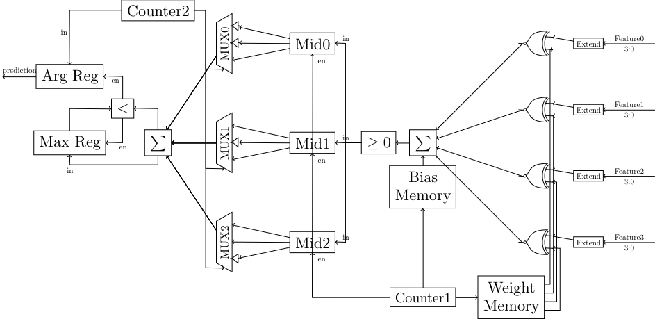
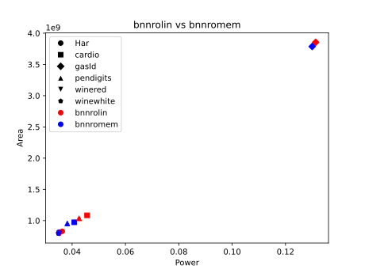

|           |   bnnrolin area |   bnnromem area | area change   |   bnnrolin power |   bnnromem power | power change   |
|:----------|----------------:|----------------:|:--------------|-----------------:|-----------------:|:---------------|
| Har       |            8.29 |            8.16 | -1.6%         |             36.3 |             35.1 | -3.3%          |
| cardio    |           10.85 |            9.74 | -10.2%        |             45.6 |             40.8 | -10.5%         |
| gasId     |           38.54 |           37.87 | -1.7%         |            131.3 |            130   | -1.0%          |
| pendigits |           10.37 |            9.55 | -7.9%         |             42.6 |             38.2 | -10.3%         |
| winered   |            8.04 |            7.96 | -1.0%         |             35.7 |             35.2 | -1.4%          |
| winewhite |            8    |            7.96 | -0.5%         |             34.9 |             34.9 | +0.0%          |

Instead of hardcoding a custom input vector for each neuron the row of
weights that correspond to each neuron are indexed from the weight 
matrix by the counter and the 5-bit expansion of each input feature is
xnored by it's weight bit.

# BNNROMEM -> BNNROMESH
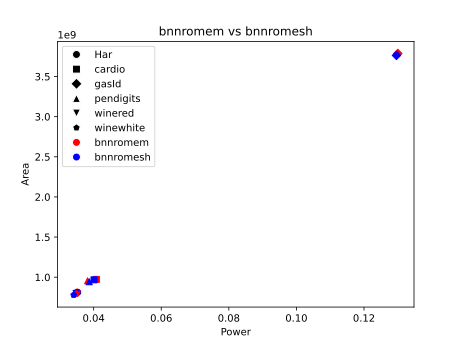

|           |   bnnromem area |   bnnromesh area | area change   |   bnnromem power |   bnnromesh power | power change   |
|:----------|----------------:|-----------------:|:--------------|-----------------:|------------------:|:---------------|
| Har       |            8.16 |             8.11 | -0.6%         |             35.1 |              35.3 | +0.6%          |
| cardio    |            9.74 |             9.67 | -0.7%         |             40.8 |              40.1 | -1.7%          |
| gasId     |           37.87 |            37.63 | -0.6%         |            130   |             129.6 | -0.3%          |
| pendigits |            9.55 |             9.43 | -1.3%         |             38.2 |              38.7 | +1.3%          |
| winered   |            7.96 |             7.99 | +0.4%         |             35.2 |              34.8 | -1.1%          |
| winewhite |            7.96 |             7.79 | -2.1%         |             34.9 |              34.1 | -2.3%          |

Instead of a decoder from the counter to index the register bit
the current result of the first layer should be written to,
bnnromesh stores the value at the end of a shifting register.
At each cycle the register array shifts right once, so when the last
neuron's result is written at the left-most position the first neuron's
result reaches the right-most position and all the results are stored
in order.

# BNNROMESH -> BNNROMESX


|           |   bnnromesh area |   bnnromesx area | area change   |   bnnromesh power |   bnnromesx power | power change   |
|:----------|-----------------:|-----------------:|:--------------|------------------:|------------------:|:---------------|
| Har       |             8.11 |             8.38 | +3.3%         |              35.3 |              36.9 | +4.5%          |
| cardio    |             9.67 |            10.03 | +3.7%         |              40.1 |              42   | +4.7%          |
| gasId     |            37.63 |            37.84 | +0.6%         |             129.6 |             135.5 | +4.6%          |
| pendigits |             9.43 |             9.47 | +0.4%         |              38.7 |              40.4 | +4.4%          |
| winered   |             7.99 |             8.13 | +1.8%         |              34.8 |              35.9 | +3.2%          |
| winewhite |             7.79 |             7.98 | +2.4%         |              34.1 |              35.4 | +3.8%          |

This design was implemented mostly out of curiosity and not
because it would help much.

Since the counter is not used to index the position the result is
stored, the sequence of values it takes doesn't have to be 
linear(0, 1, 2..). Instead of a 6-bit counter we can use any FSM that
gives a sequence of 40 unique 6-bit values in it's place, given that
we replace the array of weights we indexed with the counter's values
with a lookup table with the new sequence's values as indexes.
The smallest such FSM is a linear-feedback shift register with a single
xor gate for the two most significant bits, so that is implemented.

The gain from removing a 6-bit add-1 circuit is negligable and I don't
think the lookup table was implemented as well as it could so the
results were negative.

# BNNROMESH -> BNNROPERM


|           |   bnnromesh area |   bnnroperm area | area change   |   bnnromesh power |   bnnroperm power | power change   |
|:----------|-----------------:|-----------------:|:--------------|------------------:|------------------:|:---------------|
| Har       |             8.11 |             8.14 | +0.4%         |              35.3 |              35.2 | -0.3%          |
| cardio    |             9.67 |             9.56 | -1.1%         |              40.1 |              39.1 | -2.5%          |
| gasId     |            37.63 |            37.67 | +0.1%         |             129.6 |             131.7 | +1.6%          |
| pendigits |             9.43 |             9.35 | -0.8%         |              38.7 |              38.5 | -0.5%          |
| winered   |             7.99 |             7.87 | -1.5%         |              34.8 |              34.7 | -0.3%          |
| winewhite |             7.79 |             7.85 | +0.8%         |              34.1 |              33.9 | -0.6%          |

This design was also implemented mostly out of curiosity.

I had a vague notion that the logic that implements the decoder from the counter to the weights would be simpler if weight rows with
"more similar" bits corresponded to counter values with "more similar"
bits. To try to test that I made a graph of the hamming distances of the 
neuron weights and got an aproximate solution to TSP on it to get a
sequence of neurons that minimises the number of bit changes between
neighbouring neurons. I then got a similar sequence for the values of
the counter (i.e. numbers 0-39) and permuted the rows of the weight
matrix so the i-th neuron in the sequence maps to the i-th value in the
counter sequence.
The columns of the second layer's weight matrix had the same permutation
applied to them so the second layer's results are not affected.

The area increased in half the datasets and decreased in the other
half, so it doesn't seem to be better than a random permutation.

# BNNROMESH -> BNNROSPINE
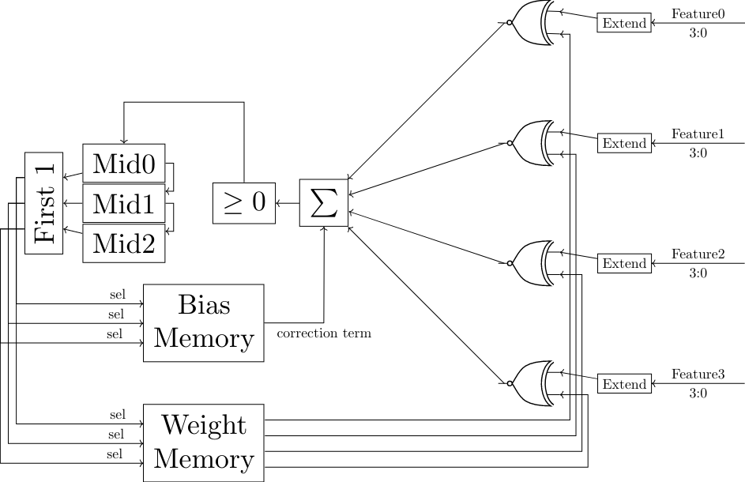
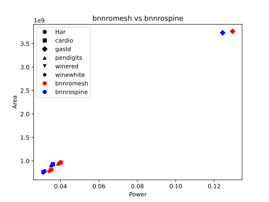

|           |   bnnromesh area |   bnnrospine area | area change   |   bnnromesh power |   bnnrospine power | power change   |
|:----------|-----------------:|------------------:|:--------------|------------------:|-------------------:|:---------------|
| Har       |             8.11 |              7.82 | -3.6%         |              35.3 |               31.7 | -10.2%         |
| cardio    |             9.67 |              9.3  | -3.8%         |              40.1 |               36   | -10.2%         |
| gasId     |            37.63 |             37.31 | -0.9%         |             129.6 |              124.4 | -4.0%          |
| pendigits |             9.43 |              9.08 | -3.7%         |              38.7 |               35.1 | -9.3%          |
| winered   |             7.99 |              7.61 | -4.8%         |              34.8 |               30.9 | -11.2%         |
| winewhite |             7.79 |              7.49 | -3.9%         |              34.1 |               30.9 | -9.4%          |

The shifting regiter that stores the 1st layer's outputs gets initialised
with a 1 in the left-most position and 0s in all other positions. A
circuit that outputs a one-hot vector where only the bit in the position
of the left-most nonzero bit in the shifting register is set to 1 is
added.
That implements a one-hot shifting register that encodes the index
of the currently calculated neuron without using additional memory
elements.

Using the bits of the one-hot vector as select signals for the weight
rows the counter and it's encoder can be removed, leading in efficiency
gains.

# BNNROSPINE -> BNNROSPINOR
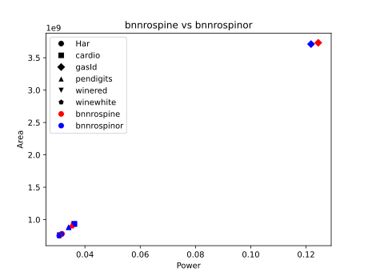

|           |   bnnrospine area |   bnnrospinor area | area change   |   bnnrospine power |   bnnrospinor power | power change   |
|:----------|------------------:|-------------------:|:--------------|-------------------:|--------------------:|:---------------|
| Har       |              7.82 |               7.76 | -0.8%         |               31.7 |                31.5 | -0.6%          |
| cardio    |              9.3  |               9.35 | +0.5%         |               36   |                36.2 | +0.6%          |
| gasId     |             37.31 |              37.11 | -0.5%         |              124.4 |               121.8 | -2.1%          |
| pendigits |              9.08 |               8.81 | -3.0%         |               35.1 |                34.1 | -2.8%          |
| winered   |              7.61 |               7.57 | -0.5%         |               30.9 |                30.8 | -0.3%          |
| winewhite |              7.49 |               7.48 | -0.1%         |               30.9 |                30.6 | -1.0%          |

Instead of the lookup table used for weights in bnnrospine,
the current weight that corresponds to a given input feature is
calculated by a NOR of the bits of the one-hot vector in positions
where the weight column of the feature would be -1.

Except for cardio, it is an improvement.

# BNNROSPINE -> BNNROBUS


|           |   bnnrospine area |   bnnrobus area | area change   |   bnnrospine power |   bnnrobus power | power change   |
|:----------|------------------:|----------------:|:--------------|-------------------:|-----------------:|:---------------|
| Har       |              7.82 |            9.97 | +27.5%        |               31.7 |             26.1 | -17.7%         |
| cardio    |              9.3  |           12.44 | +33.8%        |               36   |             29.4 | -18.3%         |
| gasId     |             37.31 |           55.39 | +48.5%        |              124.4 |             97.9 | -21.3%         |
| pendigits |              9.08 |           11.93 | +31.4%        |               35.1 |             29.7 | -15.4%         |
| winered   |              7.61 |            9.66 | +26.9%        |               30.9 |             25.7 | -16.8%         |
| winewhite |              7.49 |            9.56 | +27.6%        |               30.9 |             25.2 | -18.4%         |

Every input feature gets the current weight bit from an open bus to
which a tristate buffer for each entry in the feature's column in
the weight matrix is connected. Each buffer in a bus corresponds
to a neuron and is controled by that neuron's select signal from the
one-hot vector.

Decent improvements in power are achieved at the cost of significantly
larger areas. At least the power for pendigits got under 30 mW, which
I'm happy about.

# BNNPAR -> TNNPAR


|           |   bnnpar area |   tnnpar area | area change   |   bnnpar power |   tnnpar power | power change   |
|:----------|--------------:|--------------:|:--------------|---------------:|---------------:|:---------------|
| Har       |         29.4  |         14.58 | -50.4%        |           92.1 |           46.1 | -49.9%         |
| cardio    |         46.71 |         20.55 | -56.0%        |          145.3 |           66.3 | -54.4%         |
| gasId     |        269.76 |        110.99 | -58.9%        |          767.7 |          325.4 | -57.6%         |
| pendigits |         42.95 |         29.97 | -30.2%        |          136.8 |           97.4 | -28.8%         |
| winered   |         27.82 |         13.42 | -51.8%        |           90.7 |           44   | -51.5%         |
| winewhite |         26.01 |         10.49 | -59.7%        |           84.6 |           35.1 | -58.5%         |

Tnnpar is exactly the same as bnnpar except for weights that are set to
0 corresponding to the feature being added to neither the positive or
negativ sum of the neuron in the first layer and neither the bit output
of a hidden neuron nor it's inverse being added to the popcount of the
output neuron for the second layer.

# BNNPARSIGN -> TNNPARSIGN 
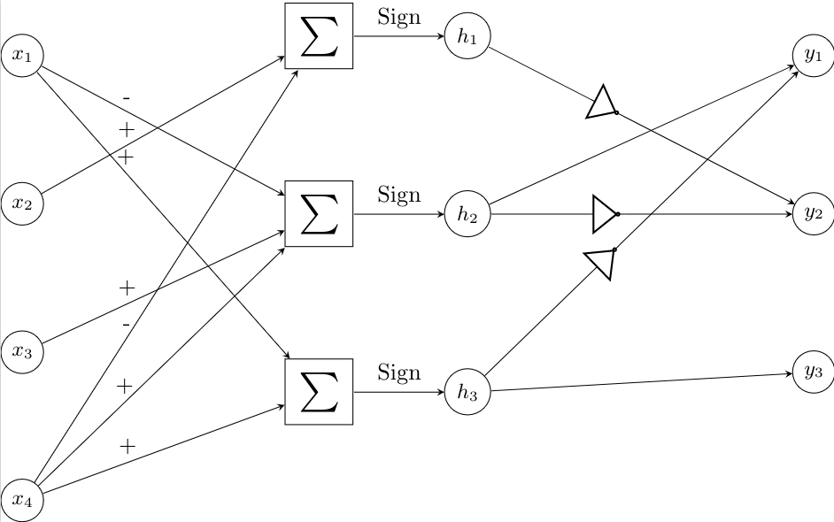


|           |   bnnparsign area |   tnnparsign area | area change   |   bnnparsign power |   tnnparsign power | power change   |
|:----------|------------------:|------------------:|:--------------|-------------------:|-------------------:|:---------------|
| Har       |             24.52 |             13.4  | -45.4%        |               78.8 |               42.7 | -45.8%         |
| cardio    |             33.27 |             19.21 | -42.3%        |              106.2 |               62.4 | -41.2%         |
| gasId     |            175.09 |            101.65 | -41.9%        |              499.1 |              297.1 | -40.5%         |
| pendigits |             33.38 |             29.43 | -11.8%        |              108.9 |               95.8 | -12.0%         |
| winered   |             22.45 |             11.78 | -47.5%        |               74.6 |               40   | -46.4%         |
| winewhite |             20.47 |              9.53 | -53.4%        |               68   |               32.8 | -51.8%         |

Equivelant to bnnparsign with the connections that correspond to
weights of 0 being ignored by having their input not included
in the neuron's sum in either of the layers.

# TNNPARSIGN -> TNNPARW


|           |   tnnparsign area |   tnnparw area | area change   |   tnnparsign power |   tnnparw power | power change   |
|:----------|------------------:|---------------:|:--------------|-------------------:|----------------:|:---------------|
| Har       |             13.4  |          13.82 | +3.1%         |               42.7 |            44.2 | +3.5%          |
| cardio    |             19.21 |          19.85 | +3.3%         |               62.4 |            63.9 | +2.4%          |
| gasId     |            101.65 |         101.42 | -0.2%         |              297.1 |           294.6 | -0.8%          |
| pendigits |             29.43 |          29.74 | +1.1%         |               95.8 |            97.2 | +1.5%          |
| winered   |             11.78 |          12.26 | +4.1%         |               40   |            40.6 | +1.5%          |
| winewhite |              9.53 |          10.18 | +6.8%         |               32.8 |            34.1 | +4.0%          |

Equivelant of bnnparw, widths of neurons have been reduced to the minimum
that supports all their output values. Unlike it's fully connected
counterpart reducing the widths for ternary networks was all around
bad for performance. That goes against my prior expectation, as I
assumed that the output values being smaller would let the width decrease
more and thus simplify the adder further.
I think the issue is again with
obstructing datapath extraction since it needs to calculate different
widths of the same intermediate values for different neurons, althougth
if the exact same adder trees as in tnnparsign were used and then only
a truncated part of the results was compared to 0, which just means a
different bit than the MSB is taken as the sign bit, that would implement
tnnparw with the same area and power as tnnparsign so I have trouble
with how it ended up that worse off.

# TNNPARSIGN -> TNNPAAR, TNNPAARTER


|           |   tnnparsign area |   tnnpaar area | area change   |   tnnparsign power |   tnnpaar power | power change   |
|:----------|------------------:|---------------:|:--------------|-------------------:|----------------:|:---------------|
| Har       |             13.4  |          14.03 | +4.7%         |               42.7 |            44   | +3.0%          |
| cardio    |             19.21 |          18.75 | -2.4%         |               62.4 |            61.4 | -1.6%          |
| gasId     |            101.65 |         107.06 | +5.3%         |              297.1 |           312.8 | +5.3%          |
| pendigits |             29.43 |          28.34 | -3.7%         |               95.8 |            93.2 | -2.7%          |
| winered   |             11.78 |          12.61 | +7.0%         |               40   |            42.2 | +5.5%          |
| winewhite |              9.53 |          10.47 | +9.9%         |               32.8 |            34.9 | +6.4%          |

|           |   tnnparsign area |   tnnpaarter area | area change   |   tnnparsign power |   tnnpaarter power | power change   |
|:----------|------------------:|------------------:|:--------------|-------------------:|-------------------:|:---------------|
| Har       |             13.4  |             14.01 | +4.6%         |               42.7 |               44.7 | +4.7%          |
| cardio    |             19.21 |             19.87 | +3.4%         |               62.4 |               65   | +4.2%          |
| gasId     |            101.65 |            110.62 | +8.8%         |              297.1 |              324.5 | +9.2%          |
| pendigits |             29.43 |             27.95 | -5.0%         |               95.8 |               93   | -2.9%          |
| winered   |             11.78 |             12.85 | +9.1%         |               40   |               43.7 | +9.3%          |
| winewhite |              9.53 |             10.29 | +8.0%         |               32.8 |               34.2 | +4.3%          |

There is no difference in how Paar's algorithm is implemented for ternary
networks, it works the same way for sparse matrices. Only pendigits had
a 5% improvement here, which disapoints me.

# BNNSEQ -> TNNSEQ


|           |   bnnseq area |   tnnseq area | area change   |   bnnseq power |   tnnseq power | power change   |
|:----------|--------------:|--------------:|:--------------|---------------:|---------------:|:---------------|
| Har       |         29.55 |         25.69 | -13.1%        |          132.7 |          119.6 | -9.9%          |
| cardio    |         31.47 |         21.74 | -30.9%        |          143.1 |          101.4 | -29.1%         |
| gasId     |         47.67 |         35.6  | -25.3%        |          216.8 |          158.2 | -27.0%         |
| pendigits |         34.71 |         34.64 | -0.2%         |          139   |          139.1 | +0.1%          |
| winered   |         29.57 |         24.95 | -15.6%        |          131.7 |          117.3 | -10.9%         |
| winewhite |         29.75 |         24.45 | -17.8%        |          128.6 |          115.5 | -10.2%         |

The way sparcity is added to the first layer of bnnseq is that an additional memory is added beyond the one that records whether the operation
the neuron shall do on the current sample.
The new memory stores a boolean matrix of which weights in the layer
are nonzero. The bit for the current feature controls a multiplexer
on it's corresponding neuron to select the feature or 0 for the value
that gets added/subtracted.

On the second layer the midle values are added in a different order by
each output neuron, such that each cycle the next input that has a
nonzero weight to the neuron is added to the accumulator. Because
of that the second layer takes as many cycles to finish as the
greatest number of nonzero weights an output neuron has, instead of the
full count of midle neurons.

# TNNSEQ -> TNNZEQ


|           |   tnnseq area |   tnnzeq area | area change   |   tnnseq power |   tnnzeq power | power change   |
|:----------|--------------:|--------------:|:--------------|---------------:|---------------:|:---------------|
| Har       |         25.69 |         23.86 | -7.1%         |          119.6 |          115.7 | -3.3%          |
| cardio    |         21.74 |         22.16 | +1.9%         |          101.4 |          105.9 | +4.4%          |
| gasId     |         35.6  |         60.56 | +70.1%        |          158.2 |          236.5 | +49.5%         |
| pendigits |         34.64 |         32.95 | -4.9%         |          139.1 |          135.7 | -2.4%          |
| winered   |         24.95 |         22.66 | -9.2%         |          117.3 |          110.8 | -5.5%          |
| winewhite |         24.45 |         22.08 | -9.7%         |          115.5 |          108.9 | -5.7%          |

The change from tnnseq is that in the first layer each neuron has it's
own multiplexer to regular/negated input features as in bnndirect, but
additionaly inputs of the multiplexer in positions that correspond
to weights of zero have a value of 0.

# TNNZEQ -> TNNZEW


|           |   tnnzeq area |   tnnzew area | area change   |   tnnzeq power |   tnnzew power | power change   |
|:----------|--------------:|--------------:|:--------------|---------------:|---------------:|:---------------|
| Har       |         23.86 |         19.85 | -16.8%        |          115.7 |           94.5 | -18.3%         |
| cardio    |         22.16 |         18.06 | -18.5%        |          105.9 |           83.4 | -21.2%         |
| gasId     |         60.56 |         57.54 | -5.0%         |          236.5 |          221.6 | -6.3%          |
| pendigits |         32.95 |         28.85 | -12.4%        |          135.7 |          117.5 | -13.4%         |
| winered   |         22.66 |         18.73 | -17.3%        |          110.8 |           89.3 | -19.4%         |
| winewhite |         22.08 |         18.5  | -16.2%        |          108.9 |           89.1 | -18.2%         |

The widths of the accumulators of the first layer are reduced to the
minimum required.

[1] Banik, S., Funabiki, Y., Isobe, T. (2019). More Results on Shortest Linear Programs. In: Attrapadung, N., Yagi, T. (eds) Advances in Information and Computer Security. IWSEC 2019. Lecture Notes in Computer Science(), vol 11689. Springer, Cham. https://doi.org/10.1007/978-3-030-26834-3_7
